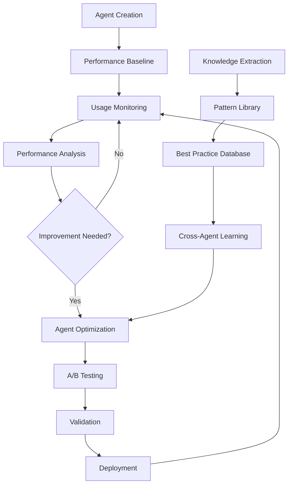
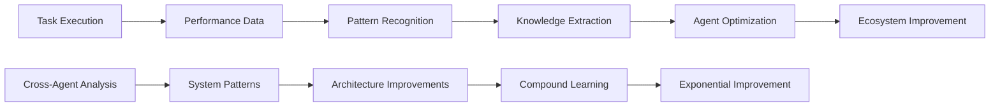
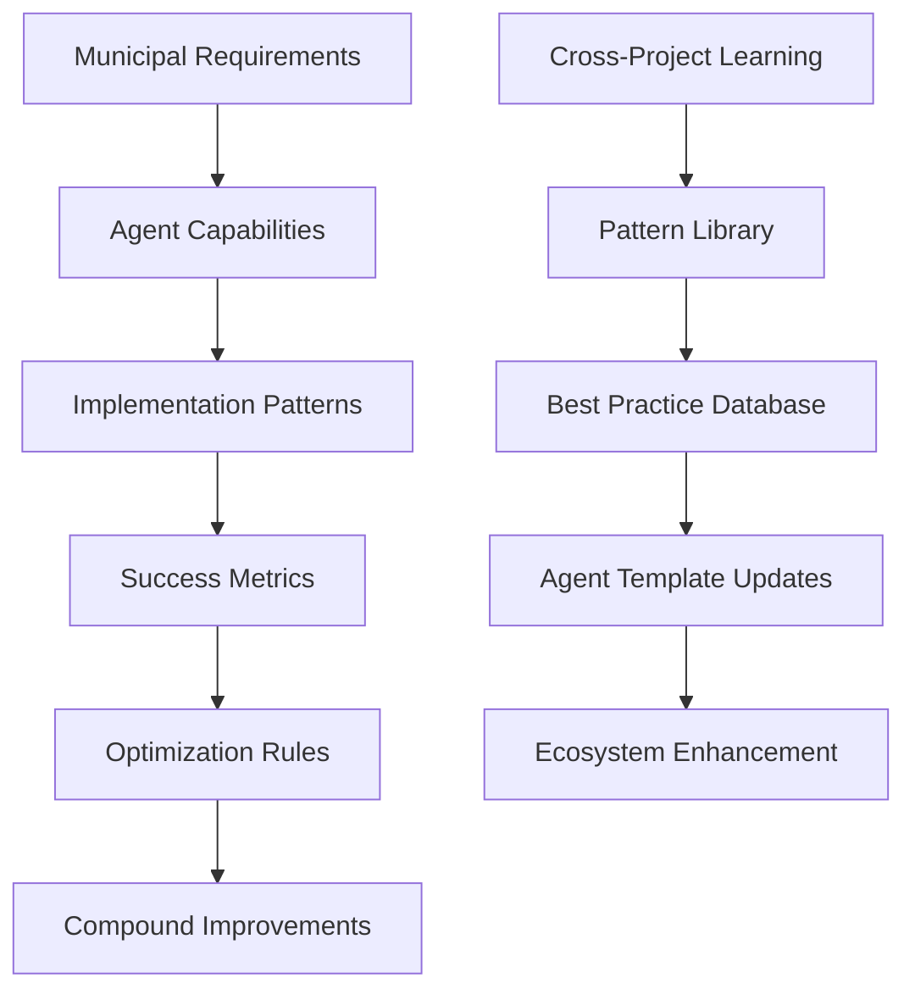
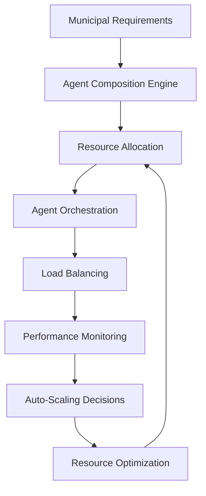
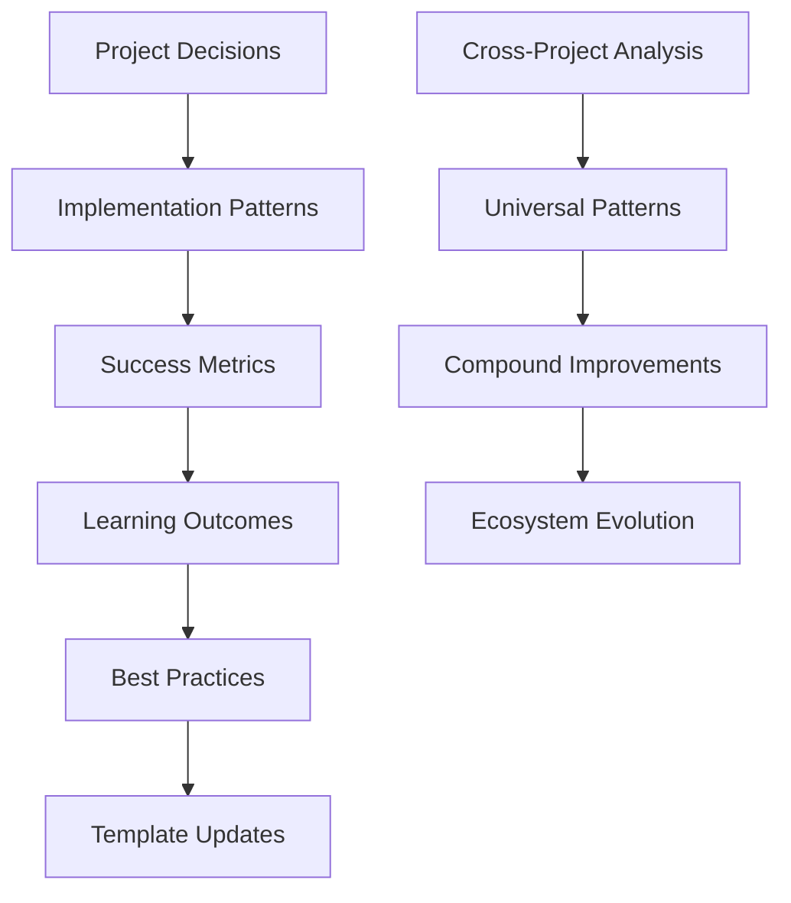

# Agent Ecosystem Meta-Architecture

## Executive Summary

This document defines the comprehensive meta-architecture for the Drupal municipal portal agent ecosystem, enabling continuous improvement, scaling, and integration with compound engineering principles. The architecture supports systematic knowledge capture, agent evolution, and exponential improvement over time.

## 1. Agent Lifecycle Management and Evolution Patterns

### 1.1 Agent Versioning and Evolution Framework



**Agent Evolution Patterns:**

1. **Semantic Versioning for Capabilities**
   - Major: Breaking changes to agent interface or core functionality
   - Minor: New capabilities or significant improvements
   - Patch: Bug fixes and minor optimizations

2. **Capability Discovery System**
   ```json
   {
     "agent_id": "drupal-step-by-step-implementer",
     "version": "2.1.3",
     "capabilities": [
       "municipal_feature_implementation",
       "ai_integration",
       "compliance_validation"
     ],
     "dependencies": ["drupal-environment-setup", "gpzh-municipal-specialist"],
     "performance_metrics": {
       "success_rate": 0.94,
       "avg_completion_time": "2.3h",
       "user_satisfaction": 4.7
     }
   }
   ```

3. **Backwards Compatibility Matrix**
   - Track agent interaction patterns
   - Maintain compatibility profiles
   - Implement graceful degradation strategies

### 1.2 Agent Health Monitoring

**Performance Metrics:**
- Success rate and failure analysis
- Average completion time and efficiency
- Resource utilization patterns
- User satisfaction scores
- Code quality metrics

**Health Monitoring Dashboard:**
```yaml
monitoring_config:
  metrics:
    - name: "agent_success_rate"
      threshold: 0.90
      alert_level: "warning"
    - name: "avg_completion_time"
      threshold: "3h"
      alert_level: "info"
    - name: "resource_utilization"
      threshold: 0.80
      alert_level: "critical"
  
  alerts:
    - condition: "success_rate < 0.85"
      action: "trigger_analysis_workflow"
    - condition: "completion_time > 4h"
      action: "optimize_agent_workflow"
```

## 2. Learning and Improvement Feedback Loops

### 2.1 Multi-Level Learning Architecture



**Learning Loop Implementation:**

1. **Event-Driven Feedback Collection**
   ```javascript
   class FeedbackCollector {
     async captureTaskExecution(agentId, taskData) {
       const event = {
         timestamp: Date.now(),
         agent_id: agentId,
         task_type: taskData.type,
         inputs: taskData.inputs,
         outputs: taskData.outputs,
         performance_metrics: taskData.metrics,
         user_feedback: taskData.userFeedback,
         context: taskData.context
       };
       
       await this.eventStore.store(event);
       await this.triggerAnalysis(event);
     }
   }
   ```

2. **Pattern Recognition Engine**
   - ML-based analysis of successful interaction patterns
   - Failure mode identification and prevention
   - Optimization opportunity detection
   - Cross-agent learning pattern extraction

3. **Knowledge Synthesis System**
   - Automated ADR generation from patterns
   - Best practice extraction and codification
   - Anti-pattern identification and avoidance
   - Institutional knowledge preservation

### 2.2 Compound Learning Mechanisms

**Knowledge Graph Architecture:**


**Implementation Strategy:**
1. **Cross-Agent Pattern Analysis**
   - Identify successful collaboration patterns
   - Extract reusable workflow templates
   - Create optimization recommendations

2. **Institutional Memory System**
   - Preserve decision context and rationale
   - Track implementation outcomes
   - Enable knowledge transfer across projects

## 3. Agent Performance Monitoring and Optimization

### 3.1 Comprehensive Telemetry System

**Performance Monitoring Framework:**

```yaml
telemetry_config:
  collection:
    - agent_execution_metrics
    - resource_utilization
    - interaction_patterns
    - error_rates_and_types
    - user_satisfaction_scores
  
  analysis:
    - real_time_performance_monitoring
    - trend_analysis_and_prediction
    - anomaly_detection
    - bottleneck_identification
    - optimization_opportunity_analysis
  
  reporting:
    - executive_dashboards
    - technical_performance_reports
    - improvement_recommendations
    - compliance_status_reports
```

**Real-Time Analytics:**
```javascript
class PerformanceAnalyzer {
  async analyzeAgentPerformance(agentId, timeWindow) {
    const metrics = await this.collectMetrics(agentId, timeWindow);
    
    return {
      efficiency: this.calculateEfficiency(metrics),
      quality: this.calculateQuality(metrics),
      reliability: this.calculateReliability(metrics),
      scalability: this.calculateScalability(metrics),
      recommendations: this.generateRecommendations(metrics)
    };
  }
  
  async predictiveOptimization(agentId) {
    const historicalData = await this.getHistoricalData(agentId);
    const patterns = await this.mlAnalysis.identifyPatterns(historicalData);
    
    return {
      predicted_bottlenecks: patterns.bottlenecks,
      optimization_opportunities: patterns.optimizations,
      scaling_requirements: patterns.scaling,
      recommended_actions: patterns.actions
    };
  }
}
```

### 3.2 Automated Optimization Systems

**Optimization Triggers:**
1. **Performance Degradation Detection**
   - Automated threshold monitoring
   - Trend analysis and prediction
   - Proactive optimization scheduling

2. **Resource Optimization**
   - Dynamic resource allocation
   - Load balancing and scaling
   - Cost optimization strategies

3. **Quality Improvement**
   - Automated testing and validation
   - Code quality monitoring
   - Compliance verification

## 4. Ecosystem Scaling and Maintenance Strategies

### 4.1 Horizontal Scaling Architecture



**Scaling Strategies:**

1. **Agent Pool Management**
   ```yaml
   scaling_config:
     agent_pools:
       - name: "core_development"
         min_instances: 2
         max_instances: 10
         scaling_triggers:
           - cpu_utilization > 70%
           - queue_length > 5
           - response_time > 30s
       
       - name: "specialized_municipal"
         min_instances: 1
         max_instances: 5
         scaling_triggers:
           - active_projects > 3
           - compliance_workload > threshold
   ```

2. **Multi-Tenant Architecture**
   - Municipality-specific agent configurations
   - Resource isolation and security
   - Shared learning and optimization

3. **Geographic Distribution**
   - Canton-specific compliance requirements
   - Language and cultural adaptations
   - Regional performance optimization

### 4.2 Maintenance and Governance

**Governance Framework:**
```yaml
governance:
  agent_lifecycle:
    - creation_standards
    - review_processes
    - deployment_gates
    - deprecation_procedures
  
  quality_assurance:
    - continuous_testing
    - security_scanning
    - compliance_validation
    - performance_benchmarking
  
  knowledge_management:
    - adr_automation
    - best_practice_extraction
    - institutional_memory
    - cross_project_learning
```

**Maintenance Automation:**
1. **Dependency Management**
   - Automated security updates
   - Compatibility testing
   - Impact analysis

2. **Configuration Management**
   - Infrastructure as code
   - Environment synchronization
   - Rollback capabilities

## 5. Integration with Compound Engineering Principles

### 5.1 Knowledge Capture and Codification

**ADR Automation System:**
```javascript
class ADRAutomationEngine {
  async captureDecision(context) {
    const decision = {
      title: this.generateTitle(context),
      status: 'proposed',
      context: this.extractContext(context),
      decision: this.extractDecision(context),
      consequences: this.predictConsequences(context),
      alternatives: this.identifyAlternatives(context)
    };
    
    return await this.createADR(decision);
  }
  
  async synthesizePatterns(decisions) {
    const patterns = await this.mlAnalysis.identifyPatterns(decisions);
    
    return {
      architectural_patterns: patterns.architecture,
      implementation_patterns: patterns.implementation,
      governance_patterns: patterns.governance,
      optimization_opportunities: patterns.optimizations
    };
  }
}
```

**Best Practice Extraction:**
1. **Success Pattern Recognition**
   - Automated analysis of successful implementations
   - Pattern template generation
   - Reusable component identification

2. **Anti-Pattern Prevention**
   - Failure mode analysis
   - Risk factor identification
   - Preventive measure implementation

### 5.2 Institutional Knowledge Preservation

**Knowledge Graph Architecture:**


**Implementation Components:**

1. **Decision Context Preservation**
   ```json
   {
     "decision_id": "arch_001",
     "context": {
       "project": "zh_municipal_portal",
       "stakeholders": ["gpzh", "citizens", "developers"],
       "constraints": ["swiss_compliance", "accessibility", "security"],
       "requirements": ["multilingual", "ai_integration", "performance"]
     },
     "rationale": "Selected Drupal 11 for municipal compliance and extensibility",
     "outcomes": {
       "performance_impact": "+15% load time improvement",
       "compliance_score": "98% WCAG 2.1 AA",
       "developer_satisfaction": 4.8
     }
   }
   ```

2. **Cross-Project Learning Networks**
   - Municipal portal pattern library
   - Swiss compliance template collection
   - AI integration best practices
   - Performance optimization cookbook

## Implementation Roadmap

### Phase 1: Foundation (Months 1-3)
- **Agent Registry and Discovery System**
  - Implement agent capability registration
  - Create dependency mapping system
  - Establish basic health monitoring

- **Basic Feedback Collection**
  - Event-driven data collection
  - Performance metrics tracking
  - User feedback integration

- **Initial ADR Automation**
  - Automated decision capture
  - Template-based ADR generation
  - Basic pattern recognition

### Phase 2: Learning Systems (Months 4-6)
- **Advanced Analytics Engine**
  - ML-based pattern recognition
  - Predictive optimization
  - Cross-agent learning networks

- **Knowledge Synthesis Systems**
  - Automated best practice extraction
  - Pattern template generation
  - Anti-pattern identification

- **Scaling Infrastructure**
  - Agent pool management
  - Auto-scaling implementation
  - Resource optimization

### Phase 3: Advanced Optimization (Months 7-12)
- **AI-Driven Orchestration**
  - Intelligent agent composition
  - Predictive resource allocation
  - Self-healing systems

- **Compound Engineering Integration**
  - Advanced knowledge graphs
  - Cross-project learning networks
  - Exponential improvement systems

- **Enterprise-Grade Governance**
  - Compliance automation
  - Security orchestration
  - Quality assurance pipelines

## Success Metrics

### Quantitative Metrics
- **Agent Performance**: 95% success rate, <2h average completion
- **Learning Efficiency**: 20% improvement per quarter
- **Scaling Capability**: Support 10+ simultaneous municipal projects
- **Knowledge Retention**: 90% pattern reuse rate

### Qualitative Metrics
- **Developer Experience**: Consistent 4.5+ satisfaction scores
- **Municipal Compliance**: 100% Swiss government standards adherence
- **System Reliability**: 99.9% uptime with automated recovery
- **Innovation Rate**: Continuous compound improvements

This meta-architecture enables the creation of a self-improving, scalable agent ecosystem that embodies compound engineering principles, ensuring exponential improvement over time while maintaining the highest standards required for Swiss municipal portal development."