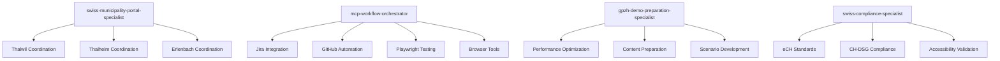

# GPZH Agent Ecosystem Integration Strategy

## Overview

This document outlines the comprehensive integration strategy for optimizing the ZH-DEMO GPZH agent ecosystem, focusing on multi-site municipality coordination, Swiss compliance, and demo preparation excellence.

## Agent Ecosystem Architecture

### Core GPZH Agents (New)


### Enhanced Existing Agents
- **drupal-technical-pm**: GPZH-specific task routing logic
- **qa-testing-specialist**: Multi-municipality testing coordination
- **drupal-ai-integration-specialist**: Swiss municipal content specialization
- **drupal-performance-specialist**: Multi-site performance optimization

## Task Routing Matrix

| Task Type | Primary Agent | Supporting Agents | MCP Integration |
|-----------|---------------|------------------|-----------------|
| Multi-Municipality Feature | swiss-municipality-portal-specialist | drupal-11-lead-developer, qa-testing-specialist | GitHub, Playwright |
| Swiss Compliance | swiss-compliance-specialist | qa-testing-specialist, drupal-configuration-expert | Browser-Tools, Memory |
| Demo Preparation | gpzh-demo-preparation-specialist | drupal-performance-specialist, swiss-municipality-portal-specialist | Puppeteer, Browser-Tools |
| Complex Automation | mcp-workflow-orchestrator | All relevant agents | All MCP servers |
| AI Content Localization | drupal-ai-integration-specialist | swiss-municipality-portal-specialist, swiss-compliance-specialist | Memory, Sequential-Thinking |

## Workflow Patterns

### 1. Complete GPZH Feature Development
```bash
# Triggered by: GPZH-XXX Jira ticket creation
# Route: drupal-technical-pm (routing) → swiss-municipality-portal-specialist (coordination) 
#        → development agents → qa-testing-specialist (validation) 
#        → swiss-compliance-specialist (compliance) → gpzh-demo-preparation-specialist (demo readiness)

@gpzh-feature-workflow GPZH-123 "Building Permit Online Form"
```

### 2. Multi-Municipality Testing Pipeline
```bash
# Triggered by: PR creation with GPZH context
# Route: qa-testing-specialist (orchestration) → mcp-workflow-orchestrator (automation)
#        → Playwright/Browser-Tools (execution) → swiss-compliance-specialist (validation)

@gpzh-test-pipeline --municipalities="thalwil,thalheim,erlenbach" --compliance="full"
```

### 3. Demo Preparation Automation
```bash
# Triggered by: Demo event planning or stakeholder request
# Route: gpzh-demo-preparation-specialist (orchestration) → drupal-performance-specialist (optimization)
#        → swiss-municipality-portal-specialist (content) → mcp-workflow-orchestrator (automation)

@gpzh-demo-prepare --event="qualification-presentation" --duration="60min"
```

## Quality Gates and Validation

### Municipality Coordination Gates
- **Architecture Consistency**: Shared core with municipality-specific overlays validated
- **Content Appropriateness**: Municipality-specific content validation across all sites
- **Performance Uniformity**: <2s load times and >90 Core Web Vitals across all municipalities
- **Branding Compliance**: Municipality-specific branding and visual identity validation

### Swiss Compliance Gates
- **eCH Standards**: Automated validation of applicable eCH standards compliance
- **CH-DSG Compliance**: Swiss data protection law compliance validation
- **Accessibility Standards**: eCH-0059 and WCAG 2.1 AA compliance validation
- **Interoperability**: Swiss e-government system integration validation

### Demo Readiness Gates
- **Performance Excellence**: Sub-2-second load times with comprehensive performance evidence
- **Content Quality**: Professional, municipality-appropriate content across all scenarios
- **Functionality Validation**: Complete functionality testing across all demo scenarios
- **Contingency Preparation**: Backup scenarios and recovery procedures validated

## MCP Integration Architecture

### Primary MCP Workflows
```yaml
mcp_integration_patterns:
  jira_automation:
    trigger: "GPZH-XXX ticket creation"
    mcps: ["atlassian-jira", "github", "memory"]
    coordination: "mcp-workflow-orchestrator"
    
  testing_automation:
    trigger: "PR creation with GPZH context"
    mcps: ["playwright", "browser-tools", "github"]
    coordination: "qa-testing-specialist + mcp-workflow-orchestrator"
    
  demo_automation:
    trigger: "Demo preparation request"
    mcps: ["puppeteer", "browser-tools", "memory"]
    coordination: "gpzh-demo-preparation-specialist + mcp-workflow-orchestrator"
    
  compliance_validation:
    trigger: "Compliance check request"
    mcps: ["browser-tools", "memory", "sequential-thinking"]
    coordination: "swiss-compliance-specialist + mcp-workflow-orchestrator"
```

### Cross-MCP Coordination
- **State Management**: Memory MCP maintains workflow state across long-running processes
- **Decision Making**: Sequential-Thinking MCP handles complex workflow routing decisions
- **Evidence Collection**: Automated evidence collection across all MCP interactions
- **Performance Monitoring**: Real-time performance monitoring across all MCP workflows

## Performance and Reliability Standards

### Response Time Targets
- **Agent Routing**: <5 seconds for task routing decisions
- **Multi-Site Operations**: <10 seconds for cross-municipality coordination
- **Compliance Validation**: <15 seconds for comprehensive compliance checks
- **Demo Preparation**: <30 seconds for demo readiness validation
- **MCP Orchestration**: <60 seconds for complex multi-MCP workflows

### Reliability Requirements
- **Agent Availability**: 99.9% availability during business hours
- **Workflow Success Rate**: >95% successful workflow completion
- **Error Recovery**: <30 seconds for automated error recovery
- **Failover Procedures**: <60 seconds for agent failover and recovery
- **Data Consistency**: 100% data consistency across multi-municipality operations

## Implementation Roadmap

### Week 1-2: Foundation Setup
1. **Deploy Core GPZH Agents**: swiss-municipality-portal-specialist, mcp-workflow-orchestrator
2. **Enhance Task Routing**: drupal-technical-pm GPZH routing logic implementation
3. **Basic MCP Integration**: Core Jira, GitHub, and Playwright automation workflows
4. **Initial Testing**: Basic multi-municipality coordination and task routing validation

### Week 3-4: Quality and Compliance
1. **Deploy Compliance Agents**: swiss-compliance-specialist, enhanced qa-testing-specialist
2. **Implement Quality Gates**: Swiss compliance and municipality coordination validation
3. **Advanced MCP Workflows**: Complex automation workflows with full MCP integration
4. **Comprehensive Testing**: End-to-end workflow testing and validation

### Week 5-6: Demo Excellence and Optimization
1. **Deploy Demo Specialist**: gpzh-demo-preparation-specialist with full optimization
2. **AI Content Enhancement**: Swiss municipal AI content specialization implementation
3. **Performance Optimization**: Multi-site performance optimization and monitoring
4. **Final Validation**: Complete system validation and demo readiness confirmation

### Week 7-8: Refinement and Documentation
1. **Workflow Optimization**: Performance optimization based on testing feedback
2. **Documentation Completion**: Comprehensive documentation and training materials
3. **Stakeholder Training**: Agent ecosystem training for development and editorial teams
4. **Go-Live Preparation**: Final preparation for production deployment and stakeholder demonstrations

## Success Metrics and Monitoring

### Quantitative Metrics
- **Task Routing Accuracy**: >95% correct agent assignment for GPZH tasks
- **Multi-Site Operation Success**: >99% successful cross-municipality operations
- **Compliance Validation Rate**: 100% Swiss compliance standard validation
- **Demo Performance**: <2s load times, >90 Core Web Vitals across all municipalities
- **Workflow Efficiency**: >80% reduction in manual coordination overhead

### Qualitative Metrics
- **Stakeholder Satisfaction**: Positive feedback on agent coordination effectiveness
- **Development Velocity**: Measurable improvement in development and deployment speed
- **Quality Consistency**: Consistent quality and compliance across all municipalities
- **Swiss Standards Adherence**: Complete adherence to Swiss municipal service requirements
- **Demo Excellence**: Successful stakeholder demonstrations and qualification presentations

## Risk Mitigation and Contingency Planning

### Technical Risks
- **Agent Coordination Failures**: Automated failover and manual override procedures
- **MCP Integration Issues**: Fallback to manual workflows with agent assistance
- **Performance Degradation**: Real-time monitoring with automatic optimization triggers
- **Compliance Validation Failures**: Automated compliance issue detection and resolution

### Operational Risks
- **Stakeholder Adoption**: Comprehensive training and gradual rollout procedures
- **Workflow Complexity**: Simplified interfaces with advanced capabilities available on demand
- **Resource Constraints**: Prioritized implementation with core functionality first
- **Timeline Pressures**: Agile implementation with minimum viable product approach

## Long-Term Optimization Strategy

### Continuous Improvement
- **Performance Monitoring**: Ongoing monitoring and optimization of agent performance
- **Workflow Enhancement**: Regular workflow optimization based on usage patterns and feedback
- **Technology Updates**: Regular updates to support new Drupal, MCP, and Swiss standard versions
- **Capability Expansion**: Gradual expansion of agent capabilities based on project requirements

### Scalability Planning
- **Multi-Canton Expansion**: Architecture designed for expansion to additional Swiss cantons
- **Agent Ecosystem Growth**: Framework for adding new specialized agents as requirements evolve
- **MCP Integration Expansion**: Support for additional MCP servers and advanced automation capabilities
- **International Expansion**: Architecture supporting expansion to other European municipal markets

This integration strategy provides a comprehensive roadmap for optimizing the ZH-DEMO GPZH agent ecosystem while maintaining high quality, performance, and Swiss compliance standards throughout the implementation process.