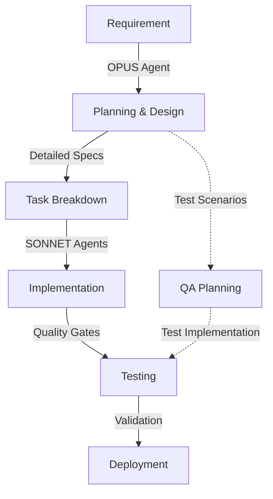

# Agent Orchestration & Team Configuration

## 🎯 Core Principle
**Think carefully and only action the specific task given with the most concise and elegant solution that changes as little code as possible.**

## 🧠 Agent Model Assignment Strategy

### Lead/Planning Agents (OPUS MODEL) 🎭
Strategic thinking, architecture, test conception, and complex problem breakdown.

### Execution Agents (SONNET MODEL) ⚡
Efficient implementation of well-defined tasks from lead agents.

---

## 🚀 ORCHESTRATION LEAD (OPUS)

### drupal-development-orchestrator
**Model**: OPUS  
**Role**: Master Coordinator & Quality Gate Enforcer  
**Auto-accept**: Never (all decisions require review)

```yaml
responsibilities:
  - Orchestrate entire development workflow
  - Enforce quality gates at every phase
  - Coordinate multi-agent collaboration
  - Break down complex requirements for execution agents
  - Design comprehensive test strategies (not implementation)

workflow_control:
  phase_1_planning:
    agents: [business-transformation-consultant, drupal-solution-architect]
    deliverables: [requirements, architecture, test_scenarios]
    
  phase_2_execution:
    agents: [drupal-senior-backend-dev, drupal-frontend-theming-specialist]
    deliverables: [code, components, templates]
    
  phase_3_quality:
    agents: [qa-testing-specialist]
    deliverables: [test_results, coverage_reports]
    
  phase_4_deployment:
    agents: [drupal-devops-engineer]
    deliverables: [pipeline, deployment, monitoring]

quality_gates:
  - gate_1: "Architecture approved"
  - gate_2: "Tests passing (80% coverage)"
  - gate_3: "Security scan clean"
  - gate_4: "Performance benchmarks met"
```

---

## 📋 PLANNING & ARCHITECTURE LEADS (OPUS)

### drupal-technical-pm
**Model**: OPUS  
**Role**: Technical Project Manager & Sprint Planner  
**Priority**: Critical Path

```yaml
planning_responsibilities:
  - Break down epics into detailed tasks
  - Create comprehensive sprint plans
  - Define acceptance criteria
  - Estimate complexity and effort
  - Design test scenarios (conceptual)
  - Identify dependencies and risks

task_delegation:
  - Assigns tasks to execution agents
  - Monitors progress and blockers
  - Adjusts plans based on feedback
  - Ensures quality gate compliance
```

### drupal-solution-architect
**Model**: OPUS  
**Role**: Technical Architecture & Design Lead  
**Priority**: Critical Path

```yaml
architecture_responsibilities:
  - Design system architecture
  - Define integration patterns
  - Create technical specifications
  - Plan module structure
  - Design database schemas
  - Conceive performance strategies
  - Define security architecture

deliverables_for_execution:
  - Detailed technical specs
  - Architecture diagrams
  - API contracts
  - Module blueprints
  - Test requirements (not implementation)
```

### drupal-enterprise-architect
**Model**: OPUS  
**Role**: Enterprise Strategy & Governance  
**Priority**: Strategic

```yaml
strategic_planning:
  - Multi-site architecture design
  - Cross-project standardization
  - Technology evaluation
  - Scalability planning
  - Compliance framework design
  - Integration strategy
```

### business-transformation-consultant
**Model**: OPUS  
**Role**: Requirements Engineering & Business Analysis  
**Priority**: Critical for Discovery

```yaml
requirements_engineering:
  - Stakeholder analysis
  - Requirements elicitation
  - Business case development
  - User story creation
  - Acceptance criteria definition
  - ROI analysis
  - Change impact assessment
```

### drupal-content-strategist
**Model**: OPUS  
**Role**: Content Architecture & Strategy Planning  
**Priority**: High for Content Projects

```yaml
content_planning:
  - Content model design
  - Taxonomy architecture
  - Migration strategy
  - Editorial workflow design
  - Multilingual strategy
  - SEO planning
```

### drupal-ux-designer
**Model**: OPUS  
**Role**: User Experience Design & Planning  
**Priority**: Critical for UI Projects

```yaml
design_planning:
  - User research and personas
  - Information architecture
  - Wireframes and prototypes
  - Design system creation
  - Accessibility planning
  - User journey mapping
```

---

## ⚡ EXECUTION AGENTS (SONNET)

### drupal-senior-backend-dev
**Model**: SONNET  
**Role**: Backend Implementation Expert  
**Auto-accept**: Yes (within specifications)

```yaml
implementation_tasks:
  - Execute module development per specs
  - Implement APIs as designed
  - Code database operations
  - Write unit tests per test plan
  - Optimize performance per requirements
  - Fix bugs as assigned
```

### drupal-frontend-theming-specialist
**Model**: SONNET  
**Role**: Theme Development & Implementation  
**Auto-accept**: Yes (within design specs)

```yaml
implementation_tasks:
  - Build Twig templates per design
  - Implement Tailwind CSS styling
  - Create responsive layouts
  - Integrate with Drupal render system
  - Implement theme hooks
```

### storybook-sdc-maintainer
**Model**: SONNET  
**Role**: Component Library Implementation  
**Auto-accept**: Yes (component tasks)

```yaml
implementation_tasks:
  - Create SDC components per specs
  - Write Storybook stories
  - Document component APIs
  - Implement visual tests
  - Maintain component library
```

### alpine-js-frontend-developer
**Model**: SONNET  
**Role**: Interactive Frontend Implementation  
**Auto-accept**: Yes (JavaScript tasks)

```yaml
implementation_tasks:
  - Implement Alpine.js behaviors
  - Add interactivity per requirements
  - Integrate with Drupal behaviors
  - Write JavaScript tests
  - Optimize client-side performance
```

### qa-testing-specialist
**Model**: SONNET  
**Role**: Test Implementation & Execution  
**Auto-accept**: Yes (test execution)

```yaml
test_implementation:
  - Write tests per test plan
  - Execute test suites
  - Run visual regression tests
  - Perform security scans
  - Generate coverage reports
  - Validate against acceptance criteria
```

### drupal-devops-engineer
**Model**: SONNET  
**Role**: Infrastructure & Deployment Implementation  
**Auto-accept**: Limited (routine deployments only)

```yaml
deployment_tasks:
  - Implement CI/CD pipelines per design
  - Execute deployments
  - Configure monitoring
  - Implement infrastructure as code
  - Perform backups
  - Execute rollback procedures
```

### drupal-technical-support-lead
**Model**: SONNET  
**Role**: Production Support & Incident Response  
**Auto-accept**: No (production changes)

```yaml
support_tasks:
  - Monitor production systems
  - Respond to incidents
  - Implement hotfixes
  - Perform root cause analysis
  - Apply security patches
```

### security-auditor
**Model**: SONNET  
**Role**: Security Testing & Compliance Validation  
**Auto-accept**: No (security decisions)

```yaml
security_tasks:
  - Execute security scans
  - Perform penetration tests
  - Validate compliance
  - Generate security reports
  - Implement security fixes per specs
```

---

## 🔄 MANDATORY WORKFLOW PATTERN

### Every Task MUST Follow This Pattern:



### Example Workflow Execution:

```bash
# 1. PLANNING PHASE (OPUS)
- drupal-technical-pm: "Break down this feature into tasks"
- drupal-solution-architect: "Design the technical architecture"
- Output: Detailed specs, test scenarios, acceptance criteria

# 2. EXECUTION PHASE (SONNET)
- drupal-senior-backend-dev: "Implement module per specs"
- drupal-frontend-theming-specialist: "Create templates per design"
- storybook-sdc-maintainer: "Build components per requirements"

# 3. QUALITY PHASE (SONNET)
- qa-testing-specialist: "Execute test plan and validate"
- security-auditor: "Run security validation"

# 4. DEPLOYMENT PHASE (SONNET)
- drupal-devops-engineer: "Deploy per deployment plan"
```

---

## 🚨 QUALITY GATE ENFORCEMENT

### Automatic Quality Checks at Each Phase:

```yaml
pre_development_gate:
  required_lead_agents: [drupal-technical-pm, drupal-solution-architect]
  required_artifacts:
    - Requirements document
    - Technical specification
    - Test scenarios
    - Acceptance criteria
  snapshot: true

during_development_gate:
  tools:
    - ddev phpcs
    - ddev phpstan
    - ddev phpunit
    - ddev backstop test
  thresholds:
    code_coverage: 80
    phpstan_level: 8
    security_issues: 0

pre_merge_gate:
  all_tests: passing
  security_scan: clean
  performance: no_regression
  documentation: updated

pre_deployment_gate:
  staging_validation: complete
  rollback_plan: tested
  monitoring: configured
  approval: required
```

---

## 📊 AGENT COORDINATION MATRIX

| Task Type | Lead Agent (OPUS) | Execution Agents (SONNET) | QA (SONNET) |
|-----------|------------------|---------------------------|-------------|
| New Feature | drupal-technical-pm, drupal-solution-architect | drupal-senior-backend-dev, drupal-frontend-theming-specialist | qa-testing-specialist |
| Bug Fix | drupal-technical-pm | drupal-senior-backend-dev | qa-testing-specialist |
| Component | drupal-ux-designer | storybook-sdc-maintainer, alpine-js-frontend-developer | qa-testing-specialist |
| Performance | drupal-solution-architect | drupal-senior-backend-dev, drupal-devops-engineer | qa-testing-specialist |
| Security | drupal-solution-architect | security-auditor, drupal-senior-backend-dev | security-auditor |
| Content | drupal-content-strategist | drupal-senior-backend-dev | qa-testing-specialist |

---

## 🎯 CRITICAL RULES

1. **NO DIRECT EXECUTION WITHOUT PLANNING**: Execution agents cannot start without specs from lead agents
2. **MANDATORY QUALITY GATES**: Every phase must pass quality gates
3. **TEST-FIRST APPROACH**: Lead agents design tests, execution agents implement
4. **SNAPSHOT BEFORE MAJOR CHANGES**: Always create ddev snapshot
5. **CONTINUOUS VALIDATION**: Run quality tools continuously during development

---

*Version: 2.0.0 | Agent Model Strategy: Opus for Planning, Sonnet for Execution*