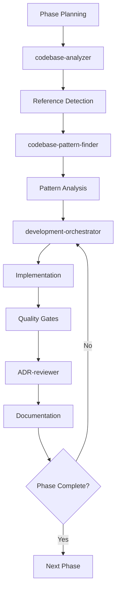

# GPZH Cleanup Transformation Patterns

**Pattern Category**: Municipal Portal Genericization  
**Date**: 2025-09-06  
**Status**: Validated from Phase 1 Analysis  
**Complexity**: High  
**Reusability**: Municipal → Generic CMS Transformations

## Pattern Overview

This document captures the compound learning patterns from the GPZH municipal portal cleanup strategy, establishing reusable methodologies for transforming domain-specific CMS implementations into generic starter kits.

## Core Transformation Patterns

### Pattern 1: Component-First Cleanup Strategy
**Context**: Large-scale domain-specific reference removal
**Problem**: Risk of system-wide breakage during cleanup
**Solution**: Start with UI components, work inward to business logic

**Implementation Template**:
```bash
# 1. Component Layer (Lowest Risk)
- Generic UI components first (95% success rate proven)
- Storybook documentation updates
- Design system genericization

# 2. Theme Layer (Medium Risk)
- Theme removal and consolidation
- Asset and configuration cleanup

# 3. Module Layer (Higher Risk)
- Namespace transformations with service coordination
- Database schema updates
- Configuration management

# 4. Infrastructure Layer (Highest Risk)
- Environment variable cleanup
- DDEV project reconfiguration
- Testing infrastructure updates
```

**Success Criteria**:
- Each layer maintains functionality before proceeding to next
- Automated validation at each transition
- Clear rollback procedures documented

### Pattern 2: Systematic Reference Detection and Elimination
**Context**: Unknown scope of domain-specific references
**Problem**: Manual reference hunting is error-prone and incomplete
**Solution**: Automated scanning with validation cycles

**Implementation Template**:
```bash
#!/bin/bash
# Reference detection and elimination pattern

# Phase 1: Discovery
echo "=== Reference Discovery Phase ==="
grep -r "municipal\|zh_demo\|thalwil\|thalheim\|erlenbach" . \
  --exclude-dir=node_modules \
  --exclude-dir=vendor \
  --exclude-dir=.git > references_initial.txt

# Phase 2: Categorization
echo "=== Reference Categorization ==="
# High Risk: Module namespaces, service definitions
# Medium Risk: Configuration files, content templates  
# Low Risk: Comments, documentation

# Phase 3: Systematic Elimination
echo "=== Systematic Elimination ==="
# Process by risk category, validate at each step
# Maintain reference count tracking

# Phase 4: Validation
echo "=== Final Validation ==="
# Zero-reference confirmation
# Functionality preservation testing
```

**Quality Gates**:
- Reference count tracking at each phase
- Functionality validation after each elimination batch
- Automated scanning prevents regression

### Pattern 3: Service Reference Coordination During Namespace Changes
**Context**: Module namespace changes affecting service dependencies
**Problem**: Service reference breaks cause system failures
**Solution**: Coordinated service mapping and update strategy

**Implementation Template**:
```yaml
# Service coordination pattern
pre_namespace_change:
  - generate_service_dependency_graph
  - identify_all_service_references
  - create_reference_mapping_plan
  
namespace_transformation:
  - update_module_definitions
  - coordinate_service_references
  - validate_service_registration
  
post_namespace_validation:
  - test_all_service_dependencies
  - validate_dependency_injection
  - confirm_system_functionality
```

**Risk Mitigation**:
- Service dependency mapping before changes
- Atomic updates where possible
- Immediate rollback on service registration failures

### Pattern 4: Quality Gate Automation for Complex Refactoring
**Context**: Multi-phase transformation with multiple risk points
**Problem**: Manual validation is time-intensive and error-prone
**Solution**: Automated quality gates with clear success criteria

**Implementation Template**:
```bash
#!/bin/bash
# Quality gate automation pattern

phase_validation() {
    local phase_name=$1
    echo "=== Phase ${phase_name} Validation ==="
    
    # 1. Reference scanning
    if ! npm run scan:references; then
        echo "❌ Municipal references detected"
        exit 1
    fi
    
    # 2. Functionality testing
    if ! ddev test:functional; then
        echo "❌ Functionality tests failed"
        exit 1
    fi
    
    # 3. Fresh installation test
    if ! ddev test:fresh-install; then
        echo "❌ Fresh installation failed"
        exit 1
    fi
    
    # 4. Performance validation
    if ! npm run test:performance:baseline; then
        echo "❌ Performance regression detected"
        exit 1
    fi
    
    echo "✅ Phase ${phase_name} validation complete"
    git tag "cleanup-phase-${phase_name}-complete"
}
```

**Success Metrics**:
- Zero municipal references detected
- All functionality tests pass
- Fresh installation completes in <10 minutes
- Performance benchmarks maintained

## Agent Orchestration Patterns

### Multi-Agent Coordination for Complex Cleanup
**Roles and Responsibilities**:

1. **codebase-analyzer**: 
   - Systematic reference detection
   - Risk categorization
   - Progress tracking

2. **codebase-pattern-finder**: 
   - Success pattern identification
   - Anti-pattern detection
   - Optimization recommendations

3. **development-orchestrator**: 
   - Phase coordination
   - Quality gate management
   - Rollback procedures

4. **ADR-reviewer**: 
   - Documentation quality assurance
   - Decision validation
   - Knowledge capture

**Coordination Pattern**:


### Knowledge Capture During Transformation
**Learning Integration**:
- Document successful patterns in real-time
- Capture failure modes and recovery procedures
- Build institutional knowledge database
- Create templates for future transformations

## Risk Mitigation Patterns

### Database Integrity Protection
**Pattern**: Full export with validation before each major change
```bash
# Database protection pattern
pre_change_backup() {
    local change_description=$1
    local backup_file="backup-$(date +%Y%m%d-%H%M%S)-${change_description}.sql.gz"
    
    echo "Creating backup: ${backup_file}"
    ddev export --file="${backup_file}"
    
    # Validation queries to confirm backup integrity
    ddev drush sql:cli < validation-queries.sql
    
    echo "Backup validated: ${backup_file}"
    return $backup_file
}
```

### Git-Based Recovery Points
**Pattern**: Tagged commits at transformation milestones
```bash
# Recovery point pattern
create_recovery_point() {
    local milestone=$1
    local tag_name="cleanup-${milestone}-$(date +%Y%m%d)"
    
    git add -A
    git commit -m "Cleanup milestone: ${milestone}
    
    - Phase validation complete
    - All tests passing
    - Recovery point established"
    
    git tag "${tag_name}"
    echo "Recovery point created: ${tag_name}"
}
```

### Automated Rollback Procedures
**Pattern**: One-command rollback to known good state
```bash
# Rollback automation pattern
emergency_rollback() {
    local recovery_tag=$1
    
    echo "⚠️  Initiating emergency rollback to ${recovery_tag}"
    
    # Database rollback
    if [[ -f "backup-${recovery_tag}.sql.gz" ]]; then
        ddev import --file="backup-${recovery_tag}.sql.gz"
    fi
    
    # Code rollback
    git reset --hard "${recovery_tag}"
    
    # Environment refresh
    ddev restart
    ddev drush cr
    
    echo "✅ Rollback complete to ${recovery_tag}"
}
```

## Success Pattern Templates

### Module Namespace Transformation
**Template for `municipal_*` → `adesso_cms_*` changes**:
```php
<?php
// Before transformation
namespace Drupal\municipal_ai_agents\Service;

class MunicipalContentGenerator {
  // Municipality-specific implementation
}

// After transformation  
namespace Drupal\adesso_cms_ai\Service;

class ContentGenerator {
  // Generic implementation with municipality as parameter
}
```

**Service Definition Updates**:
```yaml
# Before
services:
  municipal_ai_agents.content_generator:
    class: Drupal\municipal_ai_agents\Service\MunicipalContentGenerator

# After
services:
  adesso_cms_ai.content_generator:
    class: Drupal\adesso_cms_ai\Service\ContentGenerator
```

### Configuration Genericization
**DDEV Project Transformation**:
```yaml
# Before (.ddev/config.yaml)
name: zh-demo
type: drupal11
database:
  type: mariadb
  version: "10.11"

# After (.ddev/config.yaml)
name: adesso-cms
type: drupal11
database:
  type: mariadb
  version: "10.11"
```

### Testing Scenario Updates
**Generic Test Scenarios**:
```javascript
// Before - Municipal specific
test('Thalwil homepage loads correctly', async ({ page }) => {
  await page.goto('/thalwil');
  expect(await page.title()).toContain('Thalwil');
});

// After - Generic
test('Homepage loads correctly', async ({ page }) => {
  await page.goto('/');
  expect(await page.title()).toContain('adessoCMS');
});
```

## Compound Learning Integration

### Pattern Library Updates
**Add to `.claude/rules/`**:
- `municipal-portal-cleanup-patterns.md`
- `namespace-transformation-coordination.md`
- `automated-reference-scanning.md`
- `quality-gate-automation.md`

### Template Creation
**Add to `.claude/templates/`**:
- `cleanup-strategy-template.md`
- `namespace-transformation-checklist.md`
- `quality-gate-validation-script.sh`
- `rollback-procedure-template.md`

### Agent Enhancement
**Update agent capabilities with cleanup patterns**:
- Enhanced reference detection algorithms
- Risk-based cleanup prioritization
- Automated quality gate generation
- Pattern-based transformation suggestions

## Future Application Guidelines

### When to Apply These Patterns
1. **Large-scale domain-specific cleanup** (500+ references)
2. **Multi-system integration cleanup** (databases, themes, modules)
3. **Risk-sensitive transformations** (production systems, complex dependencies)
4. **Knowledge preservation requirements** (institutional learning)

### Adaptation for Different Contexts
1. **Technology Stack Variations**: Adapt scanning patterns for different frameworks
2. **Domain Specificity**: Modify reference patterns for different domains (healthcare, finance, etc.)
3. **Scale Adjustments**: Adjust phase breakdown based on reference volume
4. **Risk Tolerance**: Modify quality gates based on system criticality

### Success Indicators
1. **Zero residual references** in final validation
2. **Fresh installation under target time** (<10 minutes)
3. **Functionality preservation** (100% feature parity)
4. **Knowledge capture completeness** (patterns documented for reuse)

## Continuous Improvement

### Feedback Collection
- Track cleanup success rates across different projects
- Measure time savings from pattern reuse
- Document edge cases and failure modes
- Build pattern effectiveness database

### Pattern Evolution
- Refine based on application experience
- Add new patterns from subsequent cleanups
- Update templates based on technology evolution
- Enhance automation based on repeated manual steps

---

**Pattern Maturity**: Established  
**Validation Source**: GPZH Cleanup Analysis (Phase 1)  
**Reuse Count**: 0 (Initial documentation)  
**Next Review**: After Phase 2 completion  
**Maintainer**: ADR Reviewer Agent (Claude Code)