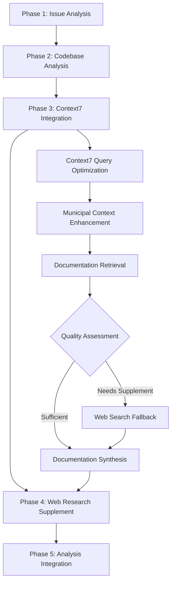

# Context7 Agent Coordination Framework
## Enhanced Research Workflow Integration

### Overview

This framework defines how Context7 integration enhances the existing 46-agent ecosystem for Swiss municipal portal development. The coordination model implements parallel intelligence gathering with Context7 as the primary documentation source, integrated with existing web research and codebase analysis capabilities.

## Agent Coordination Matrix

### Phase 3: Context7 Integration Enhancement

| Agent Type | Context7 Role | Coordination Protocol | Municipal Focus |
|------------|---------------|----------------------|-----------------|
| **Context7 Documentation Researcher** | Primary documentation source | Lead Phase 3 research with municipal query patterns | Swiss compliance + version accuracy |
| **Web Search Researcher** | Fallback + supplement | Activate when Context7 lacks municipal context | Government case studies + implementation examples |
| **Codebase Pattern Finder** | Integration validation | Cross-reference Context7 recommendations with existing patterns | Municipal architecture alignment |
| **GPZH Municipal Specialist** | Compliance validation | Review Context7 findings for Canton requirements | Swiss government standards verification |
| **Accessibility Validator** | WCAG implementation | Validate Context7 accessibility guidance | WCAG 2.1 AA compliance verification |

## Sequential Handoff Protocol with Context7

### Enhanced 5-Phase Research Process



### Context7 Integration Decision Tree

```yaml
context7_decision_matrix:
  use_context7_primary:
    conditions:
      - Official library documentation needed
      - Version-specific configuration required
      - Framework best practices sought
      - Performance optimization patterns needed
    query_enhancement:
      - Add municipal context suffix
      - Include Swiss compliance requirements
      - Specify exact version numbers
      - Add accessibility context
      
  use_websearch_fallback:
    conditions:
      - Municipal implementation examples missing
      - Swiss government compliance gaps
      - Community solutions needed
      - Real-world case studies required
    coordination:
      - Activate Web Search Researcher
      - Focus on government portal examples
      - Prioritize Swiss municipal sites
      - Include eCH-0059 compliance examples
      
  use_combined_approach:
    conditions:
      - Complex municipal requirements
      - Technical + compliance validation needed
      - Multi-agent expertise required
    orchestration:
      - Parallel Context7 + WebSearch execution
      - Municipal specialist validation
      - Accessibility compliance review
      - Integration with existing patterns
```

## Agent Handoff Protocols

### Context7 → Web Search Handoff
```yaml
handoff_triggers:
  insufficient_municipal_context:
    condition: "Context7 response lacks Swiss government portal specifics"
    action: "Activate Web Search Researcher with municipal query patterns"
    data_transfer:
      - Context7 technical findings
      - Municipal context gaps identified
      - Swiss compliance requirements
      - Specific government examples needed
      
  version_accuracy_concerns:
    condition: "Context7 version information questionable or outdated"
    action: "Web Search verification of current versions and compatibility"
    data_transfer:
      - Technology stack versions from Context7
      - Discrepancy details
      - Verification requirements
      - Municipal deployment considerations
```

### Context7 → Municipal Specialist Handoff
```yaml
compliance_validation:
  swiss_standards_review:
    trigger: "Context7 documentation retrieved for municipal implementation"
    specialist_tasks:
      - Validate eCH-0059 compliance alignment
      - Review CH-DSG data protection implications
      - Check GPZH Canton-specific requirements
      - Assess multilingual implementation adequacy
    output_requirements:
      - Compliance gap analysis
      - Swiss-specific implementation modifications
      - Risk assessment for government deployment
      - Certification pathway guidance
```

### Context7 → Accessibility Validator Handoff
```yaml
accessibility_verification:
  wcag_compliance_check:
    trigger: "Context7 provides accessibility implementation guidance"
    validator_tasks:
      - Verify WCAG 2.1 AA pattern compliance
      - Test accessibility implementation examples
      - Validate screen reader compatibility
      - Check keyboard navigation patterns
    deliverables:
      - Accessibility compliance confirmation
      - Implementation gap identification
      - Testing procedure recommendations
      - Government accessibility standard alignment
```

## Context7 Performance Monitoring Integration

### Agent Performance Metrics
```yaml
context7_agent_metrics:
  documentation_quality:
    municipal_relevance_score: "1-5 rating for Swiss government portal applicability"
    version_accuracy_rate: "Percentage of correct version-specific information"
    compliance_coverage: "WCAG/CH-DSG/eCH-0059 requirement coverage percentage"
    
  coordination_efficiency:  
    handoff_success_rate: "Successful agent transitions percentage"
    fallback_utilization: "When and why WebSearch fallback was necessary"
    synthesis_quality: "Integration effectiveness across agent findings"
    
  municipal_effectiveness:
    swiss_compliance_accuracy: "Government standard adherence verification"
    implementation_readiness: "Municipal deployment preparation completeness"
    multi_agent_coordination: "Cross-agent collaboration success rate"
```

### Learning Loop Integration
```yaml
compound_learning_patterns:
  context7_optimization:
    successful_queries:
      - Track municipal context patterns that improve results
      - Document version-specific query effectiveness
      - Identify Swiss compliance query enhancements
      
    handoff_patterns:
      - Learn optimal Context7 → WebSearch transition points
      - Optimize municipal specialist coordination timing
      - Improve accessibility validator integration points
      
  agent_coordination_improvements:
    parallel_execution_optimization:
      - Identify tasks suitable for simultaneous agent execution
      - Optimize Context7 + codebase analysis coordination
      - Enhance municipal compliance validation workflows
```

## Municipal Compliance Coordination

### Swiss Government Standards Integration
```yaml
compliance_agent_coordination:
  ech_0059_validation:
    primary_agent: "GPZH Municipal Specialist"
    context7_input: "Technical implementation documentation"
    coordination_points:
      - Government web standard compliance review
      - Municipal portal requirement validation
      - Swiss accessibility standard alignment
      
  ch_dsg_compliance:
    primary_agent: "Data Protection Specialist"  
    context7_input: "Data handling and privacy implementation patterns"
    validation_requirements:
      - Data processing compliance verification
      - Privacy implementation review
      - Municipal data governance alignment
      
  wcag_accessibility:
    primary_agent: "Accessibility Validator"
    context7_input: "Accessibility implementation guidance"
    testing_protocols:
      - WCAG 2.1 AA compliance verification
      - Screen reader testing procedures
      - Government accessibility standard validation
```

## Implementation Workflow

### Context7-Enhanced Research Command Execution
```yaml
enhanced_workflow_steps:
  1_preparation:
    - Load municipal query patterns from `.claude/mcp-servers/context7/municipal-queries.yml`
    - Initialize Context7Monitor for performance tracking
    - Prepare agent coordination matrix
    
  2_context7_execution:
    - Execute municipal-enhanced Context7 queries
    - Apply version-specific optimization patterns
    - Monitor query performance and fallback triggers
    
  3_agent_coordination:
    - Evaluate Context7 results for handoff requirements
    - Activate appropriate supplemental agents (Web Search, Municipal Specialist)
    - Coordinate parallel execution where beneficial
    
  4_synthesis_integration:
    - Merge Context7 documentation with agent findings
    - Apply municipal compliance validation
    - Generate implementation-ready recommendations
    
  5_learning_capture:
    - Document successful Context7 query patterns
    - Update municipal optimization templates
    - Record agent coordination effectiveness metrics
```

### Quality Gates for Agent Coordination

```yaml
coordination_quality_gates:
  context7_integration:
    - [ ] Municipal context successfully applied to all queries
    - [ ] Version-specific documentation retrieved and validated
    - [ ] Swiss compliance requirements addressed in technical guidance
    - [ ] Fallback mechanisms activated appropriately
    
  agent_handoff_quality:
    - [ ] Appropriate agents activated based on Context7 results
    - [ ] Municipal specialist validation completed for government standards
    - [ ] Accessibility compliance verified by dedicated validator
    - [ ] Web search supplementation provided municipal implementation examples
    
  synthesis_effectiveness:
    - [ ] Context7 documentation integrated with existing codebase patterns
    - [ ] Municipal compliance requirements satisfied across all findings
    - [ ] Implementation guidance specific to Swiss government portals
    - [ ] Agent coordination learning patterns captured for compound improvement
```

This coordination framework ensures Context7 integration enhances rather than disrupts the existing agent ecosystem, providing Swiss municipal portal development with accurate, compliant, and implementation-ready technical documentation while maintaining the compound learning principles that drive continuous improvement.