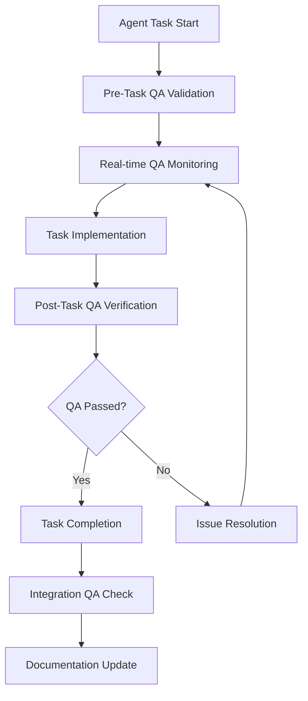

# Lean Quality Assurance Framework für Essentielle Agenten

## Framework Philosophie

**Minimalismus mit Maximalem Impact**
- QA als integraler Bestandteil, nicht als zusätzlicher Schritt
- Automatisierung wo möglich, manuell wo wertvoll
- Schnelle Feedback-Loops für sofortige Qualitätsverbesserung
- Evolutionäre Implementierung - start simple, grow smart

## QA-Komponenten Übersicht

### 1. Component Quality Validation
**Automatisiert:**
- Twig Template Syntax & Logic Validation
- SDC Component Schema Compliance
- Storybook Story Coverage & Accessibility
- Component Performance Benchmarks

**Semi-Automatisiert:**
- Component API Consistency Checks
- Design System Adherence Validation
- Cross-browser Compatibility Testing

**Manuell:**
- UX Pattern Consistency Review
- Content Strategy Alignment
- Visual Design Quality Assessment

### 2. Code Standards Enforcement
**Automatisiert:**
- PHP_CodeSniffer (Drupal Standards)
- ESLint/Prettier (Frontend Standards)
- PHPStan Static Analysis (Level 6+)
- Security Vulnerability Scanning (Composer/npm audit)
- Configuration Schema Validation

**Semi-Automatisiert:**
- Architecture Pattern Compliance
- API Documentation Coverage
- Performance Anti-Pattern Detection

**Manuell:**
- Code Review für komplexe Business Logic
- Security Architecture Review
- Performance Architecture Decisions

### 3. Performance Benchmarking
**Automatisiert:**
- Lighthouse Performance Audits (Desktop/Mobile)
- Database Query Performance Analysis
- Cache Hit Ratio Monitoring
- Bundle Size Analysis
- Core Web Vitals Tracking

**Semi-Automatisiert:**
- Load Testing mit realistischen Daten
- Memory Usage Pattern Analysis
- CDN Performance Optimization

**Manuell:**
- Performance Budget Reviews
- Scalability Architecture Assessment
- User Experience Performance Impact

### 4. Accessibility Compliance
**Automatisiert:**
- axe-core Accessibility Testing
- WAVE Integration für alle Komponenten
- Color Contrast Ratio Validation
- Keyboard Navigation Testing
- Screen Reader Compatibility Checks

**Semi-Automatisiert:**
- Multilingual Accessibility Testing (DE/FR/IT)
- Government Portal Accessibility Standards
- Content Accessibility Guidelines Validation

**Manuell:**
- Real User Testing mit Assistive Technologies
- Content Clarity and Comprehension
- Municipal Service Accessibility Requirements

### 5. Integration Testing
**Automatisiert:**
- API Endpoint Response Validation
- Database Migration Integrity Checks
- Configuration Import/Export Cycles
- Cross-Service Communication Testing
- Authentication/Authorization Flows

**Semi-Automatisiert:**
- End-to-End User Journey Testing
- Third-party Integration Validation
- Multi-environment Consistency Checks

**Manuell:**
- Business Process Integration Testing
- User Acceptance Testing
- Stakeholder Workflow Validation

## Automation Matrix

### Vollständig Automatisierbar (CI/CD Pipeline)
```yaml
automated_checks:
  code_quality:
    - php_codesniffer
    - eslint
    - phpstan
    - security_audit
  performance:
    - lighthouse_ci
    - bundle_analyzer
    - query_performance
  accessibility:
    - axe_core
    - color_contrast
    - keyboard_navigation
  functionality:
    - phpunit_tests
    - jest_tests
    - behat_tests
    - configuration_validation
```

### Semi-Automatisiert (Tool + Human Review)
```yaml
semi_automated:
  integration:
    - api_contract_testing
    - cross_browser_testing
    - load_testing
  design:
    - responsive_design_validation
    - component_consistency
    - design_system_compliance
  content:
    - multilingual_validation
    - content_quality_metrics
    - seo_optimization
```

### Manuell Erforderlich
```yaml
manual_reviews:
  architecture:
    - technical_decision_review
    - security_architecture
    - scalability_planning
  user_experience:
    - usability_testing
    - content_strategy_review
    - accessibility_user_testing
  business:
    - requirement_compliance
    - stakeholder_approval
    - legal_compliance_review
```

## Agent-Spezifische QA Integration

### Core Development Agents

#### drupal-project-initializer
**QA-Integration:**
```yaml
quality_gates:
  pre_initialization:
    - requirement_validation
    - environment_readiness_check
  during_setup:
    - configuration_schema_validation
    - dependency_security_scan
    - accessibility_baseline_setup
  post_initialization:
    - project_structure_validation
    - initial_performance_baseline
    - security_hardening_verification
```

#### drupal-step-by-step-implementer
**QA-Integration:**
```yaml
step_validation:
  before_each_step:
    - dependency_check
    - backup_verification
    - rollback_plan_validation
  during_implementation:
    - real_time_syntax_checking
    - security_pattern_validation
    - performance_impact_monitoring
  after_each_step:
    - functional_testing
    - integration_verification
    - documentation_update_check
```

#### drupal-module-developer
**QA-Integration:**
```yaml
development_quality:
  code_generation:
    - drupal_coding_standards_enforcement
    - security_best_practices_validation
    - performance_anti_pattern_detection
  testing:
    - automatic_unit_test_generation
    - integration_test_coverage
    - api_documentation_validation
  deployment:
    - configuration_export_verification
    - dependency_compatibility_check
    - update_hook_validation
```

#### drupal-theme-specialist
**QA-Integration:**
```yaml
theme_quality:
  development:
    - twig_template_validation
    - css_performance_optimization
    - accessibility_compliance_checking
  component_creation:
    - sdc_schema_validation
    - storybook_story_generation
    - responsive_design_testing
  integration:
    - cross_browser_compatibility
    - performance_budget_compliance
    - design_system_consistency
```

### Quality Assurance Agents

#### drupal-test-automator
**Meta-QA Integration:**
```yaml
test_quality:
  test_generation:
    - test_coverage_analysis
    - test_quality_metrics
    - performance_test_validation
  execution:
    - parallel_test_execution
    - flaky_test_detection
    - test_result_analysis
  maintenance:
    - obsolete_test_cleanup
    - test_performance_optimization
    - documentation_synchronization
```

#### drupal-code-quality-inspector
**Self-Monitoring:**
```yaml
inspector_quality:
  rule_management:
    - rule_effectiveness_analysis
    - false_positive_tracking
    - rule_performance_optimization
  analysis:
    - analysis_accuracy_validation
    - performance_impact_monitoring
    - reporting_quality_assurance
```

### Infrastructure Agents

#### ddev-orchestrator
**Environment QA:**
```yaml
environment_quality:
  setup:
    - service_configuration_validation
    - security_hardening_verification
    - performance_optimization_check
  maintenance:
    - service_health_monitoring
    - backup_integrity_verification
    - update_compatibility_testing
```

#### drupal-deployment-manager
**Deployment QA:**
```yaml
deployment_quality:
  pre_deployment:
    - comprehensive_test_suite_execution
    - security_vulnerability_scan
    - performance_regression_testing
    - configuration_consistency_check
  deployment:
    - zero_downtime_verification
    - rollback_capability_testing
    - monitoring_setup_validation
  post_deployment:
    - functionality_smoke_testing
    - performance_baseline_comparison
    - error_monitoring_verification
```

### Frontend Agents

#### storybook-component-curator
**Component QA:**
```yaml
component_quality:
  story_creation:
    - accessibility_story_coverage
    - interaction_testing
    - visual_regression_testing
  documentation:
    - component_api_documentation
    - usage_example_validation
    - design_token_consistency
```

#### drupal-ui-designer
**Design QA:**
```yaml
design_quality:
  implementation:
    - design_system_compliance
    - responsive_design_validation
    - accessibility_compliance
  integration:
    - cross_device_testing
    - performance_impact_assessment
    - user_experience_validation
```

## Workflow Integration

### Development Lifecycle QA Gates



### Git Workflow Integration

```yaml
git_hooks:
  pre_commit:
    - syntax_validation
    - code_standards_check
    - security_scan
    - configuration_validation
  pre_push:
    - unit_test_execution
    - integration_test_subset
    - performance_regression_check
  post_merge:
    - comprehensive_test_suite
    - accessibility_audit
    - performance_benchmark
    - deployment_readiness_check
```

### CI/CD Pipeline QA Stages

```yaml
pipeline_stages:
  validation:
    - code_quality_gate
    - security_vulnerability_scan
    - dependency_audit
  testing:
    - unit_tests
    - integration_tests
    - accessibility_tests
    - performance_tests
  quality_assurance:
    - comprehensive_audit
    - manual_review_triggers
    - stakeholder_approval_gates
  deployment_readiness:
    - production_environment_validation
    - rollback_capability_verification
    - monitoring_setup_check
```

## Performance Metrics & KPIs

### Quality Metrics
```yaml
quality_kpis:
  code_quality:
    - technical_debt_ratio
    - code_coverage_percentage
    - security_vulnerability_count
    - performance_budget_compliance
  user_experience:
    - core_web_vitals_scores
    - accessibility_compliance_percentage
    - cross_browser_compatibility_score
  process_efficiency:
    - automated_test_execution_time
    - manual_review_cycle_time
    - defect_detection_rate
    - deployment_success_rate
```

### Efficiency Metrics
```yaml
efficiency_kpis:
  automation:
    - percentage_of_automated_checks
    - false_positive_rate
    - qa_execution_time_reduction
  developer_experience:
    - feedback_loop_time
    - qa_overhead_percentage
    - developer_satisfaction_score
  business_impact:
    - time_to_market_improvement
    - defect_escape_rate_reduction
    - compliance_audit_success_rate
```

## Implementation Roadmap

### Phase 1: Foundation (Woche 1-2)
```yaml
foundation:
  setup:
    - automated_code_standards_enforcement
    - basic_security_scanning
    - performance_baseline_establishment
  integration:
    - git_hooks_implementation
    - basic_ci_cd_pipeline
    - essential_agent_qa_integration
```

### Phase 2: Automation (Woche 3-4)
```yaml
automation:
  expansion:
    - comprehensive_automated_testing
    - accessibility_automation
    - performance_monitoring
  optimization:
    - qa_execution_time_optimization
    - false_positive_reduction
    - reporting_dashboard_setup
```

### Phase 3: Intelligence (Woche 5-6)
```yaml
intelligence:
  enhancement:
    - predictive_quality_analysis
    - intelligent_test_selection
    - automated_quality_reporting
  integration:
    - stakeholder_dashboard
    - quality_trend_analysis
    - continuous_improvement_feedback
```

## Entwickler-freundliche Integration

### IDE Integration
```yaml
ide_support:
  real_time_validation:
    - syntax_highlighting_for_standards
    - inline_security_warnings
    - performance_impact_indicators
  automated_assistance:
    - code_completion_with_standards
    - automated_fix_suggestions
    - accessibility_guidance
```

### Quick Feedback Mechanisms
```yaml
feedback_systems:
  immediate:
    - real_time_validation_during_typing
    - instant_accessibility_feedback
    - performance_impact_warnings
  rapid:
    - pre_commit_validation_results
    - automated_test_execution_feedback
    - security_scan_summaries
  comprehensive:
    - daily_quality_reports
    - weekly_trend_analysis
    - monthly_improvement_recommendations
```

### Quality Culture Integration
```yaml
culture:
  education:
    - embedded_learning_opportunities
    - quality_best_practices_documentation
    - peer_review_guidelines
  recognition:
    - quality_achievement_tracking
    - improvement_milestone_celebration
    - knowledge_sharing_incentives
```

## Fazit

Dieses lean QA Framework bietet:

- **Minimalen Overhead** durch intelligente Automatisierung
- **Maximalen Impact** durch gezielte Qualitätsmessungen  
- **Entwickler-freundliche Integration** ohne Workflow-Unterbrechung
- **Schnelle Feedback-Loops** für sofortige Verbesserungen
- **Evolutionäre Implementierung** für nachhaltigen Erfolg

Die agent-spezifische Integration stellt sicher, dass jeder Agent optimal zur Gesamtqualität beiträgt, während die Automatisierungsmatrix klare Grenzen zwischen automatisierten und manuellen Prozessen definiert.