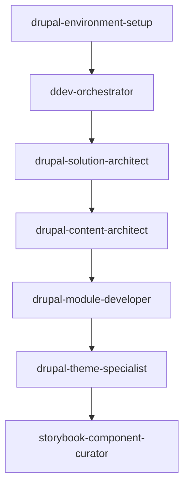
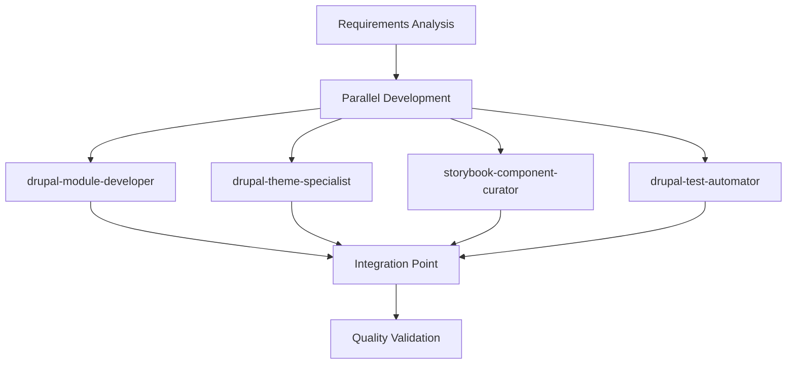
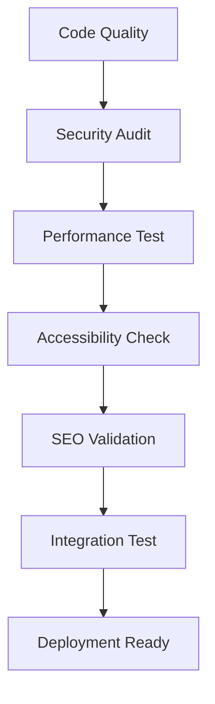
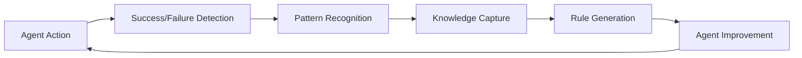

# Drupal Agent Orchestration

**Objective:** Establish systematic orchestration patterns for the 27 specialized Drupal agents that maximize compound engineering benefits through intelligent coordination, parallel execution, and continuous learning loops.

## Agent Ecosystem Architecture

### Core Agent Categories

#### 1. Infrastructure & Environment (4 agents)
- **Primary**: `ddev-orchestrator` - Container management and local development
- **Supporting**: `drupal-deployment-manager`, `composer-dependency-manager`, `drupal-configuration-syncer`
- **Coordination Pattern**: Sequential setup, parallel maintenance

#### 2. Architecture & Planning (4 agents) 
- **Primary**: `drupal-solution-architect` - Overall system architecture
- **Supporting**: `drupal-content-architect`, `drupal-database-architect`, `drupal-multisite-manager`
- **Coordination Pattern**: Collaborative design with decision handoffs

#### 3. Implementation & Development (6 agents)
- **Backend**: `drupal-module-developer`, `drupal-api-integrator`, `drupal-migration-specialist`
- **Frontend**: `drupal-theme-specialist`, `storybook-component-curator`, `drupal-ui-designer`
- **Coordination Pattern**: Parallel development with integration points

#### 4. Quality & Optimization (6 agents)
- **Testing**: `drupal-test-automator`, `drupal-accessibility-auditor`
- **Code Quality**: `drupal-code-quality-inspector`, `drupal-security-guardian`
- **Performance**: `drupal-performance-optimizer`, `drupal-seo-optimizer`
- **Coordination Pattern**: Continuous validation with feedback loops

#### 5. Knowledge & Documentation (3 agents)
- **Primary**: `drupal-knowledge-curator` - ADRs and institutional knowledge
- **Supporting**: `adr-reviewer`, `drupal-documentation-generator`
- **Coordination Pattern**: Real-time capture with periodic consolidation

#### 6. Specialized Solutions (4 agents)
- **Advanced**: `drupal-headless-architect`, `drupal-commerce-specialist`
- **Domain**: `municipality-portal-specialist`, `german-market-compliance-specialist`
- **Coordination Pattern**: On-demand activation based on requirements

## Orchestration Patterns

### 1. New Project Initialization

**Sequential Pattern** - Each phase depends on the previous:



**Implementation**:
```yaml
# .work/orchestration/new-project-sequence.yml
phases:
  1_environment:
    primary_agent: "drupal-environment-setup"
    success_criteria: 
      - "DDEV environment running"
      - "Drupal 11 installed"
      - "Basic configuration imported"
    handoff_context: "Environment URLs, admin credentials, service status"

  2_container_optimization:
    primary_agent: "ddev-orchestrator"
    depends_on: "1_environment"
    success_criteria:
      - "Performance mode configured"
      - "Frontend services exposed"
      - "Custom commands available"
    handoff_context: "Container configuration, exposed ports, performance metrics"

  3_architecture_planning:
    primary_agent: "drupal-solution-architect"
    depends_on: "2_container_optimization"
    parallel_agents: ["drupal-content-architect", "drupal-database-architect"]
    success_criteria:
      - "System architecture documented"
      - "Content model designed" 
      - "Database schema planned"
    handoff_context: "Architecture decisions, entity relationships, performance requirements"
```

### 2. Feature Development Workflow

**Parallel Pattern** - Multiple agents work simultaneously:



**Implementation**:
```yaml
# .work/orchestration/feature-development-parallel.yml
parallel_execution:
  backend_development:
    primary_agent: "drupal-module-developer"
    tasks:
      - "Custom module scaffolding"
      - "Service implementation"
      - "Entity/Field API integration"
    output: "web/modules/custom/*/src/"

  frontend_development:
    primary_agent: "drupal-theme-specialist" 
    depends_on_partial: "backend_development.entities"
    tasks:
      - "Twig template creation"
      - "Theme library configuration"
      - "Tailwind CSS integration"
    output: "web/themes/custom/*/templates/"

  component_documentation:
    primary_agent: "storybook-component-curator"
    depends_on: "frontend_development.components"
    tasks:
      - "Component story creation"
      - "Props documentation"
      - "Accessibility testing"
    output: "web/themes/custom/*/.storybook/"

  test_implementation:
    primary_agent: "drupal-test-automator"
    parallel_to: ["backend_development", "frontend_development"]
    tasks:
      - "Unit test scaffolding"
      - "Functional test creation" 
      - "JavaScript test setup"
    output: "web/modules/custom/*/tests/"

integration_point:
  trigger: "all_parallel_tasks_complete"
  validation_agents: 
    - "drupal-code-quality-inspector"
    - "drupal-accessibility-auditor"
  success_criteria:
    - "All tests pass"
    - "Code quality standards met"
    - "Accessibility requirements satisfied"
```

### 3. Quality Assurance Pipeline

**Cascading Validation Pattern** - Each level builds on the previous:



**Implementation**:
```yaml
# .work/orchestration/quality-pipeline.yml
quality_gates:
  level_1_code_quality:
    agent: "drupal-code-quality-inspector"
    validations:
      - "PHPCS Drupal standards"
      - "PHPStan level 8+ analysis"
      - "Composer audit passes"
    failure_action: "block_pipeline"

  level_2_security:
    agent: "drupal-security-guardian"
    depends_on: "level_1_code_quality"
    validations:
      - "Security module scan"
      - "Dependency vulnerabilities"
      - "Permission audit"
    failure_action: "security_review_required"

  level_3_performance:
    agent: "drupal-performance-optimizer"
    depends_on: "level_2_security"
    validations:
      - "Page load time < 2s"
      - "Database query optimization"
      - "Cache configuration"
    failure_action: "performance_tuning_required"

  level_4_accessibility:
    agent: "drupal-accessibility-auditor"
    depends_on: "level_3_performance"
    validations:
      - "WCAG 2.1 AA compliance"
      - "Screen reader compatibility" 
      - "Keyboard navigation"
    failure_action: "accessibility_remediation_required"

  level_5_seo:
    agent: "drupal-seo-optimizer"
    depends_on: "level_4_accessibility"
    validations:
      - "Meta tag optimization"
      - "Structured data markup"
      - "Core Web Vitals"
    failure_action: "seo_optimization_required"

  level_6_integration:
    agent: "drupal-test-automator"
    depends_on: "level_5_seo"
    validations:
      - "Full functional test suite"
      - "JavaScript interaction tests"
      - "Cross-browser compatibility"
    failure_action: "integration_fixing_required"
```

### 4. Continuous Learning Integration

**Knowledge Capture Pattern** - Learning happens at every step:



**Implementation**:
```yaml
# .work/orchestration/learning-integration.yml
learning_hooks:
  post_agent_execution:
    trigger: "agent_task_complete"
    capture_agent: "feedback-codifier"
    data_points:
      - "execution_time"
      - "success_rate" 
      - "error_patterns"
      - "output_quality"
    output: "memory-bank/agent-performance/{{agent_name}}-{{timestamp}}.md"

  pattern_recognition:
    trigger: "weekly"
    analysis_agent: "thoughts-analyzer"
    input: "memory-bank/agent-performance/*.md"
    patterns_to_identify:
      - "frequently_failing_combinations"
      - "high_performance_sequences"
      - "optimal_parallel_groupings"
    output: "memory-bank/patterns/orchestration-patterns.md"

  rule_generation:
    trigger: "pattern_confidence > 0.8"
    generation_agent: "claude-rules-writer"
    input: "memory-bank/patterns/orchestration-patterns.md"
    output: ".claude/rules/generated-orchestration-improvements.md"

  agent_improvement:
    trigger: "rule_generation_complete"
    update_agents: "agent-architect"
    actions:
      - "update_agent_capabilities"
      - "modify_coordination_patterns"
      - "optimize_handoff_protocols"
```

## Agent Communication Protocols

### Handoff Context Template

**MUST** use this template for all agent handoffs:

```markdown
## Agent Handoff: {{source_agent}} → {{target_agent}}

### Completed Work
- **Primary Deliverable**: {{main_output_location}}
- **Supporting Files**: {{list_of_created_files}}
- **Configuration Changes**: {{environment_modifications}}
- **Dependencies Added**: {{new_dependencies}}

### Current System State
- **Environment Status**: {{ddev_status, services_running}}
- **Database State**: {{content_types, configuration_imported}}
- **Frontend State**: {{assets_built, components_available}}
- **Test Coverage**: {{test_files_created, coverage_percentage}}

### Handoff Data
```json
{
  "entity_types": ["{{entity_machine_names}}"],
  "service_definitions": ["{{service_ids}}"],
  "theme_components": ["{{component_names}}"],
  "configuration_keys": ["{{config_names}}"],
  "performance_metrics": {
    "build_time": "{{seconds}}",
    "bundle_size": "{{kb}}",
    "test_execution_time": "{{seconds}}"
  }
}
```

### Next Agent Requirements
- **Expected Input**: {{what_target_agent_needs}}
- **Success Criteria**: {{measurable_outcomes}}
- **Quality Gates**: {{validation_requirements}}
- **Timeline**: {{estimated_completion_time}}

### Compound Learning Captured
- **New Patterns Identified**: {{reusable_patterns}}
- **Performance Improvements**: {{speed_gains_achieved}}
- **Quality Enhancements**: {{quality_metrics_improved}}
- **Rule Updates Needed**: {{suggested_rule_modifications}}
```

### Error Recovery Protocol

When agent orchestration fails:

```yaml
# .work/orchestration/error-recovery.yml
error_handling:
  agent_failure:
    detection: "agent_exit_code != 0 || timeout_exceeded"
    immediate_actions:
      - "capture_failure_context"
      - "preserve_partial_work"
      - "log_error_details"
    recovery_agent: "debug-detective"
    recovery_tasks:
      - "analyze_failure_cause"
      - "identify_recovery_strategy"
      - "suggest_alternative_approaches"

  cascade_failure:
    detection: "dependent_agent_cannot_start"
    actions:
      - "rollback_to_last_stable_state"
      - "requeue_failed_sequence"
      - "notify_orchestration_adjustment_needed"
    
  quality_gate_failure:
    detection: "validation_agent_reports_failure"
    actions:
      - "isolate_failing_component"
      - "revert_problematic_changes"
      - "schedule_targeted_remediation"

  learning_integration:
    post_recovery_actions:
      - "document_failure_pattern"
      - "update_prevention_rules"
      - "improve_agent_coordination"
      - "strengthen_quality_gates"
```

## Performance Optimization

### Agent Resource Management

**MUST** implement resource-aware orchestration:

```yaml
# .work/orchestration/resource-management.yml
resource_constraints:
  parallel_agent_limits:
    development_tasks: 3  # Max 3 development agents simultaneously
    quality_tasks: 2      # Max 2 quality agents simultaneously
    documentation_tasks: 1 # Max 1 documentation agent at a time

  memory_allocation:
    high_memory_agents: ["drupal-test-automator", "drupal-performance-optimizer"]
    medium_memory_agents: ["drupal-module-developer", "drupal-theme-specialist"]
    low_memory_agents: ["drupal-documentation-generator", "adr-reviewer"]

  execution_priority:
    critical: ["drupal-security-guardian", "drupal-code-quality-inspector"]
    high: ["drupal-module-developer", "drupal-theme-specialist"] 
    medium: ["storybook-component-curator", "drupal-test-automator"]
    low: ["drupal-documentation-generator", "drupal-seo-optimizer"]

optimization_strategies:
  agent_caching:
    cache_agent_outputs: true
    cache_duration: "24h"
    cache_invalidation: "on_dependency_change"

  intelligent_scheduling:
    batch_similar_tasks: true
    optimize_for_resource_usage: true
    prefer_sequential_for_dependencies: true
```

## Compound Engineering Integration

### Exponential Improvement Tracking

Every orchestration MUST measure and improve:

```yaml
# .work/orchestration/improvement-tracking.yml
metrics:
  development_velocity:
    measurement: "story_points_per_sprint"
    target_improvement: "15% quarterly"
    current_baseline: "{{baseline_velocity}}"

  quality_improvement:
    measurement: "defect_rate_reduction"
    target_improvement: "20% quarterly"  
    current_baseline: "{{baseline_defects}}"

  agent_efficiency:
    measurement: "task_completion_time"
    target_improvement: "25% quarterly"
    current_baseline: "{{baseline_times}}"

  knowledge_reuse:
    measurement: "pattern_application_rate"
    target_improvement: "30% quarterly"
    current_baseline: "{{baseline_reuse}}"

feedback_loops:
  daily: "agent_performance_collection"
  weekly: "pattern_recognition_analysis" 
  monthly: "orchestration_optimization"
  quarterly: "compound_improvement_assessment"
```

This orchestration system ensures that our Drupal agent ecosystem becomes exponentially more effective with each iteration, building compound intelligence that makes every future project faster, safer, and higher quality.