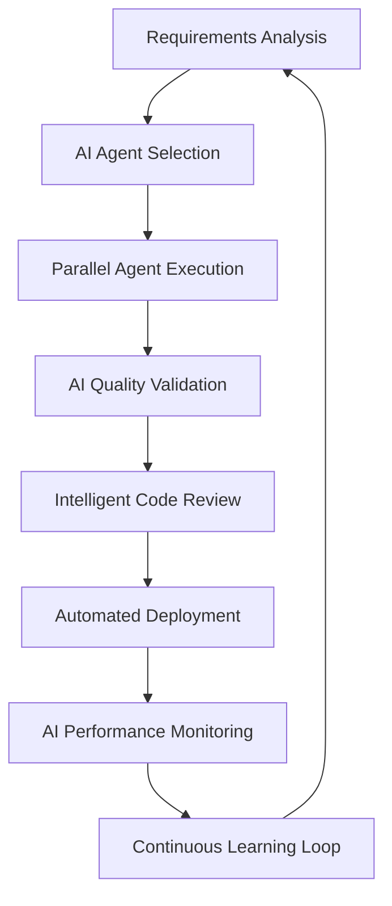

# Drupal AI Integration

**Objective:** Establish comprehensive AI integration patterns that leverage Claude agents and AI services to create intelligent, self-improving Drupal development workflows with automated content management and proactive system optimization.

## AI-Enhanced Development Workflow

### Agent-Driven Development Pipeline

**MUST** integrate AI agents at every development phase:



### Claude Agent Context Management

```php
// web/modules/custom/zh_demo_ai/src/Service/ClaudeContextManager.php
<?php

declare(strict_types=1);

namespace Drupal\zh_demo_ai\Service;

use Drupal\Core\Config\ConfigFactoryInterface;
use Drupal\Core\File\FileSystemInterface;
use Drupal\Core\Logger\LoggerChannelFactoryInterface;

/**
 * Manages Claude agent context and memory for compound engineering.
 */
final readonly class ClaudeContextManager {

  public function __construct(
    private ConfigFactoryInterface $configFactory,
    private FileSystemInterface $fileSystem,
    private LoggerChannelFactoryInterface $loggerFactory,
  ) {}

  /**
   * Capture development context for agent handoffs.
   */
  public function captureContext(string $agent_name, array $context_data): string {
    $context = [
      'timestamp' => time(),
      'agent' => $agent_name,
      'project_state' => $this->getCurrentProjectState(),
      'environment_info' => $this->getEnvironmentInfo(),
      'recent_changes' => $this->getRecentChanges(),
      'context_data' => $context_data,
      'compound_learnings' => $this->extractCompoundLearnings($context_data),
    ];

    $context_file = sprintf(
      '.work/agent-context/%s-%s.json',
      $agent_name,
      date('Y-m-d-H-i-s')
    );

    file_put_contents($context_file, json_encode($context, JSON_PRETTY_PRINT));
    
    // Update memory bank with persistent learnings
    $this->updateMemoryBank($agent_name, $context['compound_learnings']);

    return $context_file;
  }

  /**
   * Load context for incoming agent.
   */
  public function loadContext(string $target_agent): array {
    $context_pattern = '.work/agent-context/*-*.json';
    $context_files = glob($context_pattern);
    
    if (empty($context_files)) {
      return $this->generateInitialContext($target_agent);
    }

    // Get most recent context file
    usort($context_files, fn($a, $b) => filemtime($b) - filemtime($a));
    $latest_context = json_decode(file_get_contents($context_files[0]), true);

    // Enhance context with agent-specific requirements
    return $this->enhanceContextForAgent($target_agent, $latest_context);
  }

  private function getCurrentProjectState(): array {
    return [
      'ddev_status' => $this->getDdevStatus(),
      'database_state' => $this->getDatabaseState(),
      'installed_modules' => $this->getInstalledModules(),
      'active_theme' => $this->getActiveTheme(),
      'configuration_state' => $this->getConfigurationState(),
    ];
  }

  private function extractCompoundLearnings(array $context_data): array {
    $learnings = [];

    // Pattern recognition for reusable solutions
    if (isset($context_data['successful_patterns'])) {
      $learnings['reusable_patterns'] = $context_data['successful_patterns'];
    }

    // Performance improvements achieved
    if (isset($context_data['performance_metrics'])) {
      $learnings['performance_gains'] = $this->analyzePerformanceGains(
        $context_data['performance_metrics']
      );
    }

    // Quality improvements
    if (isset($context_data['quality_metrics'])) {
      $learnings['quality_improvements'] = $context_data['quality_metrics'];
    }

    return $learnings;
  }

  private function updateMemoryBank(string $agent_name, array $learnings): void {
    $memory_file = "memory-bank/agents/{$agent_name}-learnings.md";
    
    if (!file_exists($memory_file)) {
      file_put_contents($memory_file, "# {$agent_name} Compound Learnings\n\n");
    }

    $learning_entry = sprintf(
      "## %s - %s\n\n%s\n\n",
      date('Y-m-d H:i:s'),
      $agent_name,
      $this->formatLearningsForMarkdown($learnings)
    );

    file_put_contents($memory_file, $learning_entry, FILE_APPEND);
  }
}
```

### Intelligent Content Management

**MUST** implement AI-powered content workflows:

```php
// web/modules/custom/zh_demo_ai/src/Plugin/QueueWorker/IntelligentContentProcessor.php
<?php

declare(strict_types=1);

namespace Drupal\zh_demo_ai\Plugin\QueueWorker;

use Drupal\Core\Plugin\ContainerFactoryPluginInterface;
use Drupal\Core\Queue\QueueWorkerBase;
use Drupal\node\NodeInterface;
use Symfony\Component\DependencyInjection\ContainerInterface;

/**
 * Processes content with AI enhancement and validation.
 *
 * @QueueWorker(
 *   id = "intelligent_content_processor",
 *   title = @Translation("Intelligent Content Processor"),
 *   cron = {"time" = 30}
 * )
 */
final class IntelligentContentProcessor extends QueueWorkerBase implements ContainerFactoryPluginInterface {

  public function __construct(
    array $configuration,
    string $plugin_id,
    mixed $plugin_definition,
    private AIContentServiceInterface $aiContentService,
    private AccessibilityValidatorInterface $accessibilityValidator,
    private TranslationServiceInterface $translationService,
  ) {
    parent::__construct($configuration, $plugin_id, $plugin_definition);
  }

  public static function create(ContainerInterface $container, array $configuration, $plugin_id, $plugin_definition): self {
    return new self(
      $configuration,
      $plugin_id,
      $plugin_definition,
      $container->get('zh_demo_ai.content_service'),
      $container->get('zh_demo_ai.accessibility_validator'),
      $container->get('zh_demo_ai.translation_service'),
    );
  }

  public function processItem($data): void {
    if (!isset($data->nid)) {
      throw new \InvalidArgumentException('Node ID is required');
    }

    $node = Node::load($data->nid);
    if (!$node instanceof NodeInterface) {
      return;
    }

    // AI-powered content enhancement
    $this->enhanceContent($node);
    
    // Automated accessibility validation
    $this->validateAccessibility($node);
    
    // Intelligent translation management
    $this->manageTranslations($node);
    
    // SEO optimization
    $this->optimizeForSEO($node);

    $node->save();
  }

  private function enhanceContent(NodeInterface $node): void {
    $content_type = $node->bundle();
    
    // AI content enhancement based on content type
    switch ($content_type) {
      case 'official_announcement':
        $this->aiContentService->enhanceOfficialContent($node);
        break;
        
      case 'public_service':
        $this->aiContentService->enhanceServiceInformation($node);
        break;
        
      default:
        $this->aiContentService->enhanceGeneralContent($node);
    }
  }

  private function validateAccessibility(NodeInterface $node): void {
    $violations = $this->accessibilityValidator->validate($node);
    
    if (!empty($violations)) {
      // Attempt AI-powered accessibility fixes
      $this->aiContentService->fixAccessibilityIssues($node, $violations);
      
      // Re-validate after fixes
      $remaining_violations = $this->accessibilityValidator->validate($node);
      
      if (!empty($remaining_violations)) {
        // Flag for human review
        $node->set('field_accessibility_review_needed', TRUE);
        \Drupal::messenger()->addWarning(
          $this->t('Content @title requires accessibility review.', [
            '@title' => $node->getTitle(),
          ])
        );
      }
    }
  }

  private function manageTranslations(NodeInterface $node): void {
    $required_languages = $this->translationService->getRequiredLanguages($node);
    $missing_translations = [];

    foreach ($required_languages as $langcode) {
      if (!$node->hasTranslation($langcode)) {
        $missing_translations[] = $langcode;
      }
    }

    if (!empty($missing_translations)) {
      // Queue for AI-assisted translation
      $this->translationService->queueForTranslation($node, $missing_translations);
    }
  }
}
```

## Automated Quality Assurance

### AI-Powered Code Review

```php
// web/modules/custom/zh_demo_ai/src/Service/AICodeReviewer.php
<?php

declare(strict_types=1);

namespace Drupal\zh_demo_ai\Service;

use Drupal\Core\Logger\LoggerChannelFactoryInterface;

/**
 * AI-powered code review service for continuous quality improvement.
 */
final readonly class AICodeReviewer {

  public function __construct(
    private LoggerChannelFactoryInterface $loggerFactory,
  ) {}

  /**
   * Perform AI-powered code review on changed files.
   */
  public function reviewChangedFiles(array $file_paths): array {
    $review_results = [];

    foreach ($file_paths as $file_path) {
      $review_results[$file_path] = $this->reviewFile($file_path);
    }

    // Generate compound learning from review patterns
    $this->captureReviewLearnings($review_results);

    return $review_results;
  }

  private function reviewFile(string $file_path): array {
    $file_content = file_get_contents($file_path);
    $file_extension = pathinfo($file_path, PATHINFO_EXTENSION);

    $review_criteria = match ($file_extension) {
      'php' => $this->getPHPReviewCriteria(),
      'js' => $this->getJavaScriptReviewCriteria(),
      'twig' => $this->getTwigReviewCriteria(),
      'yml', 'yaml' => $this->getYamlReviewCriteria(),
      default => $this->getGenericReviewCriteria(),
    };

    $findings = [];

    // Security analysis
    $security_issues = $this->analyzeSecurityVulnerabilities($file_content, $file_extension);
    if (!empty($security_issues)) {
      $findings['security'] = $security_issues;
    }

    // Performance analysis
    $performance_issues = $this->analyzePerformanceImpact($file_content, $file_extension);
    if (!empty($performance_issues)) {
      $findings['performance'] = $performance_issues;
    }

    // Accessibility analysis (for frontend files)
    if (in_array($file_extension, ['twig', 'js', 'css'], true)) {
      $accessibility_issues = $this->analyzeAccessibilityCompliance($file_content, $file_extension);
      if (!empty($accessibility_issues)) {
        $findings['accessibility'] = $accessibility_issues;
      }
    }

    // Code quality analysis
    $quality_issues = $this->analyzeCodeQuality($file_content, $file_extension);
    if (!empty($quality_issues)) {
      $findings['quality'] = $quality_issues;
    }

    return [
      'file_path' => $file_path,
      'findings' => $findings,
      'severity' => $this->calculateSeverityScore($findings),
      'recommendations' => $this->generateRecommendations($findings, $file_path),
    ];
  }

  private function getPHPReviewCriteria(): array {
    return [
      'drupal_standards' => true,
      'security_patterns' => [
        'sql_injection_prevention',
        'xss_prevention', 
        'csrf_protection',
        'input_sanitization',
      ],
      'performance_patterns' => [
        'database_query_optimization',
        'cache_usage',
        'memory_efficiency',
      ],
      'modern_php' => [
        'typed_properties',
        'readonly_classes',
        'strict_types',
        'enum_usage',
      ],
    ];
  }

  private function analyzeSecurityVulnerabilities(string $content, string $extension): array {
    $vulnerabilities = [];

    // SQL injection patterns
    if (preg_match('/\bdb_query\s*\([^)]*\$/', $content)) {
      $vulnerabilities[] = [
        'type' => 'sql_injection_risk',
        'description' => 'Potential SQL injection vulnerability with dynamic queries',
        'severity' => 'high',
        'suggestion' => 'Use prepared statements or the Database API with placeholders',
      ];
    }

    // XSS patterns in Twig/PHP
    if ($extension === 'twig' && preg_match('/\{\{\s*[^|]*\s*\}\}/', $content)) {
      if (!preg_match('/\|\s*(escape|e)\s*/', $content)) {
        $vulnerabilities[] = [
          'type' => 'xss_risk',
          'description' => 'Unescaped output in Twig template',
          'severity' => 'high', 
          'suggestion' => 'Use |escape filter or ensure content is properly sanitized',
        ];
      }
    }

    return $vulnerabilities;
  }

  private function captureReviewLearnings(array $review_results): void {
    $patterns = $this->identifyCommonPatterns($review_results);
    $improvements = $this->suggestSystemImprovements($patterns);

    // Update memory bank with learnings
    $learning_entry = [
      'timestamp' => time(),
      'review_session' => uniqid(),
      'files_reviewed' => count($review_results),
      'common_patterns' => $patterns,
      'system_improvements' => $improvements,
      'compound_benefits' => $this->calculateCompoundBenefits($patterns),
    ];

    file_put_contents(
      'memory-bank/code-review/review-learnings-' . date('Y-m-d') . '.json',
      json_encode($learning_entry, JSON_PRETTY_PRINT),
      FILE_APPEND
    );
  }
}
```

### Intelligent Testing Automation

```yaml
# .work/ai-workflows/intelligent-testing.yml
intelligent_testing_pipeline:
  triggers:
    - code_change_detected
    - pull_request_created
    - scheduled_quality_check

  ai_test_generation:
    agent: "drupal-test-automator"
    capabilities:
      - analyze_code_changes
      - generate_unit_tests
      - create_functional_tests
      - suggest_edge_cases
    output: "auto-generated test files"

  ai_test_optimization:
    agent: "test-performance-optimizer"
    tasks:
      - identify_slow_tests
      - suggest_test_parallelization
      - optimize_test_data_setup
      - reduce_test_redundancy

  compound_learning:
    capture_patterns:
      - successful_test_strategies
      - common_failure_modes
      - performance_optimization_wins
    update_rules:
      - test_generation_templates
      - quality_gate_criteria
      - automation_strategies
```

## AI-Enhanced Content Workflows

### Multilingual AI Translation Pipeline

```php
// web/modules/custom/zh_demo_ai/src/Service/AITranslationService.php
<?php

declare(strict_types=1);

namespace Drupal\zh_demo_ai\Service;

use Drupal\Core\Entity\ContentEntityInterface;
use Drupal\Core\Language\LanguageManagerInterface;

/**
 * AI-powered translation service for government content.
 */
final readonly class AITranslationService {

  public function __construct(
    private LanguageManagerInterface $languageManager,
  ) {}

  /**
   * Generate AI-assisted translations with government compliance.
   */
  public function generateTranslations(ContentEntityInterface $entity, array $target_languages): array {
    $translations = [];
    $source_language = $entity->language()->getId();

    foreach ($target_languages as $target_language) {
      // Skip if translation already exists
      if ($entity->hasTranslation($target_language)) {
        continue;
      }

      $translation_context = $this->buildTranslationContext($entity);
      $translated_content = $this->performAITranslation(
        $entity,
        $source_language,
        $target_language,
        $translation_context
      );

      // Validate government content compliance
      $validation_result = $this->validateGovernmentTranslation(
        $translated_content,
        $target_language
      );

      if ($validation_result['compliant']) {
        $translations[$target_language] = $translated_content;
      } else {
        // Queue for human review
        $this->queueForHumanReview($entity, $target_language, $validation_result['issues']);
      }
    }

    return $translations;
  }

  private function buildTranslationContext(ContentEntityInterface $entity): array {
    return [
      'content_type' => $entity->bundle(),
      'government_level' => $this->determineGovernmentLevel($entity),
      'formality_level' => $this->determineFormality($entity),
      'technical_complexity' => $this->assessTechnicalComplexity($entity),
      'target_audience' => $this->identifyTargetAudience($entity),
      'legal_context' => $this->extractLegalContext($entity),
    ];
  }

  private function performAITranslation(
    ContentEntityInterface $entity,
    string $source_language,
    string $target_language,
    array $context
  ): array {
    // AI translation logic with context awareness
    $translation_prompt = $this->buildTranslationPrompt($context, $source_language, $target_language);
    
    // Use Claude or other AI service for translation
    $ai_response = $this->callAITranslationService($translation_prompt, $entity);

    return $this->parseTranslationResponse($ai_response);
  }

  private function validateGovernmentTranslation(array $translated_content, string $language): array {
    $validation_rules = $this->getGovernmentTranslationRules($language);
    $issues = [];

    // Validate terminology consistency
    if (!$this->validateTerminology($translated_content, $language)) {
      $issues[] = 'Terminology not consistent with government standards';
    }

    // Validate formality level
    if (!$this->validateFormality($translated_content, $language)) {
      $issues[] = 'Formality level inappropriate for government communication';
    }

    // Validate legal accuracy
    if (!$this->validateLegalAccuracy($translated_content, $language)) {
      $issues[] = 'Legal terminology may be inaccurate';
    }

    return [
      'compliant' => empty($issues),
      'issues' => $issues,
    ];
  }
}
```

## Performance Monitoring and Optimization

### AI-Driven Performance Analysis

```yaml
# .work/ai-workflows/performance-monitoring.yml
performance_monitoring:
  continuous_analysis:
    metrics_collection:
      - page_load_times
      - database_query_performance
      - memory_usage_patterns
      - cache_hit_ratios
      - user_experience_metrics

    ai_pattern_recognition:
      agent: "drupal-performance-optimizer"
      analysis_frequency: "hourly"
      pattern_types:
        - performance_degradation_trends
        - resource_usage_anomalies
        - bottleneck_identification
        - optimization_opportunities

  proactive_optimization:
    automatic_fixes:
      - cache_optimization
      - query_optimization_suggestions
      - image_optimization
      - css_js_minification

    predictive_scaling:
      - anticipate_traffic_spikes
      - pre-optimize_critical_paths
      - suggest_infrastructure_changes

  compound_learning:
    performance_patterns:
      - capture_optimization_successes
      - document_performance_regressions
      - build_optimization_playbook
      - create_predictive_models
```

## Agent Coordination and Learning

### Compound Engineering Integration

**MUST** implement these learning patterns:

```yaml
# .work/ai-workflows/compound-learning.yml
compound_learning_system:
  real_time_capture:
    agent_interactions:
      - successful_coordination_patterns
      - effective_handoff_strategies
      - optimal_parallel_execution_models
    
    development_improvements:
      - speed_gains_per_iteration
      - quality_improvements_over_time
      - reduced_error_rates
      - increased_automation_coverage

  pattern_codification:
    automatic_rule_generation:
      trigger: "pattern_confidence > 85%"
      output: ".claude/rules/generated/"
      validation: "adr_review_required"

    workflow_optimization:
      agent_selection_improvement: "learn optimal agents for task types"
      coordination_refinement: "improve handoff protocols"
      quality_gate_evolution: "enhance validation criteria"

  exponential_improvement:
    measurement_framework:
      - development_velocity_tracking
      - quality_metric_improvement
      - automation_effectiveness
      - knowledge_reuse_rates

    feedback_loops:
      - daily_agent_performance_review
      - weekly_pattern_analysis
      - monthly_system_optimization
      - quarterly_compound_assessment
```

This comprehensive AI integration ensures that every Drupal development action contributes to exponentially improving system intelligence, creating a self-optimizing development environment that gets faster, smarter, and more reliable with each iteration.