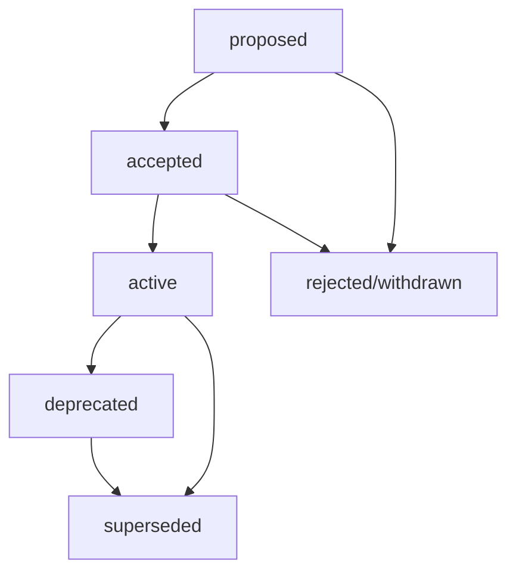

# ADR Status Workflow Management

## MADR 4.0.0 Status Lifecycle for Municipal Portal

This document defines the status workflow for Architecture Decision Records (ADRs) in the adessoCMS municipal portal system, ensuring proper governance and compliance tracking.

## Status Definitions

### 1. `proposed`
**Definition**: Decision is under consideration and review.

**Characteristics**:
- 📋 Document is complete and ready for review
- 👥 Stakeholder review in progress
- 🔍 Technical feasibility assessment ongoing
- ⏳ Approval pending from decision makers
- 🚫 Implementation has NOT started

**Municipal Requirements**:
- Swiss compliance analysis completed
- Multi-municipality impact assessment included
- Accessibility implications documented
- Stakeholder notification sent

**Approval Required From**:
- Technical Lead
- Municipal Representative  
- Compliance Officer (for decisions affecting regulations)
- Accessibility Specialist (for citizen-facing changes)

### 2. `accepted`
**Definition**: Decision approved but implementation not yet started.

**Characteristics**:
- ✅ All required approvals obtained
- 📅 Implementation timeline established
- 💰 Budget/resources allocated
- 📋 Implementation plan documented
- 🚧 Ready to begin implementation

**Municipal Requirements**:
- Municipality rollout sequence confirmed
- Compliance certification timeline established
- Citizen communication plan prepared
- Staff training requirements identified

**Triggers for Transition**:
- All stakeholder approvals received
- Technical feasibility confirmed
- Resource allocation approved
- Implementation timeline agreed

### 3. `active`
**Definition**: Decision implemented and currently in use.

**Characteristics**:
- 🚀 Implementation completed and deployed
- ✅ Validation testing passed
- 📊 Monitoring and metrics in place
- 👥 Users (citizens/staff) actively using solution
- 📈 Performance targets being met

**Municipal Requirements**:
- All municipalities successfully using implementation
- WCAG 2.1 AA compliance verified
- Swiss compliance certifications obtained
- Citizen feedback monitoring active
- Staff training completed

**Monitoring Requirements**:
- Performance metrics tracking
- Accessibility compliance monitoring
- Citizen satisfaction measurement
- Municipal staff feedback collection
- Security and compliance auditing

### 4. `deprecated`
**Definition**: Decision no longer recommended for new implementations.

**Characteristics**:
- ⚠️ Better alternatives now available
- 🔄 Replacement solution exists
- 📉 Performance or compliance issues identified
- 🛠️ Maintenance becoming problematic
- 🕐 Sunset timeline established

**Municipal Requirements**:
- Citizen impact assessment completed
- Migration timeline for affected municipalities
- Communication plan for stakeholders
- Training plan for replacement solution
- Data migration and compliance verification

**Deprecation Process**:
1. Announce deprecation with timeline
2. Document replacement solution
3. Create migration guide
4. Support existing implementations during transition
5. Monitor adoption of replacement solution

### 5. `superseded`
**Definition**: Decision replaced by a newer ADR.

**Characteristics**:
- 🔄 Replaced by specific newer ADR
- 📚 Historical reference maintained
- 🔗 Clear linkage to replacement decision
- 📊 Lessons learned documented
- ❌ No longer influences new implementations

**Municipal Requirements**:
- All municipalities migrated to new solution
- Historical compliance records maintained
- Citizen-facing services updated
- Documentation updated to reference new ADR
- Knowledge transfer completed

**Supersession Requirements**:
- Replacement ADR must be in `accepted` or `active` status
- Migration path documented in both ADRs
- Stakeholder notification completed
- Compliance continuity verified

## Workflow Transitions



### Transition Rules

#### `proposed` → `accepted`
**Required**:
- [ ] All stakeholder approvals obtained
- [ ] Swiss compliance analysis approved
- [ ] Technical feasibility confirmed
- [ ] Resource allocation approved
- [ ] Municipal impact assessment accepted
- [ ] Implementation timeline established

**Approval Matrix**:
| Decision Type | Technical Lead | Municipal Rep | Compliance Officer | Accessibility Specialist |
|--------------|----------------|---------------|-------------------|-------------------------|
| Infrastructure | Required | Required | - | - |
| Citizen-Facing | Required | Required | Required | Required |
| Compliance | Required | Required | Required | - |
| Content/Editorial | Required | Required | - | Recommended |

#### `accepted` → `active`
**Required**:
- [ ] Implementation completed
- [ ] All validation tests passed
- [ ] Swiss compliance verified
- [ ] Municipal deployment successful
- [ ] Performance targets met
- [ ] User acceptance testing completed

**Municipal Validation**:
- [ ] Thalwil deployment verified
- [ ] Thalheim deployment verified  
- [ ] Erlenbach deployment verified
- [ ] Accessibility testing passed
- [ ] Multilingual functionality verified
- [ ] Performance monitoring active

#### `active` → `deprecated`
**Required**:
- [ ] Replacement solution identified
- [ ] Deprecation timeline established
- [ ] Migration plan documented
- [ ] Stakeholder notification sent
- [ ] Impact assessment completed

**Municipal Considerations**:
- [ ] Citizen communication plan
- [ ] Municipal staff retraining plan
- [ ] Service continuity guaranteed
- [ ] Compliance transition verified

#### `active/deprecated` → `superseded`
**Required**:
- [ ] Replacement ADR in `accepted` or `active` status
- [ ] Migration completed or timeline established
- [ ] All references updated
- [ ] Knowledge transfer completed
- [ ] Historical compliance maintained

## Status Management Tools

### ADR Status Checker Script

Create validation script to verify status transitions:

```bash
#!/bin/bash
# .claude/scripts/adr-status-check.sh

check_adr_status() {
    local adr_file="$1"
    local current_status=$(grep "Status:" "$adr_file" | cut -d: -f2 | tr -d ' ')
    
    echo "Checking ADR status: $current_status"
    
    case "$current_status" in
        "proposed")
            check_proposed_requirements "$adr_file"
            ;;
        "accepted")
            check_accepted_requirements "$adr_file"
            ;;
        "active")
            check_active_requirements "$adr_file"
            ;;
        "deprecated")
            check_deprecated_requirements "$adr_file"
            ;;
        "superseded")
            check_superseded_requirements "$adr_file"
            ;;
        *)
            echo "ERROR: Invalid status: $current_status"
            return 1
            ;;
    esac
}

check_proposed_requirements() {
    echo "Validating proposed ADR requirements..."
    # Check for required sections
    # Validate stakeholder list
    # Verify compliance analysis
}

# Usage: ddev exec .claude/scripts/adr-status-check.sh path/to/adr.md
```

### Status Transition Hooks

Integration points for automation:

```javascript
// .claude/hooks/adr-status-hooks.js

const statusTransitionHooks = {
  onProposedToAccepted: async (adrFile) => {
    // Send notifications to stakeholders
    // Create implementation timeline
    // Update project tracking
  },
  
  onAcceptedToActive: async (adrFile) => {
    // Activate monitoring
    // Send deployment notifications  
    // Update compliance tracking
  },
  
  onActiveToDeprecated: async (adrFile) => {
    // Send deprecation notices
    // Create migration timeline
    // Update documentation
  },
  
  onSuperseded: async (adrFile, replacementAdr) => {
    // Update cross-references
    // Archive old implementation
    // Transfer monitoring
  }
};
```

## Municipal Governance Integration

### Stakeholder Notification Matrix

| Status Change | Citizens | Municipal Staff | Developers | Compliance | External Partners |
|--------------|----------|----------------|------------|------------|-------------------|
| `proposed` → `accepted` | - | ✅ | ✅ | ✅ | ✅ |
| `accepted` → `active` | ✅ | ✅ | ✅ | ✅ | ✅ |
| `active` → `deprecated` | ✅ | ✅ | ✅ | ✅ | ✅ |
| `active` → `superseded` | ✅ | ✅ | ✅ | ✅ | ✅ |

### Compliance Checkpoints

#### WCAG 2.1 AA Accessibility
- **`proposed`**: Accessibility impact analysis
- **`accepted`**: Accessibility implementation plan
- **`active`**: Accessibility compliance verification
- **`deprecated`**: Accessibility continuity plan

#### Swiss Data Protection (CH-DSG)
- **`proposed`**: Privacy impact assessment
- **`accepted`**: Data protection implementation plan
- **`active`**: Compliance monitoring active
- **`deprecated`**: Data migration compliance plan

#### E-Government Standards (eCH-0059)
- **`proposed`**: Standards compliance analysis
- **`accepted`**: Certification timeline established
- **`active`**: Standards compliance verified
- **`deprecated`**: Standards continuity maintained

## Quality Gates

### Proposed → Accepted
- [ ] All template sections completed
- [ ] Swiss compliance analysis approved
- [ ] Multi-municipality impact documented
- [ ] Technical feasibility confirmed
- [ ] Resource requirements approved
- [ ] Stakeholder approvals obtained

### Accepted → Active  
- [ ] Implementation completed
- [ ] All municipalities deployed
- [ ] Performance targets met
- [ ] Accessibility testing passed
- [ ] Swiss compliance verified
- [ ] User acceptance completed

### Active → Deprecated
- [ ] Replacement solution available
- [ ] Migration timeline established
- [ ] Impact assessment completed
- [ ] Stakeholder communication sent
- [ ] Compliance transition planned

### Deprecated/Active → Superseded
- [ ] All implementations migrated
- [ ] Documentation updated
- [ ] Cross-references updated
- [ ] Knowledge transfer completed
- [ ] Historical compliance maintained

---

**Workflow Version**: MADR 4.0.0  
**Municipal Portal Version**: {current-version}  
**Last Updated**: 2025-01-09  
**Next Review**: 2025-04-09  
**Maintainer**: Municipal Portal Governance Team  