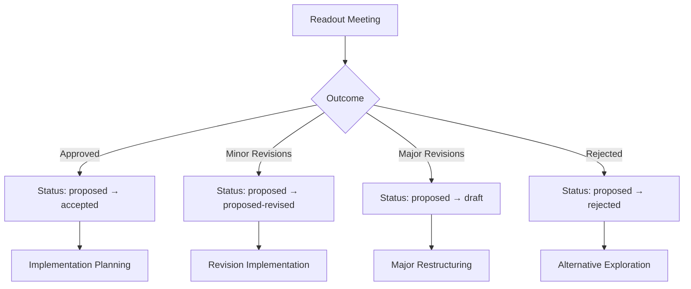

# Collaborative ADR Readout Meeting Framework

## MADR 4.0.0 Readout Meeting System for Municipal Portal

This framework establishes structured, time-efficient readout meetings for Architecture Decision Records (ADRs) in the adessoCMS municipal portal system, ensuring effective stakeholder collaboration while maintaining Swiss government compliance requirements.

## Meeting Structure Framework

### Core Principles

**Time Efficiency**: 10-15 minute focused sessions  
**Written First**: All feedback captured in structured formats  
**Cross-Functional**: <10 participants with defined roles  
**Decision-Oriented**: Clear outcomes and action items  
**Compliance-Integrated**: Swiss municipal requirements built-in  

### Standard Meeting Template

```
ADR Readout Meeting: {ADR-XXX: Title}
Duration: 10-15 minutes
Date: {YYYY-MM-DD}
Facilitator: {Name}

Participants:
- Technical Lead: {Name}
- Municipal Representative: {Name}
- Compliance Officer: {Name}
- Accessibility Specialist: {Name}
- [Additional stakeholders as needed]

Pre-Reading Required:
- ADR Document (5-7 min read time)
- Municipal Impact Summary (2-3 min read time)
- Compliance Checklist (1-2 min read time)

Meeting Agenda:
1. Context Summary (2 min) - Facilitator
2. Decision Overview (3 min) - Technical Lead
3. Municipal Impact Review (3 min) - Municipal Rep
4. Compliance Check (2 min) - Compliance Officer
5. Stakeholder Concerns (3 min) - All participants
6. Decision & Next Steps (2 min) - Facilitator

Written Feedback Collection: Live Google Doc/Confluence
```

## Pre-Meeting Preparation Templates

### ADR Pre-Reading Package

**Document Structure:**
```markdown
# ADR-{XXX} Readout Package
**Estimated Reading Time**: 8-10 minutes total

## Executive Summary (2 min read)
- Problem Statement: {One sentence problem}
- Proposed Solution: {One sentence solution}
- Municipal Impact: {High/Medium/Low + key points}
- Compliance Status: {Compliant/Needs Review/Non-Compliant}
- Resource Requirements: {Timeline, budget, staff}

## Decision Context (3 min read)
[Condensed version of ADR context section]

## Implementation Impact (2 min read)
### Multi-Municipality Rollout
- Thalwil: {Specific impact}
- Thalheim: {Specific impact}
- Erlenbach: {Specific impact}

### Citizen Service Impact
- Service Changes: {What citizens will experience}
- Accessibility: {WCAG 2.1 AA compliance status}
- Languages: {German/French/Italian impact}

## Swiss Compliance Quick Check (1 min read)
- ✅/❌ WCAG 2.1 AA Accessibility
- ✅/❌ CH-DSG Data Protection
- ✅/❌ eCH-0059 E-Government Standards
- ✅/❌ Multilingual Requirements

## Discussion Questions (2 min read)
1. {Specific question about technical approach}
2. {Municipal process integration question}
3. {Compliance or risk question}
4. {Resource or timeline question}
```

### Stakeholder Notification Template

```markdown
Subject: ADR Readout Meeting - {ADR Title} - {Date/Time}

Dear Municipal Portal Stakeholders,

You are invited to participate in a collaborative review of Architecture Decision Record ADR-{XXX}: {Title}.

Meeting Details:
- Date/Time: {DateTime}
- Duration: 10-15 minutes
- Location: {Meeting room/Zoom link}
- Facilitator: {Name}

Pre-Meeting Requirements (8-10 min reading):
- Please review the attached ADR Pre-Reading Package
- Complete the Stakeholder Input Form by {deadline}
- Identify any blocking concerns or questions

Your Role in This Decision:
- {Personalized role description}
- {Specific expertise needed}
- {Decision authority level}

Agenda Focus:
- Municipal impact assessment
- Swiss compliance verification
- Cross-functional integration concerns
- Resource and timeline validation

If you cannot attend, please submit written feedback via the Stakeholder Input Form.

Prepared by: ADR Reviewer Agent
Municipal Portal Governance Team
```

## Meeting Facilitation Guides

### Facilitator Preparation Checklist

**24 Hours Before Meeting:**
- [ ] ADR document finalized and distributed
- [ ] Pre-reading package created and sent
- [ ] Stakeholder input forms distributed
- [ ] Meeting room/technology tested
- [ ] Backup facilitator identified
- [ ] Decision authority confirmed

**30 Minutes Before Meeting:**
- [ ] Review submitted stakeholder input forms
- [ ] Prepare discussion priorities based on feedback
- [ ] Set up collaborative writing tool (shared doc)
- [ ] Test screen sharing for ADR presentation
- [ ] Review municipal compliance requirements

**During Meeting Responsibilities:**
- Time management (strict 15-minute limit)
- Ensure all voices heard (especially compliance/accessibility)
- Capture decisions and action items in real-time
- Redirect detailed technical discussions to follow-up
- Maintain focus on decision outcome

### Meeting Flow Scripts

#### Opening (1 minute)
```
"Welcome to the ADR readout for {Title}. We have 10-15 minutes to review this architectural decision and reach a clear outcome. 

Everyone should have read the pre-reading package. Our focus today is on:
1. Municipal impact validation
2. Swiss compliance verification  
3. Cross-functional concerns
4. Decision approval or revision needs

Let's start with context."
```

#### Context Summary (2 minutes)
```
"[Technical Lead], please provide a 2-minute overview of:
- The problem we're solving
- The proposed solution
- Key trade-offs considered
- Implementation timeline

Focus on aspects that affect our municipalities and citizen services."
```

#### Municipal Impact Review (3 minutes)
```
"[Municipal Representative], please address:
- Impact on Thalwil, Thalheim, and Erlenbach portals
- Changes to citizen-facing services
- Municipal staff workflow implications
- Public communication requirements

Are there any municipal-specific concerns not addressed in the ADR?"
```

#### Compliance Check (2 minutes)
```
"[Compliance Officer], please confirm:
- WCAG 2.1 AA accessibility compliance status
- CH-DSG data protection requirements
- eCH-0059 e-government standards alignment
- Any regulatory risks or certification needs"
```

#### Stakeholder Concerns (3 minutes)
```
"Open floor for concerns, questions, or suggestions. Please focus on:
- Blocking issues that prevent approval
- Missing stakeholder considerations
- Resource or timeline concerns
- Integration risks

If it's a detailed technical discussion, we'll schedule a follow-up."
```

#### Decision & Next Steps (2 minutes)
```
"Based on our discussion, the decision is:
- [ ] Approved as-is - moving to 'accepted' status
- [ ] Approved with minor revisions - {specify revisions}
- [ ] Requires major revision - {specify requirements}
- [ ] Rejected - {specify reasons}

Next steps:
- {Specific actions}
- {Responsible parties}
- {Timeline}
- {Follow-up meeting if needed}"
```

## Written Feedback Collection Framework

### Live Collaborative Document Template

```markdown
# ADR-{XXX} Readout Meeting - Live Feedback

## Meeting Information
Date: {YYYY-MM-DD}
Time: {HH:MM-HH:MM}
Facilitator: {Name}
ADR Status: {proposed/accepted/etc.}

## Participants & Roles
| Name | Role | Decision Authority |
|------|------|-------------------|
| {Name} | Technical Lead | Implementation approval |
| {Name} | Municipal Rep | Service impact approval |
| {Name} | Compliance Officer | Regulatory approval |
| {Name} | Accessibility Specialist | WCAG compliance |

## Real-Time Discussion Capture

### Technical Concerns
- [ ] {Concern 1} - Raised by: {Name} - Status: {Open/Resolved}
- [ ] {Concern 2} - Raised by: {Name} - Status: {Open/Resolved}

### Municipal Impact Issues
- [ ] {Issue 1} - Raised by: {Name} - Action: {Required action}
- [ ] {Issue 2} - Raised by: {Name} - Action: {Required action}

### Compliance Questions
- [ ] {Question 1} - Raised by: {Name} - Answer: {Response}
- [ ] {Question 2} - Raised by: {Name} - Answer: {Response}

### Resource & Timeline Feedback
- [ ] {Feedback 1} - Impact: {High/Medium/Low}
- [ ] {Feedback 2} - Impact: {High/Medium/Low}

## Decision Outcome
**Status Change**: {proposed} → {accepted/needs-revision/rejected}
**Rationale**: {Brief explanation of decision}
**Conditions**: {Any conditions for approval}

## Action Items
| Action | Responsible | Deadline | Status |
|--------|------------|----------|--------|
| {Action 1} | {Name} | {Date} | Open |
| {Action 2} | {Name} | {Date} | Open |

## Follow-Up Requirements
- [ ] ADR document updates needed: {Yes/No}
- [ ] Additional stakeholder consultation: {Yes/No}
- [ ] Compliance verification required: {Yes/No}
- [ ] Technical validation needed: {Yes/No}
- [ ] Municipal approval process: {Yes/No}

## Post-Meeting Actions
- [ ] Update ADR status in document
- [ ] Send meeting summary to all stakeholders
- [ ] Schedule follow-up meetings if needed
- [ ] Update project tracking systems
- [ ] Notify affected teams of decision
```

### Asynchronous Stakeholder Input Form

```markdown
# Stakeholder Input Form - ADR-{XXX}

**Your Information:**
- Name: {Name}
- Role: {Title/Department}
- Stakeholder Type: {Citizens|Municipal Officials|Developers|Compliance|External Partners}
- Review Deadline: {YYYY-MM-DD}

**Pre-Reading Confirmation:**
- [ ] I have read the ADR document (estimated 5-7 minutes)
- [ ] I have reviewed the Municipal Impact Summary (2-3 minutes)
- [ ] I have checked the Compliance Checklist (1-2 minutes)

**Technical Assessment:**
Rate your confidence in the technical approach: {1-5 scale}
Comments: {Free text}

**Municipal Impact Assessment:**
Rate the municipal impact analysis completeness: {1-5 scale}
Missing considerations: {Free text}
Citizen service concerns: {Free text}

**Swiss Compliance Review:**
- WCAG 2.1 AA Accessibility: {Compliant|Concerns|Needs Review}
- CH-DSG Data Protection: {Compliant|Concerns|Needs Review}
- eCH-0059 E-Government: {Compliant|Concerns|Needs Review}
Comments: {Free text}

**Resource & Timeline Feedback:**
Are the proposed resources realistic? {Yes|No|Uncertain}
Is the timeline achievable? {Yes|No|Uncertain}
Comments: {Free text}

**Key Concerns or Questions:**
1. {Specific concern or question}
2. {Specific concern or question}
3. {Additional concerns}

**Decision Recommendation:**
- [ ] Approve as proposed
- [ ] Approve with minor revisions (specify below)
- [ ] Requires major revision (specify below)
- [ ] Reject (specify reasons below)

**Additional Comments:**
{Free text for any additional feedback}

**Attendance Confirmation:**
- [ ] I will attend the readout meeting
- [ ] I cannot attend but submit this written feedback
- [ ] I delegate my input to: {Name}
```

## Cross-Functional Participation Protocols

### Optimal Participation Matrix

**Core Participants (Always Required):**
- Technical Lead (Implementation authority)
- Municipal Representative (Service impact authority)
- ADR Author/Architect (Decision context)
- Facilitator (Process management)

**Compliance Participants (Required for citizen-facing changes):**
- Compliance Officer (Regulatory authority)
- Accessibility Specialist (WCAG 2.1 AA authority)
- Data Protection Officer (Privacy authority)

**Domain Participants (As needed):**
- UX Designer (Citizen experience impact)
- Content Manager (Editorial workflow impact)
- System Administrator (Infrastructure impact)
- External Partners (Integration dependencies)

### Stakeholder Engagement Rules

#### Municipal Officials
- **Authority**: Service definition and citizen impact approval
- **Input Required**: Operational workflow changes, public communication needs
- **Decision Power**: Can block decisions affecting citizen services
- **Preparation**: Municipal impact assessment review

#### Citizens (Representative Groups)
- **Authority**: Advisory input on service usability
- **Input Required**: For major citizen-facing changes
- **Decision Power**: Consultative, not blocking
- **Preparation**: Citizen impact summary (non-technical)

#### Developers
- **Authority**: Technical feasibility and implementation approach
- **Input Required**: Architecture, security, performance implications
- **Decision Power**: Can block technically unfeasible decisions
- **Preparation**: Technical implementation review

#### Compliance Officers
- **Authority**: Regulatory compliance and legal requirements
- **Input Required**: GDPR, accessibility, security, e-government standards
- **Decision Power**: Can block non-compliant decisions
- **Preparation**: Compliance checklist validation

### Conflict Resolution Framework

#### Stakeholder Priority Matrix
```
High Priority (Can Block Decisions):
1. Legal/Compliance violations
2. Citizen service disruptions
3. Technical infeasibility
4. Budget/resource unavailability

Medium Priority (Require Discussion):
1. Municipal workflow changes
2. Performance implications
3. User experience concerns
4. Integration complexity

Low Priority (Noted but Not Blocking):
1. Aesthetic preferences
2. Nice-to-have features
3. Long-term optimization
4. Developer convenience
```

#### Resolution Process
1. **Identify Conflict Level**: High/Medium/Low priority
2. **Stakeholder Position Clarification**: Each party states position clearly
3. **Impact Assessment**: Quantify consequences of each position
4. **Alternative Exploration**: Seek compromise solutions
5. **Escalation Path**: Municipal leadership, technical architecture board
6. **Decision Timeline**: Maximum 48 hours for resolution

## Meeting Outcome Integration

### Status Transition Mapping



### Post-Meeting Actions Automation

```javascript
// Integration hook for meeting outcomes
const readoutMeetingHooks = {
  onMeetingComplete: async (meetingData) => {
    const { adrId, outcome, actionItems, participants } = meetingData;
    
    // Update ADR status based on outcome
    await updateADRStatus(adrId, outcome.newStatus);
    
    // Send notifications to stakeholders
    await notifyStakeholders(participants, outcome);
    
    // Create action item tracking
    await createActionItems(actionItems);
    
    // Update municipal project tracking
    await updateMunicipalTracking(adrId, outcome);
    
    // Schedule follow-up meetings if needed
    if (outcome.requiresFollowUp) {
      await scheduleFollowUpMeeting(adrId, outcome.followUpType);
    }
  },
  
  onDecisionApproved: async (adrData) => {
    // Activate monitoring for implementation
    await activateImplementationTracking(adrData.id);
    
    // Update compliance tracking systems
    await updateComplianceStatus(adrData.complianceRequirements);
    
    // Notify municipal stakeholders of approved changes
    await sendMunicipalNotifications(adrData.municipalImpact);
  }
};
```

## Municipal Portal Integration

### Canton Zürich Specific Adaptations

#### Stakeholder Identification Patterns
```markdown
# Canton Zürich Stakeholder Matrix

## Primary Stakeholders
- **Municipal Council Representatives**: Policy and budget approval
- **Citizen Services Coordinators**: Service delivery impact
- **IT Department Heads**: Technical feasibility and resources
- **Accessibility Coordinators**: WCAG compliance verification
- **Data Protection Officers**: CH-DSG compliance oversight

## Secondary Stakeholders  
- **Citizen Representative Groups**: Service usability feedback
- **Municipal Staff Users**: Daily workflow impact assessment
- **Regional IT Coordinators**: Canton-wide integration requirements
- **External Service Providers**: Integration and dependency management

## Consultation Requirements
- **Public Transparency**: Major citizen-facing changes require public notification
- **Municipal Board Approval**: Budget implications >CHF X require formal approval
- **Accessibility Review**: All interface changes require accessibility validation
- **Data Protection Impact Assessment**: Data handling changes require DPIA
```

#### Multilingual Meeting Support
```markdown
# Multilingual Meeting Protocol

## Language Support Requirements
- **Primary Language**: German (Standard High German)
- **Secondary Languages**: French, Italian (as needed)
- **Translation Support**: Professional interpreters for complex decisions
- **Documentation Languages**: All critical documents in German + French

## Meeting Adaptations
- **Extended Time**: +5 minutes for translation when needed
- **Simplified Language**: Technical terms explained in plain language
- **Cultural Considerations**: Decision-making style adaptations
- **Written Summaries**: Always provided in participant's preferred language
```

## Quality Metrics & Continuous Improvement

### Meeting Effectiveness Metrics

**Quantitative Measures:**
- Meeting duration adherence (target: 10-15 minutes)
- Decision outcome rate (target: >90% clear decisions)
- Stakeholder attendance rate (target: >85%)
- Pre-reading completion rate (target: >80%)
- Action item completion rate (target: >95%)

**Qualitative Measures:**
- Stakeholder satisfaction surveys (monthly)
- Decision quality assessment (post-implementation review)
- Municipal compliance achievement rate
- Conflict resolution effectiveness
- Communication clarity ratings

### Continuous Improvement Process

**Monthly Review Cycle:**
- Meeting effectiveness analysis
- Stakeholder feedback integration
- Template and process updates
- Compliance requirement updates
- Technology and tool improvements

**Quarterly Adaptation:**
- Municipal requirement changes integration
- Swiss regulatory compliance updates
- Stakeholder participation pattern analysis
- Decision quality outcome assessment
- Process optimization based on lessons learned

---

**Framework Version**: MADR 4.0.0 Collaborative  
**Municipal Portal Compatibility**: adessoCMS Swiss Municipal Portal  
**Last Updated**: 2025-01-09  
**Next Review**: 2025-04-09  
**Maintainer**: Municipal Portal Governance Team  
**Approval**: ADR Reviewer Agent, Drupal Plan Reviewer Agent