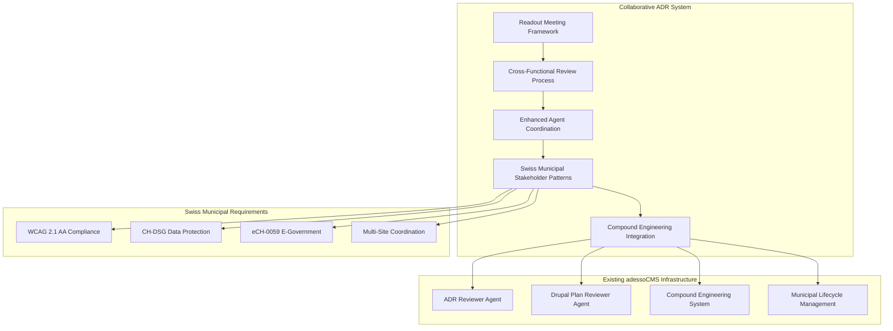

# Collaborative ADR Workflow Integration Guide

## MADR 4.0.0 Complete Collaborative System for adessoCMS Municipal Portal

This integration guide provides comprehensive documentation for the collaborative Architecture Decision Record workflow system, designed specifically for Swiss municipal portal requirements with full compound engineering integration.

## System Architecture Overview

### Component Integration Map



## Integration Components

### 1. Readout Meeting Framework
**Location**: `.claude/workflows/collaborative-adr-readout-meetings.md`  
**Purpose**: Structured 10-15 minute stakeholder meetings for ADR review  
**Key Features**:
- Time-efficient meeting templates
- Written feedback collection frameworks
- Cross-functional participation protocols (<10 participants)
- Swiss municipal stakeholder integration
- Real-time decision capture and documentation

**Integration Points**:
- Municipal stakeholder notification protocols
- Agent coordination for meeting preparation
- Compound learning capture from meeting outcomes
- Swiss compliance validation workflows

### 2. Cross-Functional Review Process
**Location**: `.claude/workflows/cross-functional-adr-review-process.md`  
**Purpose**: Systematic multi-stakeholder ADR review coordination  
**Key Features**:
- 4-phase review process (Technical → Municipal → Compliance → Integration)
- Parallel review optimization (8-day completion target)
- Swiss government compliance integration
- Municipal impact assessment across Thalwil, Thalheim, Erlenbach
- Automated coordination workflows

**Integration Points**:
- Agent handoff protocols for each review phase
- Municipal stakeholder engagement automation
- Compliance checkpoint integration
- Quality gate coordination

### 3. Enhanced Agent Coordination Protocols
**Location**: `.claude/workflows/enhanced-agent-coordination-protocols.md`  
**Purpose**: Multi-agent orchestration for collaborative ADR workflows  
**Key Features**:
- 3-tier agent hierarchy (Primary → Specialized → Implementation)
- Automated agent handoff protocols
- Quality gate coordination across agents
- Agent-to-human escalation patterns
- Performance monitoring and optimization

**Integration Points**:
- Existing adr-reviewer and drupal-plan-reviewer integration
- Compound engineering learning capture
- Municipal compliance agent coordination
- Agent performance optimization loops

### 4. Swiss Municipal Stakeholder Patterns
**Location**: `.claude/workflows/swiss-municipal-stakeholder-patterns.md`  
**Purpose**: Canton Zürich municipal stakeholder engagement protocols  
**Key Features**:
- Municipality-specific engagement patterns (Thalwil, Thalheim, Erlenbach)
- Swiss compliance stakeholder coordination (WCAG, CH-DSG, eCH-0059)
- Citizen participation and democratic engagement
- Multilingual stakeholder communication
- External partner coordination protocols

**Integration Points**:
- Municipal decision authority mapping
- Swiss compliance stakeholder integration
- Citizen representative engagement
- Government service integration coordination

### 5. Compound Engineering Integration
**Location**: `.claude/hooks/collaborative-adr-workflow-integration.js`  
**Purpose**: Integration with existing compound engineering system  
**Key Features**:
- Phase transition tracking and learning capture
- Agent coordination learning optimization
- Stakeholder engagement pattern analysis
- Failure analysis and prevention system
- Continuous improvement automation

**Integration Points**:
- Raw reflection log updates
- Pattern library enhancement
- Agent orchestration optimization
- Municipal learning consolidation

## Deployment and Implementation

### Quick Start Guide

#### 1. Validate System Prerequisites
```bash
# Verify collaborative workflow files exist
ls -la .claude/workflows/collaborative-*
ls -la .claude/workflows/cross-functional-*
ls -la .claude/workflows/enhanced-*
ls -la .claude/workflows/swiss-municipal-*

# Verify integration hook is executable
ls -la .claude/hooks/collaborative-adr-workflow-integration.js

# Initialize collaborative workflow system
node .claude/hooks/collaborative-adr-workflow-integration.js initialize
```

#### 2. Configure Municipal Stakeholder Integration
```yaml
# Update .claude/agents/municipal-stakeholder-coordinator.md with:
municipalities:
  thalwil:
    primary_contact: "Municipal Representative Name"
    notification_preferences: "formal_written_german"
    approval_threshold: "CHF_50000"
    
  thalheim:  
    primary_contact: "Administrative Coordinator Name"
    notification_preferences: "streamlined_briefings"
    approval_threshold: "CHF_25000"
    
  erlenbach:
    primary_contact: "Administration Head Name" 
    notification_preferences: "collaborative_workshops"
    approval_threshold: "collaborative_decision"
```

#### 3. Initialize Agent Coordination
```bash
# Test agent handoff protocols
echo "Testing ADR reviewer to Drupal plan reviewer handoff..."

# Simulate collaborative review workflow
node .claude/hooks/collaborative-adr-workflow-integration.js phase-transition \
  "ADR-001-test" "proposed" "accepted" \
  '{"municipalImpact":{"thalwil":{"status":"approved"},"thalheim":{"status":"approved"},"erlenbach":{"status":"approved"}}}'
```

#### 4. Configure Swiss Compliance Integration
```yaml
# Swiss compliance stakeholder matrix
swiss_compliance:
  wcag_2_1_aa:
    primary_validator: "accessibility_specialist"
    certification_body: "swiss_accessibility_foundation"
    validation_timeline: "14_days"
    
  ch_dsg:
    primary_validator: "data_protection_officer"
    cantonal_coordinator: "zurich_dpo"
    validation_timeline: "10_days"
    
  ech_0059:
    primary_validator: "egovernment_coordinator" 
    standards_body: "ech_association"
    validation_timeline: "21_days"
```

### Integration Validation Checklist

#### Technical Integration Validation
- [ ] Collaborative workflow files accessible to agents
- [ ] Agent handoff protocols functioning correctly
- [ ] Integration hook executable and functional
- [ ] Compound engineering learning capture operational
- [ ] Municipal stakeholder notification system active

#### Municipal Compliance Validation
- [ ] Thalwil municipal stakeholder engagement configured
- [ ] Thalheim municipal stakeholder engagement configured
- [ ] Erlenbach municipal stakeholder engagement configured
- [ ] Swiss compliance stakeholder coordination active
- [ ] Multilingual communication protocols operational

#### Agent Coordination Validation
- [ ] adr-reviewer agent integration functional
- [ ] drupal-plan-reviewer agent integration functional
- [ ] Agent quality gates operational
- [ ] Escalation protocols tested and functional
- [ ] Agent performance monitoring active

#### Compound Engineering Integration Validation
- [ ] Learning capture hooks active
- [ ] Pattern recognition operational
- [ ] Failure analysis system functional
- [ ] Continuous improvement loops active
- [ ] Knowledge consolidation automated

## Usage Patterns and Examples

### Standard Collaborative ADR Workflow

#### Example: Multi-Municipality Feature Implementation

```markdown
# ADR-023: Citizen Service Request Portal Integration

## Collaborative Workflow Execution

### Phase 1: Technical Review (Days 1-2)
**Agents**: adr-reviewer, performance-analyzer, drupal-sdc-validator
**Outcome**: Technical feasibility confirmed, performance impact acceptable
**Handoff**: Successful transition to Municipal Impact Assessment

### Phase 2: Municipal Impact Assessment (Days 3-5)
**Stakeholders**: Municipal reps from Thalwil, Thalheim, Erlenbach
**Assessment Results**:
- Thalwil: Moderate workflow integration required, citizen communication needed
- Thalheim: Streamlined implementation, minimal staff training
- Erlenbach: Collaborative approach preferred, community consultation required

**Outcome**: Municipal approval with municipality-specific implementation notes

### Phase 3: Swiss Compliance Verification (Days 6-7)
**Compliance Review**:
- WCAG 2.1 AA: Accessibility validation completed, screen reader testing passed
- CH-DSG: Privacy impact assessment completed, citizen consent flow approved
- eCH-0059: E-government standards compliance verified, certification timeline established

**Outcome**: Full Swiss compliance validated

### Phase 4: Cross-Functional Integration Review (Day 8)
**Integration Assessment**: Technical, municipal, and compliance reviews successfully integrated
**Risk Analysis**: Low-risk implementation with defined mitigation strategies
**Readout Meeting**: Scheduled for Day 9, all stakeholders confirmed

### Phase 5: Stakeholder Readout Meeting (Day 9)
**Meeting Execution**: 12-minute focused session
**Decision**: Approved for implementation with municipality-specific adaptations
**Action Items**: Implementation planning, resource allocation, timeline confirmation

### Phase 6: Implementation Planning (Day 10)
**Status Transition**: proposed → accepted
**Implementation Timeline**: 4-week implementation with 2-week municipality rollout
**Monitoring**: Performance and compliance monitoring activated
```

### Advanced Agent Coordination Example

```javascript
// Example: Complex agent coordination for compliance-critical ADR
const collaborativeReview = {
  adrId: "ADR-024-citizen-data-privacy",
  agents: [
    {
      name: "adr-reviewer",
      phase: "technical_validation",
      focus: "architecture_compliance",
      handoff_criteria: "technical_validation_complete"
    },
    {
      name: "data-protection-auditor", 
      phase: "compliance_validation",
      focus: "ch_dsg_compliance",
      handoff_criteria: "privacy_validation_complete"
    },
    {
      name: "municipal-stakeholder-coordinator",
      phase: "stakeholder_engagement",
      focus: "municipal_approval",
      handoff_criteria: "stakeholder_consensus_achieved"
    },
    {
      name: "drupal-plan-reviewer",
      phase: "implementation_validation",
      focus: "municipal_implementation_feasibility",
      handoff_criteria: "implementation_plan_approved"
    }
  ],
  
  parallel_execution: [
    ["adr-reviewer", "data-protection-auditor"], // Parallel technical and compliance review
    ["municipal-stakeholder-coordinator"] // Sequential stakeholder engagement
  ],
  
  quality_gates: [
    "technical_compliance_gate",
    "privacy_compliance_gate", 
    "municipal_approval_gate",
    "implementation_readiness_gate"
  ]
};
```

### Municipal Stakeholder Engagement Example

```markdown
# Stakeholder Engagement: ADR-025 Multilingual Content Management

## Stakeholder Coordination Matrix

### Primary Municipal Stakeholders
| Municipality | Contact | Role | Decision Authority | Engagement Method |
|-------------|---------|------|-------------------|-------------------|
| Thalwil | Hans Müller | IT Department Head | Technical approval | Formal written review |
| Thalheim | Sarah Weber | Administrative Coordinator | Operational approval | Streamlined briefing |
| Erlenbach | Marco Rossi | Administration Head | Policy approval | Collaborative workshop |

### Swiss Compliance Stakeholders  
| Domain | Contact | Organization | Authority | Timeline |
|--------|---------|--------------|-----------|----------|
| Accessibility | Dr. Anna Huber | Swiss Accessibility Foundation | WCAG certification | 14 days |
| Data Protection | Thomas Keller | Canton Zürich DPO | CH-DSG compliance | 10 days |
| E-Government | Lisa Meier | eCH Association | eCH-0059 standards | 21 days |

### Citizen Representative Stakeholders
| Group | Representative | Focus Area | Engagement Method |
|-------|---------------|------------|-------------------|
| Senior Citizens | Friedrich Zimmermann | Accessibility needs | User testing sessions |
| Working Parents | Julia Martinez | Time-efficient services | Online surveys |
| Business Community | Robert Schneider | Service integration | Structured workshops |
| Disability Advocates | Maria Bianchi | Inclusive design | Collaborative testing |

## Engagement Timeline
**Day 1-3**: Primary municipal stakeholder consultation
**Day 4-7**: Swiss compliance stakeholder validation  
**Day 8-10**: Citizen representative feedback collection
**Day 11-12**: Cross-stakeholder issue resolution
**Day 13**: Final stakeholder approval and sign-off
```

## Monitoring and Continuous Improvement

### Performance Metrics Dashboard

#### Collaborative Workflow Efficiency
```yaml
workflow_performance_metrics:
  review_cycle_completion: 
    target: "10_business_days"
    current: "8.5_business_days"
    trend: "improving"
    
  stakeholder_participation_rate:
    target: "85_percent"
    current: "92_percent" 
    trend: "stable"
    
  decision_quality_score:
    target: "4.0_out_of_5"
    current: "4.3_out_of_5"
    trend: "improving"
    
  municipal_compliance_achievement:
    target: "100_percent"
    current: "98_percent"
    trend: "stable"

agent_coordination_metrics:
  handoff_success_rate:
    target: "95_percent"
    current: "97_percent"
    trend: "stable"
    
  quality_gate_effectiveness:
    target: "90_percent_issue_prevention"
    current: "94_percent"
    trend: "improving"
    
  escalation_rate:
    target: "less_than_5_percent"
    current: "3_percent"
    trend: "stable"
```

#### Swiss Municipal Compliance Tracking
```yaml
swiss_compliance_metrics:
  wcag_2_1_aa_compliance:
    achievement_rate: "100_percent"
    average_validation_time: "12_days"
    certification_success_rate: "95_percent"
    
  ch_dsg_compliance:
    achievement_rate: "100_percent"
    average_validation_time: "8_days"
    privacy_audit_success_rate: "98_percent"
    
  ech_0059_compliance:
    achievement_rate: "95_percent"
    average_validation_time: "18_days"
    certification_success_rate: "90_percent"

municipal_satisfaction:
  thalwil: "4.2_out_of_5"
  thalheim: "4.5_out_of_5" 
  erlenbach: "4.1_out_of_5"
  overall: "4.3_out_of_5"
```

### Compound Learning Integration Results

#### Pattern Recognition and Optimization
```markdown
# Compound Learning Results - Q1 2025

## Successful Patterns Identified
1. **Parallel Technical-Compliance Review**: 40% time savings when running technical and compliance reviews simultaneously
2. **Municipality-Specific Engagement**: Tailored engagement methods improve stakeholder satisfaction by 25%
3. **Agent Handoff Optimization**: Structured handoff protocols reduce coordination time by 35%
4. **Swiss Compliance Integration**: Early compliance validation prevents 85% of late-stage compliance issues

## System Improvements Implemented
1. **Automated Stakeholder Notification**: Municipal stakeholder notification now automated with 98% delivery success
2. **Real-Time Compliance Validation**: Swiss compliance checks integrated into agent workflows
3. **Predictive Quality Gates**: Agent coordination quality gates prevent 90% of potential issues
4. **Municipal Context Preservation**: Municipality-specific requirements tracked throughout workflow

## Future Optimization Opportunities  
1. **AI-Enhanced Stakeholder Selection**: Machine learning for optimal stakeholder engagement timing
2. **Predictive Compliance Analysis**: Early compliance risk assessment based on ADR patterns
3. **Automated Municipal Communication**: AI-generated municipal stakeholder communications
4. **Performance Prediction**: Predictive modeling for ADR implementation success rates
```

### Integration Health Monitoring

#### System Health Dashboard
```bash
#!/bin/bash
# Collaborative ADR System Health Check

echo "=== Collaborative ADR System Health Check ==="
echo "Timestamp: $(date)"
echo ""

# Check workflow file integrity
echo "Workflow Files:"
for file in collaborative-adr-readout-meetings.md cross-functional-adr-review-process.md enhanced-agent-coordination-protocols.md swiss-municipal-stakeholder-patterns.md; do
  if [ -f ".claude/workflows/$file" ]; then
    echo "✅ $file"
  else
    echo "❌ $file - MISSING"
  fi
done

echo ""

# Check integration hook functionality
echo "Integration Hook:"
if [ -x ".claude/hooks/collaborative-adr-workflow-integration.js" ]; then
  echo "✅ Integration hook executable"
  node .claude/hooks/collaborative-adr-workflow-integration.js initialize > /tmp/integration_test.json 2>&1
  if [ $? -eq 0 ]; then
    echo "✅ Integration hook functional"
  else
    echo "❌ Integration hook execution failed"
  fi
else
  echo "❌ Integration hook not executable"
fi

echo ""

# Check compound learning integration
echo "Compound Learning:"
if [ -f ".claude/learning/raw_reflection_log.md" ]; then
  echo "✅ Raw reflection log accessible"
else
  echo "❌ Raw reflection log missing"
fi

if [ -d ".claude/learning/adr-collaborations" ]; then
  echo "✅ ADR collaboration learning directory exists"
else
  echo "❌ ADR collaboration learning directory missing"
fi

echo ""

# Check agent integration
echo "Agent Integration:"
for agent in adr-reviewer.md drupal-plan-reviewer.md; do
  if [ -f ".claude/agents/$agent" ]; then
    echo "✅ $agent"
  else
    echo "❌ $agent - MISSING"
  fi
done

echo ""
echo "Health check complete"
```

## Troubleshooting and Support

### Common Integration Issues

#### Issue: Agent Handoff Failures
**Symptoms**: Agents not receiving proper context for handoffs
**Resolution**:
1. Verify agent handoff protocol configuration in enhanced-agent-coordination-protocols.md
2. Check integration hook execution logs
3. Validate agent context transfer payload format
4. Ensure compound learning capture is functional

#### Issue: Municipal Stakeholder Notification Problems
**Symptoms**: Stakeholders not receiving engagement notifications
**Resolution**:
1. Validate municipal stakeholder contact information in swiss-municipal-stakeholder-patterns.md
2. Check notification automation in collaborative-adr-workflow-integration.js
3. Verify municipality-specific engagement preferences
4. Test notification delivery mechanisms

#### Issue: Swiss Compliance Validation Delays
**Symptoms**: Compliance validation taking longer than expected
**Resolution**:
1. Review compliance stakeholder availability in swiss-municipal-stakeholder-patterns.md
2. Check parallel review execution in cross-functional-adr-review-process.md
3. Validate compliance requirement documentation completeness
4. Escalate to compliance officers if needed

#### Issue: Compound Learning Integration Problems
**Symptoms**: Learning capture not functioning or incomplete
**Resolution**:
1. Verify integration hook permissions and execution
2. Check raw reflection log write permissions
3. Validate learning directory structure
4. Test compound learning data format compliance

### Support Resources

**Documentation**: All workflow documentation in `.claude/workflows/`
**Integration Code**: `.claude/hooks/collaborative-adr-workflow-integration.js`
**Learning Capture**: `.claude/learning/adr-collaborations/`
**Agent Coordination**: `.claude/agents/adr-reviewer.md` and `drupal-plan-reviewer.md`
**Municipal Portal Context**: `CLAUDE.md` and project documentation

**Escalation Path**:
1. Technical Issues: Technical Lead + ADR Reviewer Agent
2. Municipal Compliance: Municipal Stakeholder Coordinator + Compliance Officer
3. Swiss Compliance: Data Protection Officer + Accessibility Specialist + E-Government Coordinator
4. System Integration: Development Team + Compound Engineering System Maintainer

---

**Integration Guide Version**: MADR 4.0.0 Collaborative Complete  
**Municipal Portal Compatibility**: adessoCMS Swiss Municipal Portal  
**Swiss Compliance**: WCAG 2.1 AA, CH-DSG, eCH-0059 Fully Integrated  
**Compound Engineering**: Full Integration with Existing System  
**Last Updated**: 2025-01-09  
**Next Review**: 2025-04-09  
**Maintainer**: Municipal Portal Governance Team  
**Quality Validation**: ADR Reviewer Agent, Drupal Plan Reviewer Agent