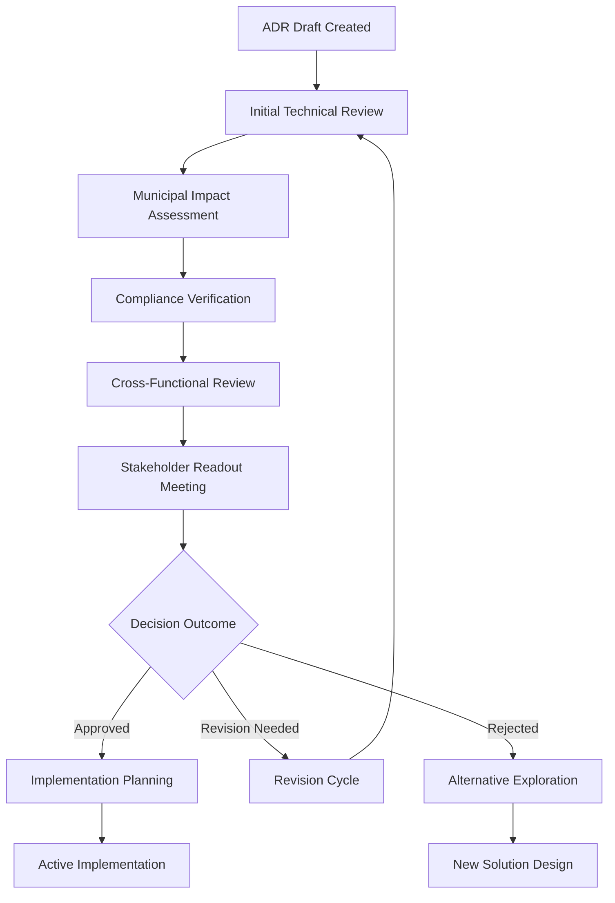

# Cross-Functional ADR Review Process for Swiss Municipal Requirements

## MADR 4.0.0 Multi-Stakeholder Review Coordination

This document establishes the systematic multi-stakeholder ADR review workflow specifically designed for Swiss municipal portal requirements, ensuring comprehensive evaluation across technical, municipal, compliance, and citizen service dimensions.

## Process Overview

### Core Principles

**Swiss Government Compliance**: Built-in compliance with WCAG 2.1 AA, CH-DSG, and eCH-0059  
**Multi-Municipality Coordination**: Thalwil, Thalheim, Erlenbach impact assessment  
**Citizen-Centric**: Citizen service impact prioritized in all decisions  
**Structured Coordination**: Systematic review phases with clear handoffs  
**Transparency**: Open communication and documentation throughout  

### Review Process Architecture



## Review Phase Definitions

### Phase 1: Initial Technical Review (24-48 hours)

**Responsible**: Technical Lead + ADR Reviewer Agent  
**Duration**: 1-2 business days  
**Deliverable**: Technical feasibility assessment  

#### Technical Review Checklist
```markdown
# Technical Review Checklist - ADR-{XXX}

## Drupal Architecture Assessment
- [ ] Drupal 11 compatibility verified
- [ ] Module selection appropriate (contrib vs custom)
- [ ] Performance implications assessed
- [ ] Security architecture reviewed
- [ ] DDEV configuration requirements identified

## Implementation Feasibility
- [ ] Resource requirements realistic
- [ ] Timeline achievable with current team
- [ ] Dependencies identified and available
- [ ] Risk factors documented and mitigated
- [ ] Testing strategy defined

## Municipal Portal Integration
- [ ] Multi-site compatibility (Thalwil, Thalheim, Erlenbach)
- [ ] Shared component impact assessed
- [ ] Configuration management approach defined
- [ ] Content architecture alignment verified
- [ ] Theme integration requirements documented

## Technical Debt Assessment
- [ ] Long-term maintenance implications
- [ ] Scalability considerations documented
- [ ] Migration path from current state defined
- [ ] Deprecation timeline for replaced components
- [ ] Knowledge transfer requirements identified

**Review Outcome**: ✅ Proceed | ⚠️ Concerns Noted | ❌ Major Issues
**Next Phase Trigger**: Technical approval or issue resolution
```

#### Technical Review Agent Coordination
```yaml
# Technical Review Coordination Protocol
primary_reviewer: technical-lead
supporting_agents:
  - adr-reviewer: architecture-validation
  - drupal-sdc-validator: component-compliance
  - performance-analyzer: performance-impact
  
review_artifacts:
  - technical_feasibility_report.md
  - implementation_risk_assessment.md
  - resource_requirement_analysis.md
  
approval_criteria:
  - drupal_best_practices: required
  - performance_impact: acceptable
  - security_compliance: verified
  - maintainability: documented
```

### Phase 2: Municipal Impact Assessment (48-72 hours)

**Responsible**: Municipal Representative + Municipal Service Coordinators  
**Duration**: 2-3 business days  
**Deliverable**: Municipal service impact analysis  

#### Municipal Impact Review Framework
```markdown
# Municipal Impact Assessment - ADR-{XXX}

## Multi-Municipality Analysis

### Thalwil Portal Impact
- **Service Changes**: {Specific changes to citizen services}
- **Workflow Impact**: {Municipal staff workflow modifications}
- **Resource Requirements**: {Staff training, hardware, timeline}
- **Citizen Communication**: {Public notification requirements}
- **Implementation Priority**: {High|Medium|Low}

### Thalheim Portal Impact
- **Service Changes**: {Specific changes to citizen services}
- **Workflow Impact**: {Municipal staff workflow modifications}
- **Resource Requirements**: {Staff training, hardware, timeline}
- **Citizen Communication**: {Public notification requirements}
- **Implementation Priority**: {High|Medium|Low}

### Erlenbach Portal Impact
- **Service Changes**: {Specific changes to citizen services}
- **Workflow Impact**: {Municipal staff workflow modifications}
- **Resource Requirements**: {Staff training, hardware, timeline}
- **Citizen Communication**: {Public notification requirements}
- **Implementation Priority**: {High|Medium|Low}

## Citizen Service Analysis

### Service Delivery Changes
- **New Services**: {Services enabled by this decision}
- **Modified Services**: {Changes to existing services}
- **Deprecated Services**: {Services being discontinued}
- **Service Quality Impact**: {Performance, availability, accessibility}

### User Experience Impact
- **Citizen Journey Changes**: {How citizen interactions change}
- **Accessibility Improvements**: {WCAG 2.1 AA enhancements}
- **Multilingual Impact**: {German/French/Italian changes}
- **Mobile Experience**: {Smartphone/tablet optimizations}
- **Self-Service Capabilities**: {New citizen self-service options}

### Municipal Operations Impact
- **Staff Training Requirements**: {Required training for municipal employees}
- **Workflow Process Changes**: {Modified municipal internal processes}
- **Integration with Legacy Systems**: {Existing system coordination}
- **Data Migration Needs**: {Citizen data and municipal records}
- **Service Level Agreements**: {Impact on municipal SLAs}

## Stakeholder Coordination Requirements

### Internal Municipal Stakeholders
- **Department Heads**: {Approval requirements and timeline}
- **IT Coordinators**: {Technical support and resource allocation}
- **Customer Service Staff**: {Training and workflow adaptation}
- **Legal/Compliance Teams**: {Regulatory approval and documentation}

### External Municipal Stakeholders  
- **Citizen Representative Groups**: {Consultation and feedback collection}
- **Canton Zürich Coordination**: {Regional integration requirements}
- **Vendor/Partner Coordination**: {External service provider impacts}
- **Public Communication Teams**: {Citizen notification and education}

**Assessment Outcome**: ✅ Municipal Approved | ⚠️ Concerns Noted | ❌ Municipal Rejection
**Escalation Path**: Municipal Council, Canton Coordination, Citizen Representative Groups
```

#### Municipal Stakeholder Notification Protocol
```markdown
# Municipal Stakeholder Notification - ADR-{XXX}

## Notification Timeline
- **T-5 days**: Internal municipal team notification
- **T-3 days**: Stakeholder review materials distributed
- **T-1 day**: Final stakeholder consultation
- **T-0**: Cross-functional review meeting

## Stakeholder-Specific Communications

### Municipal Department Heads
**Subject**: Architecture Decision Review - Service Impact Assessment Required
**Content**: Executive summary, budget implications, timeline, approval requirements
**Action Required**: Review and approve municipal service changes

### Citizen Services Coordinators  
**Subject**: Citizen Service Changes - ADR Impact Assessment
**Content**: Detailed service changes, citizen communication plan, staff training needs
**Action Required**: Validate citizen service impacts and communication strategy

### IT Department Coordinators
**Subject**: Technical Decision Review - Infrastructure and Support Requirements  
**Content**: Technical architecture changes, support requirements, integration needs
**Action Required**: Confirm technical resource availability and support capabilities

### Municipal Council Representatives (if required)
**Subject**: Municipal Policy Decision - Council Review Required
**Content**: Policy implications, budget impact, citizen service changes, regulatory compliance
**Action Required**: Policy alignment confirmation and formal approval if needed
```

### Phase 3: Swiss Compliance Verification (48 hours)

**Responsible**: Compliance Officer + Accessibility Specialist + Data Protection Officer  
**Duration**: 2 business days  
**Deliverable**: Complete compliance assessment  

#### Swiss Government Compliance Framework
```markdown
# Swiss Compliance Verification - ADR-{XXX}

## WCAG 2.1 AA Accessibility Compliance

### Accessibility Impact Assessment
- **User Interface Changes**: {Screen reader, keyboard navigation impact}
- **Content Accessibility**: {Alt text, captions, plain language requirements}
- **Color and Contrast**: {Color contrast ratio compliance verification}
- **Navigation and Structure**: {Logical heading structure, landmarks}
- **Interactive Elements**: {Form accessibility, error handling, user feedback}

### Testing Requirements
- **Automated Testing**: {axe-core, WAVE, Lighthouse accessibility}
- **Manual Testing**: {Screen reader testing, keyboard navigation}  
- **User Testing**: {Testing with citizens with disabilities}
- **Documentation**: {Accessibility statement updates required}

### Compliance Certification
- [ ] Accessibility audit completed by certified specialist
- [ ] User testing with disability community representatives
- [ ] Accessibility statement updated and published
- [ ] Staff training on accessibility requirements completed
- [ ] Ongoing monitoring and maintenance plan established

## CH-DSG Data Protection Compliance

### Privacy Impact Assessment
- **Personal Data Processing**: {Types of citizen data affected}
- **Data Collection Changes**: {New data collection requirements}
- **Data Storage and Security**: {Swiss data residency and security requirements}
- **Consent Management**: {Citizen consent collection and management}
- **Data Subject Rights**: {Access, correction, deletion capabilities}

### Legal Compliance Requirements
- [ ] Data Protection Impact Assessment (DPIA) completed
- [ ] Legal basis for data processing documented
- [ ] Data retention and deletion policies updated
- [ ] Citizen privacy notice updated and published
- [ ] Data processor agreements updated (if applicable)
- [ ] Data breach notification procedures verified

### Citizen Privacy Rights
- **Right to Information**: {Clear privacy notices in German/French}
- **Right of Access**: {Citizen data access request handling}
- **Right to Rectification**: {Data correction processes}
- **Right to Erasure**: {Data deletion capabilities and processes}
- **Right to Data Portability**: {Data export capabilities}

## eCH-0059 E-Government Standards Compliance

### E-Government Integration Standards
- **Document Exchange**: {Electronic document handling compliance}
- **Authentication Standards**: {Citizen authentication integration}
- **Interoperability**: {System integration with other government services}
- **Data Formats**: {Standardized data format compliance}
- **Service Integration**: {Integration with canton and federal services}

### Certification Requirements
- [ ] eCH-0059 compliance assessment completed
- [ ] Interoperability testing with canton systems
- [ ] Document format compliance verified
- [ ] Authentication integration tested and certified
- [ ] Service integration protocols documented and approved

### Long-term Compliance Maintenance
- [ ] Compliance monitoring procedures established
- [ ] Regular audit schedule defined
- [ ] Update procedures for changing regulations
- [ ] Staff training on e-government standards
- [ ] Vendor compliance requirements documented

## Multilingual Compliance (Swiss Language Requirements)

### Language Support Assessment
- **German (Primary)**: {Interface, content, help documentation}
- **French (Secondary)**: {Interface elements, key content, basic support}  
- **Italian (Tertiary)**: {Essential interface elements, basic content}
- **Romansh (Optional)**: {Basic interface elements if required}

### Cultural Adaptation Requirements
- **Cultural Sensitivity**: {Cultural norms and expectations integration}
- **Regional Variations**: {Canton-specific terminology and processes}
- **Professional Translation**: {Certified translation requirements}
- **Ongoing Maintenance**: {Translation update and maintenance processes}

**Compliance Outcome**: ✅ Fully Compliant | ⚠️ Conditional Approval | ❌ Non-Compliant
**Certification Timeline**: {Timeline for obtaining required certifications}
**Remediation Plan**: {Required actions for compliance achievement}
```

### Phase 4: Cross-Functional Integration Review (24 hours)

**Responsible**: All stakeholder representatives  
**Duration**: 1 business day  
**Deliverable**: Integrated review report and readout meeting preparation  

#### Integration Review Coordination
```markdown
# Cross-Functional Integration Review - ADR-{XXX}

## Review Integration Matrix

| Review Domain | Status | Key Issues | Resolution Required |
|--------------|--------|------------|-------------------|
| Technical Architecture | ✅/⚠️/❌ | {Issues identified} | {Resolution approach} |
| Municipal Impact | ✅/⚠️/❌ | {Issues identified} | {Resolution approach} |
| Swiss Compliance | ✅/⚠️/❌ | {Issues identified} | {Resolution approach} |
| Citizen Services | ✅/⚠️/❌ | {Issues identified} | {Resolution approach} |
| Resource Requirements | ✅/⚠️/❌ | {Issues identified} | {Resolution approach} |

## Cross-Domain Issue Identification

### Technical-Municipal Integration Issues
- {Issues where technical decisions affect municipal operations}
- {Resource allocation conflicts between technical and municipal needs}
- {Timeline conflicts between technical implementation and municipal readiness}

### Compliance-Implementation Integration Issues
- {Technical approaches that conflict with compliance requirements}
- {Municipal processes that need modification for compliance}
- {Timeline impacts of compliance certification requirements}

### Citizen Service-Technical Integration Issues
- {Technical limitations that affect citizen service quality}
- {Service design requirements that impact technical architecture}
- {Performance requirements driven by citizen service needs}

## Integrated Risk Assessment

### High-Risk Integration Points
1. **Risk**: {Description of integration risk}
   - **Impact**: {Potential consequences}
   - **Mitigation**: {Proposed mitigation strategy}
   - **Owner**: {Responsible stakeholder}

2. **Risk**: {Description of integration risk}
   - **Impact**: {Potential consequences}  
   - **Mitigation**: {Proposed mitigation strategy}
   - **Owner**: {Responsible stakeholder}

### Medium-Risk Integration Points
{Similar structure for medium-priority risks}

### Low-Risk Integration Points  
{Similar structure for low-priority risks}

## Stakeholder Consensus Assessment

### Areas of Agreement
- {Technical approach consensus}
- {Municipal impact acceptance}
- {Compliance pathway agreement}
- {Resource allocation consensus}

### Areas Requiring Discussion
- {Unresolved technical concerns}
- {Municipal process questions}
- {Compliance timeline concerns}
- {Resource allocation disputes}

### Blocking Issues
- {Issues that prevent decision approval}
- {Required resolution approaches}
- {Escalation requirements}

**Integration Review Outcome**: ✅ Ready for Decision | ⚠️ Issues Require Resolution | ❌ Major Integration Problems
**Readout Meeting Readiness**: {Assessment of readiness for stakeholder meeting}
```

## Review Timeline and Coordination

### Standard Review Timeline

```
Day 1-2: Technical Review Phase
├── Technical feasibility assessment
├── Architecture validation
├── Performance impact analysis
└── Risk identification

Day 3-5: Municipal Impact Assessment  
├── Multi-municipality impact analysis
├── Citizen service impact evaluation
├── Municipal stakeholder consultation
└── Resource requirement validation

Day 6-7: Swiss Compliance Verification
├── WCAG 2.1 AA accessibility review
├── CH-DSG data protection assessment  
├── eCH-0059 e-government compliance
└── Multilingual requirement validation

Day 8: Cross-Functional Integration Review
├── Issue integration and prioritization
├── Risk assessment consolidation
├── Stakeholder consensus evaluation
└── Readout meeting preparation

Day 9: Stakeholder Readout Meeting
├── Decision presentation and discussion
├── Final stakeholder input collection
├── Decision outcome determination
└── Next steps and action item assignment

Day 10: Post-Decision Actions
├── ADR status update
├── Implementation planning initiation
├── Stakeholder notification
└── Process improvement feedback collection
```

### Parallel Review Optimization

```yaml
# Parallel Review Coordination
review_phases:
  parallel_execution:
    - technical_review: days_1-2
    - municipal_assessment: days_1-3 (overlap allowed)
    - compliance_verification: days_2-4 (after technical)
    
  sequential_dependencies:
    - integration_review: requires_all_previous
    - readout_meeting: requires_integration_complete
    - decision_implementation: requires_meeting_complete

coordination_points:
  daily_standup: review_status_sync
  issue_escalation: same_day_resolution
  stakeholder_updates: every_48_hours
  decision_timeline: maximum_10_business_days
```

## Stakeholder Coordination Tools

### Review Status Dashboard
```markdown
# ADR Review Status Dashboard - ADR-{XXX}

## Overall Progress
Progress: [████████░░] 80% Complete
Timeline: Day 8 of 10
Status: Cross-Functional Integration Review In Progress

## Phase Status
| Phase | Status | Completion | Issues | Next Action |
|-------|--------|------------|--------|-------------|
| Technical Review | ✅ Complete | 100% | 0 blocking | - |
| Municipal Assessment | ✅ Complete | 100% | 2 minor | Resolved |
| Compliance Verification | 🔄 In Progress | 75% | 0 blocking | Accessibility testing |
| Integration Review | 🔜 Queued | 0% | - | Awaiting compliance |
| Readout Meeting | 🔜 Scheduled | 0% | - | Day 9, 10:00 AM |

## Stakeholder Engagement Status
| Stakeholder | Response Status | Issues Raised | Approval Status |
|-------------|----------------|---------------|-----------------|
| Technical Lead | ✅ Reviewed | 0 | Approved |
| Municipal Rep (Thalwil) | ✅ Reviewed | 2 minor | Conditionally approved |
| Municipal Rep (Thalheim) | ✅ Reviewed | 0 | Approved |
| Municipal Rep (Erlenbach) | ✅ Reviewed | 1 minor | Approved |
| Compliance Officer | 🔄 Reviewing | - | Pending |
| Accessibility Specialist | 🔄 Testing | - | Pending |
| Data Protection Officer | ✅ Reviewed | 0 | Approved |

## Issue Tracking
### Active Issues
1. **Thalwil-specific workflow integration** - Status: Resolution in progress - Owner: Municipal Rep Thalwil
2. **Accessibility testing completion** - Status: In progress - Owner: Accessibility Specialist  

### Resolved Issues
1. **Performance impact on Thalheim portal** - Resolution: Caching strategy implemented
2. **Data protection consent flow** - Resolution: Consent management updated

## Next Actions
- [ ] Complete accessibility testing (Due: End of Day 8)
- [ ] Finalize compliance verification report (Due: End of Day 8)  
- [ ] Prepare readout meeting materials (Due: Morning of Day 9)
- [ ] Send final meeting invitations (Due: End of Day 8)
```

### Automated Coordination Workflows
```javascript
// Cross-functional review coordination automation
const reviewCoordination = {
  
  // Monitor review phase progress
  monitorReviewProgress: async (adrId) => {
    const phases = await getReviewPhases(adrId);
    
    for (const phase of phases) {
      if (phase.status === 'overdue') {
        await sendEscalationNotification(phase);
      }
      
      if (phase.status === 'blocked') {
        await initiateBlockerResolution(phase);
      }
    }
    
    // Check for parallel optimization opportunities
    await optimizeParallelExecution(phases);
  },
  
  // Coordinate stakeholder notifications  
  coordinateStakeholders: async (adrId, phase) => {
    const stakeholders = await getPhaseStakeholders(phase);
    
    // Send phase-specific notifications
    for (const stakeholder of stakeholders) {
      const notification = await generatePhaseNotification(stakeholder, phase);
      await sendNotification(stakeholder, notification);
    }
    
    // Schedule follow-up reminders
    await scheduleFollowUpReminders(stakeholders, phase);
  },
  
  // Integrate review outcomes across phases
  integrateReviewOutcomes: async (adrId) => {
    const outcomes = await getAllPhaseOutcomes(adrId);
    
    // Identify cross-phase conflicts
    const conflicts = await identifyConflicts(outcomes);
    
    // Generate integrated assessment
    const integratedAssessment = await generateIntegratedAssessment(outcomes, conflicts);
    
    // Prepare readout meeting materials
    await prepareReadoutMaterials(adrId, integratedAssessment);
    
    return integratedAssessment;
  },
  
  // Handle review phase transitions
  transitionPhase: async (adrId, fromPhase, toPhase) => {
    // Validate phase completion requirements
    const completionStatus = await validatePhaseCompletion(fromPhase);
    
    if (completionStatus.canTransition) {
      // Update phase status
      await updatePhaseStatus(adrId, fromPhase, 'completed');
      await updatePhaseStatus(adrId, toPhase, 'in_progress');
      
      // Trigger next phase notifications
      await coordinateStakeholders(adrId, toPhase);
      
      // Update dashboard and tracking
      await updateReviewDashboard(adrId);
    } else {
      // Handle transition blockers
      await handleTransitionBlockers(adrId, completionStatus.blockers);
    }
  }
  
};
```

## Quality Assurance and Continuous Improvement

### Review Quality Metrics

**Effectiveness Metrics:**
- Review completion within timeline (target: >90%)
- Issue identification rate before implementation (target: >95%)  
- Stakeholder satisfaction with review process (target: >4.0/5.0)
- Post-implementation issue rate (target: <5% of reviewed decisions)
- Municipal compliance achievement rate (target: 100%)

**Efficiency Metrics:**
- Average review cycle time (target: <10 business days)
- Stakeholder participation rate (target: >85%)
- Parallel execution optimization (target: >50% time savings)
- Issue resolution time (target: <48 hours)
- Decision implementation success rate (target: >95%)

### Process Improvement Framework

```markdown
# Review Process Improvement Cycle

## Monthly Process Review
- Review cycle time analysis and optimization
- Stakeholder feedback collection and integration
- Issue pattern identification and prevention
- Tool effectiveness evaluation and enhancement
- Swiss compliance requirement updates

## Quarterly Stakeholder Assessment
- Municipal stakeholder satisfaction survey
- Cross-functional collaboration effectiveness review
- Compliance and quality outcome assessment
- Technology and automation opportunity identification  
- Process template and guideline updates

## Annual Process Evolution
- Complete process redesign based on lessons learned
- Swiss regulatory compliance requirement updates
- Municipal portal evolution impact assessment
- Stakeholder role and responsibility optimization
- Technology platform upgrades and integration
```

---

**Process Version**: MADR 4.0.0 Cross-Functional  
**Municipal Portal Compatibility**: adessoCMS Swiss Municipal Portal  
**Swiss Compliance**: WCAG 2.1 AA, CH-DSG, eCH-0059  
**Last Updated**: 2025-01-09  
**Next Review**: 2025-04-09  
**Maintainer**: Municipal Portal Governance Team  
**Integration**: ADR Reviewer Agent, Drupal Plan Reviewer Agent, Municipal Stakeholder Coordination