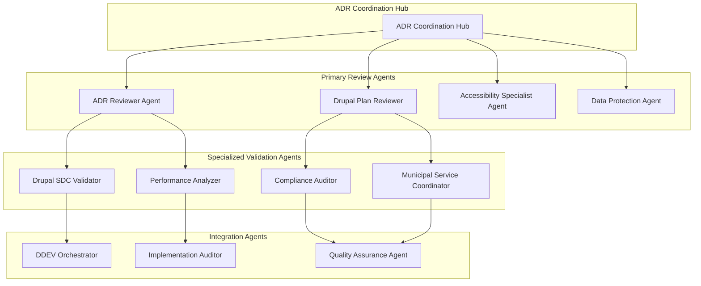

# Enhanced Agent Coordination Protocols for Collaborative ADR Workflows

## MADR 4.0.0 Multi-Agent Orchestration Framework

This document establishes enhanced coordination protocols for Claude Code agents participating in collaborative Architecture Decision Record workflows, ensuring seamless handoffs, quality gates, and municipal compliance validation throughout the ADR lifecycle.

## Agent Coordination Architecture

### Core Agent Roles in ADR Workflows



### Agent Coordination Hierarchy

**Tier 1 - Primary Decision Agents:**
- `adr-reviewer`: Architecture validation and technical quality assurance
- `drupal-plan-reviewer`: Municipal compliance and Drupal best practices
- `municipal-stakeholder-coordinator`: Swiss government stakeholder management

**Tier 2 - Specialized Validation Agents:**
- `accessibility-validator`: WCAG 2.1 AA compliance specialist
- `data-protection-auditor`: CH-DSG and privacy compliance
- `performance-analyzer`: Municipal portal performance optimization
- `drupal-sdc-validator`: Single Directory Component compliance

**Tier 3 - Implementation Support Agents:**
- `ddev-orchestrator`: Development environment coordination
- `implementation-auditor`: Post-decision implementation validation
- `quality-assurance-coordinator`: End-to-end quality verification

## Enhanced Agent Handoff Protocols

### ADR Review Agent Handoff Framework

```yaml
# ADR Agent Handoff Protocol Configuration
agent_handoff_protocol:
  
  # Primary review handoff from adr-reviewer
  adr_reviewer_handoffs:
    success_condition: "technical_validation_complete"
    handoff_targets:
      - agent: "drupal-plan-reviewer" 
        condition: "drupal_implementation_required"
        payload: ["technical_assessment", "architecture_decisions", "risk_analysis"]
      - agent: "municipal-stakeholder-coordinator"
        condition: "municipal_impact_identified"
        payload: ["stakeholder_analysis", "municipal_requirements", "compliance_checklist"]
      - agent: "accessibility-validator"
        condition: "citizen_facing_changes"
        payload: ["interface_changes", "accessibility_requirements", "wcag_checklist"]
    
    failure_condition: "technical_validation_failed"  
    failure_handoff:
      - agent: "implementation-auditor"
        action: "identify_technical_blockers"
        payload: ["validation_failures", "technical_constraints", "alternative_approaches"]

  # Drupal plan reviewer handoff coordination  
  drupal_plan_reviewer_handoffs:
    success_condition: "municipal_compliance_validated"
    handoff_targets:
      - agent: "performance-analyzer"
        condition: "performance_impact_identified"
        payload: ["performance_requirements", "scalability_analysis", "optimization_recommendations"]
      - agent: "drupal-sdc-validator"
        condition: "component_architecture_required"
        payload: ["component_specifications", "design_system_requirements", "integration_patterns"]
      - agent: "ddev-orchestrator"
        condition: "development_environment_changes"
        payload: ["ddev_requirements", "service_dependencies", "configuration_changes"]
        
    escalation_condition: "municipal_compliance_issues"
    escalation_handoff:
      - agent: "municipal-stakeholder-coordinator"
        action: "resolve_compliance_conflicts"
        payload: ["compliance_issues", "municipal_requirements", "resolution_options"]

  # Cross-agent validation protocols
  validation_checkpoints:
    technical_quality_gate:
      required_agents: ["adr-reviewer", "performance-analyzer"]
      success_criteria: ["architecture_approved", "performance_acceptable"]
      
    municipal_compliance_gate:
      required_agents: ["drupal-plan-reviewer", "accessibility-validator", "data-protection-auditor"]
      success_criteria: ["municipal_approved", "accessibility_compliant", "privacy_compliant"]
      
    implementation_readiness_gate:
      required_agents: ["ddev-orchestrator", "implementation-auditor"]
      success_criteria: ["environment_ready", "implementation_feasible"]
```

### Agent Communication Protocols

#### Standard Agent Handoff Format
```markdown
# Agent Handoff Communication - ADR-{XXX}

## Handoff Information
**From Agent**: {source-agent}
**To Agent**: {target-agent}  
**Handoff Type**: {success|escalation|collaboration}
**Handoff Reason**: {condition that triggered handoff}
**Timestamp**: {YYYY-MM-DD HH:MM:SS}

## Context Transfer Package
**ADR Identifier**: ADR-{XXX}
**Current Status**: {proposed|under-review|revision-needed}
**Review Phase**: {technical|municipal|compliance|integration}
**Priority Level**: {high|medium|low}

## Review Artifacts Transfer
**Technical Assessment**: {link to technical validation results}
**Municipal Analysis**: {link to municipal impact assessment}
**Compliance Report**: {link to compliance verification}
**Risk Assessment**: {link to risk analysis and mitigation}
**Stakeholder Feedback**: {link to collected stakeholder input}

## Specific Agent Instructions
**Validation Focus**: {specific areas requiring agent attention}
**Key Questions**: {critical questions for agent to address}
**Success Criteria**: {clear success criteria for agent work}
**Timeline**: {expected completion timeline}
**Escalation Path**: {escalation procedure if issues arise}

## Municipal Portal Context
**Affected Municipalities**: {Thalwil|Thalheim|Erlenbach|All}
**Citizen Service Impact**: {high|medium|low|none}
**Swiss Compliance Requirements**: {WCAG 2.1 AA|CH-DSG|eCH-0059|All}
**Integration Dependencies**: {external systems or services affected}

## Expected Deliverables
- [ ] {Specific deliverable 1}
- [ ] {Specific deliverable 2}  
- [ ] {Specific deliverable 3}
- [ ] Agent validation report
- [ ] Recommendations for next phase
- [ ] Identified issues and resolution approaches

## Quality Gates
**Entry Criteria**: {conditions that must be met before agent can proceed}
**Exit Criteria**: {conditions that must be met for successful completion}
**Validation Requirements**: {specific validation steps required}
**Documentation Standards**: {required documentation format and detail}

---
**Handoff Initiated By**: {source-agent}
**Handoff Approved By**: {coordination-hub}
**Next Review Checkpoint**: {scheduled review point}
```

### Multi-Agent Collaboration Patterns

#### Parallel Agent Coordination
```javascript
// Parallel agent execution coordination
const parallelAgentCoordination = {
  
  // Coordinate multiple agents working on same ADR
  coordinateParallelReview: async (adrId, agentList) => {
    const coordinationSession = await createCoordinationSession(adrId, agentList);
    
    // Initialize parallel agent work
    const agentPromises = agentList.map(async (agent) => {
      return await initiateAgentReview(agent, {
        adrId: adrId,
        sessionId: coordinationSession.id,
        parallelMode: true,
        coordinationHub: 'enhanced-adr-coordinator'
      });
    });
    
    // Monitor parallel execution
    const progressMonitor = await monitorParallelExecution(coordinationSession.id, agentPromises);
    
    // Coordinate cross-agent dependencies
    await handleCrossAgentDependencies(coordinationSession.id, agentList);
    
    // Wait for all agents to complete
    const results = await Promise.allSettled(agentPromises);
    
    // Integrate results and identify conflicts
    const integratedResults = await integrateAgentResults(results);
    const conflicts = await identifyAgentConflicts(integratedResults);
    
    // Resolve conflicts through agent negotiation
    if (conflicts.length > 0) {
      const resolution = await resolveAgentConflicts(conflicts, agentList);
      integratedResults.conflictResolution = resolution;
    }
    
    return integratedResults;
  },
  
  // Handle cross-agent dependencies during parallel execution
  handleCrossAgentDependencies: async (sessionId, agentList) => {
    const dependencies = await identifyAgentDependencies(agentList);
    
    for (const dependency of dependencies) {
      // Set up communication channels between dependent agents
      await establishAgentCommunication(dependency.sourceAgent, dependency.targetAgent);
      
      // Create shared data exchange
      await createSharedDataExchange(sessionId, dependency);
      
      // Monitor dependency resolution
      await monitorDependencyProgress(dependency);
    }
  },
  
  // Resolve conflicts between agent recommendations
  resolveAgentConflicts: async (conflicts, agentList) => {
    const resolutionStrategies = [];
    
    for (const conflict of conflicts) {
      // Attempt automated resolution first
      const automaticResolution = await attemptAutomaticResolution(conflict);
      
      if (automaticResolution.success) {
        resolutionStrategies.push(automaticResolution);
      } else {
        // Escalate to agent negotiation
        const negotiationResult = await initiateAgentNegotiation(conflict, agentList);
        resolutionStrategies.push(negotiationResult);
      }
    }
    
    return resolutionStrategies;
  }
};
```

#### Agent-to-Human Escalation Patterns

```yaml
# Agent Escalation Protocol Configuration
agent_escalation_protocols:
  
  # Technical escalation paths
  technical_escalations:
    architecture_conflicts:
      trigger_condition: "conflicting_technical_recommendations"
      escalation_path:
        - level_1: "senior_technical_lead"
        - level_2: "architecture_review_board"  
        - level_3: "cto_technical_decision"
      escalation_timeline: "24_hours"
      required_artifacts: ["conflict_analysis", "technical_options", "impact_assessment"]
      
    implementation_blockers:
      trigger_condition: "technical_implementation_impossible"
      escalation_path:
        - level_1: "implementation_team_lead"
        - level_2: "technical_architecture_team"
        - level_3: "product_owner_decision"
      escalation_timeline: "48_hours"
      required_artifacts: ["blocker_analysis", "alternative_approaches", "resource_requirements"]
  
  # Municipal escalation paths  
  municipal_escalations:
    compliance_violations:
      trigger_condition: "swiss_compliance_cannot_be_achieved"
      escalation_path:
        - level_1: "compliance_officer"
        - level_2: "municipal_legal_counsel"
        - level_3: "municipal_council_decision"
      escalation_timeline: "72_hours"
      required_artifacts: ["compliance_gap_analysis", "legal_risk_assessment", "mitigation_options"]
      
    citizen_service_impact:
      trigger_condition: "significant_citizen_service_degradation"
      escalation_path:
        - level_1: "citizen_services_coordinator"
        - level_2: "municipal_department_head"
        - level_3: "mayor_office_decision"
      escalation_timeline: "24_hours"
      required_artifacts: ["citizen_impact_analysis", "service_alternatives", "communication_plan"]
  
  # Cross-functional escalation paths
  cross_functional_escalations:
    resource_conflicts:
      trigger_condition: "insufficient_resources_identified"
      escalation_path:
        - level_1: "project_manager"
        - level_2: "resource_allocation_committee"
        - level_3: "executive_team_decision"
      escalation_timeline: "48_hours"
      required_artifacts: ["resource_gap_analysis", "priority_assessment", "budget_implications"]
      
    timeline_conflicts:
      trigger_condition: "unrealistic_timeline_identified"
      escalation_path:
        - level_1: "project_manager"
        - level_2: "steering_committee"
        - level_3: "sponsor_timeline_decision"
      escalation_timeline: "24_hours"
      required_artifacts: ["timeline_analysis", "critical_path_impact", "delay_implications"]

# Human escalation communication templates
escalation_communication_templates:
  
  technical_escalation_template: |
    Subject: Technical Escalation Required - ADR-{XXX} - {Issue Summary}
    
    **Escalation Level**: {Level}
    **Escalation Reason**: {Technical issue requiring human decision}
    **Timeline**: Decision required within {timeline}
    
    **Technical Conflict Summary**:
    {Detailed technical conflict description}
    
    **Agent Recommendations**:
    - Agent 1 ({agent_name}): {recommendation_summary}
    - Agent 2 ({agent_name}): {recommendation_summary}
    
    **Impact Analysis**:
    - Municipal Portal Impact: {impact_description}
    - Citizen Service Impact: {service_impact}
    - Technical Debt Implications: {technical_debt}
    - Resource Requirements: {resource_impact}
    
    **Required Decision**:
    {Specific decision required from human stakeholder}
    
    **Supporting Documentation**:
    {Links to detailed analysis and recommendations}
  
  municipal_escalation_template: |
    Subject: Municipal Compliance Escalation - ADR-{XXX} - {Compliance Issue}
    
    **Escalation Level**: {Level}
    **Compliance Domain**: {WCAG|CH-DSG|eCH-0059|Municipal Process}
    **Urgency**: {High|Medium|Low}
    
    **Compliance Challenge**:
    {Description of compliance issue that cannot be automatically resolved}
    
    **Swiss Government Requirements**:
    {Specific government standards or regulations affected}
    
    **Municipal Impact**:
    - Thalwil: {specific impact}
    - Thalheim: {specific impact}  
    - Erlenbach: {specific impact}
    
    **Citizen Service Implications**:
    {How this affects citizen services and access}
    
    **Recommended Actions**:
    1. {Action option 1}
    2. {Action option 2}
    3. {Action option 3}
    
    **Decision Required**:
    {Specific municipal decision needed}
    
    **Timeline**: {Decision deadline and implementation timeline}
```

## Quality Gate Coordination

### Multi-Agent Quality Gates

#### Technical Quality Gate
```yaml
technical_quality_gate:
  gate_name: "Technical Architecture Validation"
  required_agents:
    - name: "adr-reviewer"
      validation_focus: "architecture_patterns_compliance"
      success_criteria: ["patterns_approved", "technical_debt_acceptable", "maintainability_verified"]
      
    - name: "performance-analyzer"  
      validation_focus: "municipal_portal_performance"
      success_criteria: ["performance_targets_met", "scalability_verified", "citizen_experience_optimized"]
      
    - name: "drupal-sdc-validator"
      validation_focus: "component_architecture_compliance"
      success_criteria: ["sdc_patterns_followed", "design_system_aligned", "accessibility_built_in"]
  
  gate_success_criteria:
    all_agents_approve: true
    blocking_issues_resolved: true
    performance_requirements_met: true
    technical_debt_within_limits: true
    
  gate_failure_actions:
    - escalate_to_technical_lead
    - require_architecture_revision
    - schedule_additional_review_cycle
    - document_technical_risks
```

#### Municipal Compliance Gate
```yaml
municipal_compliance_gate:
  gate_name: "Swiss Municipal Compliance Validation"
  required_agents:
    - name: "drupal-plan-reviewer"
      validation_focus: "municipal_requirements_compliance"
      success_criteria: ["municipal_processes_supported", "multi_site_compatibility", "editorial_workflows_appropriate"]
      
    - name: "accessibility-validator"
      validation_focus: "wcag_2_1_aa_compliance"  
      success_criteria: ["accessibility_verified", "screen_reader_compatible", "keyboard_navigation_supported"]
      
    - name: "data-protection-auditor"
      validation_focus: "ch_dsg_privacy_compliance"
      success_criteria: ["privacy_requirements_met", "citizen_consent_managed", "data_protection_verified"]
      
    - name: "municipal-stakeholder-coordinator"
      validation_focus: "stakeholder_approval_obtained"
      success_criteria: ["municipal_representatives_approve", "citizen_impact_acceptable", "compliance_certified"]
  
  gate_success_criteria:
    all_compliance_requirements_met: true
    municipal_stakeholders_approve: true
    citizen_privacy_protected: true
    accessibility_standards_met: true
    
  gate_failure_actions:
    - escalate_to_compliance_officer
    - require_municipal_consultation
    - schedule_accessibility_remediation
    - document_compliance_gaps
```

#### Implementation Readiness Gate
```yaml
implementation_readiness_gate:
  gate_name: "ADR Implementation Readiness Validation"
  required_agents:
    - name: "ddev-orchestrator"
      validation_focus: "development_environment_readiness"
      success_criteria: ["ddev_configuration_ready", "services_available", "dependencies_resolved"]
      
    - name: "implementation-auditor"
      validation_focus: "implementation_plan_feasibility"
      success_criteria: ["implementation_steps_defined", "resources_allocated", "timeline_realistic"]
      
    - name: "quality-assurance-coordinator"
      validation_focus: "testing_and_validation_readiness"
      success_criteria: ["test_plan_defined", "acceptance_criteria_clear", "validation_approach_documented"]
  
  gate_success_criteria:
    implementation_plan_approved: true
    resources_available: true
    testing_strategy_defined: true
    risks_mitigated: true
    
  gate_failure_actions:
    - escalate_to_project_manager
    - require_implementation_plan_revision  
    - allocate_additional_resources
    - extend_implementation_timeline
```

## Agent Learning and Improvement Integration

### Compound Engineering Integration

```javascript
// Integration with existing compound engineering system
const compoundEngineeringIntegration = {
  
  // Capture agent interaction patterns for learning
  captureAgentLearning: async (adrId, agentInteractions) => {
    const learningData = {
      adr_id: adrId,
      interaction_patterns: agentInteractions,
      decision_quality: await assessDecisionQuality(adrId),
      stakeholder_satisfaction: await collectStakeholderFeedback(adrId),
      implementation_success: await measureImplementationSuccess(adrId)
    };
    
    // Send to compound engineering learning system
    await compoundLearningSystem.captureAgentInteractionLearning(learningData);
    
    // Update agent coordination patterns
    await updateAgentCoordinationPatterns(learningData);
    
    return learningData;
  },
  
  // Learn from agent coordination failures
  learnFromCoordinationFailures: async (failureData) => {
    // Analyze failure patterns
    const failureAnalysis = await analyzeCoordinationFailure(failureData);
    
    // Generate improved coordination strategies
    const improvedStrategies = await generateImprovedCoordinationStrategies(failureAnalysis);
    
    // Update agent handoff protocols
    await updateHandoffProtocols(improvedStrategies);
    
    // Create prevention rules for similar failures
    await createFailurePreventionRules(failureAnalysis);
    
    return {
      analysis: failureAnalysis,
      improvements: improvedStrategies,
      prevention_rules: await getFailurePreventionRules()
    };
  },
  
  // Optimize agent performance based on historical data
  optimizeAgentPerformance: async () => {
    const historicalPerformance = await getAgentPerformanceHistory();
    
    // Identify high-performing agent combinations
    const optimalCombinations = await identifyOptimalAgentCombinations(historicalPerformance);
    
    // Optimize handoff timings and coordination
    const optimizedTimings = await optimizeCoordinationTimings(historicalPerformance);
    
    // Update agent selection algorithms
    await updateAgentSelectionAlgorithms(optimalCombinations);
    
    return {
      optimal_combinations: optimalCombinations,
      optimized_timings: optimizedTimings,
      performance_improvements: await calculatePerformanceImprovements()
    };
  }
};
```

### Agent Performance Monitoring

```yaml
# Agent coordination performance monitoring
agent_performance_monitoring:
  
  # Individual agent performance metrics
  individual_agent_metrics:
    adr_reviewer:
      success_rate: target_95_percent
      review_completion_time: target_24_hours
      issue_identification_accuracy: target_90_percent
      handoff_quality_score: target_4_5_out_of_5
      
    drupal_plan_reviewer:
      municipal_compliance_accuracy: target_100_percent
      review_thoroughness_score: target_4_5_out_of_5
      stakeholder_satisfaction: target_4_0_out_of_5
      implementation_feasibility_accuracy: target_95_percent
  
  # Cross-agent collaboration metrics
  collaboration_metrics:
    handoff_efficiency:
      handoff_completion_time: target_4_hours
      information_transfer_completeness: target_100_percent
      handoff_success_rate: target_98_percent
      
    conflict_resolution:
      automated_resolution_rate: target_70_percent
      human_escalation_rate: target_less_than_10_percent
      resolution_time: target_24_hours
      resolution_quality_score: target_4_0_out_of_5
  
  # Overall coordination effectiveness
  coordination_effectiveness:
    adr_review_cycle_time: target_8_business_days
    decision_quality_score: target_4_5_out_of_5
    implementation_success_rate: target_95_percent
    stakeholder_satisfaction: target_4_0_out_of_5
    municipal_compliance_achievement: target_100_percent
```

---

**Protocol Version**: MADR 4.0.0 Enhanced Coordination  
**Municipal Portal Compatibility**: adessoCMS Swiss Municipal Portal  
**Agent Integration**: Full Claude Code Agent Ecosystem  
**Learning Integration**: Compound Engineering System Compatible  
**Last Updated**: 2025-01-09  
**Next Review**: 2025-04-09  
**Maintainer**: Municipal Portal Governance Team  
**Quality Assurance**: ADR Reviewer Agent, Drupal Plan Reviewer Agent