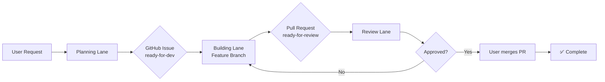

# 🔄 Lane-Based Development Workflow

## Overview
We use a **Lane-based development workflow** with GitHub Issues as the central coordination point.

## 🎯 The Three Lanes

### 1. Planning Lane (`/planning` or `/lane-planning`)
**Purpose**: Requirements analysis, architecture, and specification
**Output**: GitHub Issues with label `ready-for-dev`

**Process**:
1. Receives user requirements
2. Analyzes with specialized agents (@drupal-solution-architect, etc.)
3. Creates detailed GitHub Issue with specs
4. Labels: `planning-lane`, `ready-for-dev`

### 2. Building Lane (`/building` or `/lane-building`)
**Purpose**: Implementation and development
**Input**: GitHub Issues with `ready-for-dev`
**Output**: Pull Request with implemented features

**Process**:
1. Lists open issues: `gh issue list --label ready-for-dev`
2. Claims issue: `gh issue edit [#] --add-label in-progress`
3. **Creates feature branch**: `git checkout -b feature/issue-[#]-short-description`
4. Implements according to specifications
5. Commits with reference: `git commit -m "feat: implement X (fixes #[number])"`
6. **Creates Pull Request**: `gh pr create --assignee @me --base main`
7. Updates issue: `gh issue edit [#] --remove-label in-progress --add-label ready-for-review`
8. Links PR to issue: `gh issue comment [#] --body "PR created: #[PR-number]"`

### 3. Review Lane (`/reviewing` or `/lane-reviewing`)
**Purpose**: Quality assurance and compliance validation
**Input**: Pull Requests linked to issues with `ready-for-review`
**Output**: Merged PR or change requests

**Process**:
1. Reviews Pull Request: `gh pr review [PR#]`
2. Validates Swiss compliance
3. Tests implementation locally: `gh pr checkout [PR#]`
4. Either approves or requests changes
5. If approved: `gh pr merge [PR#] --squash`
6. Closes linked issue: `gh issue close [#] --comment "✅ Merged in PR #[PR]"`

## 📋 GitHub Issue Labels

| Label | Description | Color |
|-------|-------------|-------|
| `planning-lane` | Created by Planning Lane | Blue |
| `building-lane` | Assigned to Building Lane | Yellow |
| `review-lane` | In Review Lane | Purple |
| `ready-for-dev` | Planning complete, ready for implementation | Green |
| `in-progress` | Currently being implemented | Orange |
| `ready-for-review` | Implementation complete | Purple |
| `swiss-compliance` | Requires Swiss market compliance | Red |
| `blocked` | Blocked by dependencies | Gray |
| `approved` | Review complete, ready to merge | Green |

## 🔧 Common Commands

### Planning Lane
```bash
# Create new issue with requirements
gh issue create --title "[PLAN] Feature Name" --label "planning-lane,ready-for-dev"

# List all planning tasks
gh issue list --label planning-lane

# View issue template
cat .github/ISSUE_TEMPLATE/planning-lane-task.md
```

### Building Lane
```bash
# List ready tasks
gh issue list --label ready-for-dev

# Claim a task (example: issue #7)
gh issue edit 7 --add-label in-progress --add-assignee @me

# Create feature branch
git checkout -b feature/issue-7-event-review-dashboard

# Work on implementation
# ... make changes ...

# Commit with issue reference
git add .
git commit -m "feat: add event review dashboard for editors (refs #7)"

# Push branch
git push -u origin feature/issue-7-event-review-dashboard

# Create Pull Request
gh pr create \
  --title "feat: Event Review Dashboard for Editors" \
  --body "Implements #7 - Event review dashboard with bulk operations" \
  --assignee @me \
  --base main

# Update issue status
gh issue edit 7 --remove-label in-progress --add-label ready-for-review
gh issue comment 7 --body "Implementation complete. PR: #[PR-NUMBER]"
```

### Review Lane
```bash
# List PRs ready for review
gh pr list --label ready-for-review

# Check out PR locally for testing
gh pr checkout [PR-NUMBER]

# Run tests
ddev drush cr
ddev exec npm run test

# Review the PR
gh pr review [PR-NUMBER] --comment --body "Review comments..."

# Request changes if needed
gh pr review [PR-NUMBER] --request-changes --body "Please address: ..."

# Approve PR
gh pr review [PR-NUMBER] --approve --body "✅ LGTM! Swiss compliance verified."

# ⚠️ NOTE: PRs werden nur vom User (Marc) gemerged!
# Review Lane markiert PR nur als approved
gh pr comment [PR-NUMBER] --body "✅ Review complete. Ready for merge by @maphilipps"

# Update issue status
gh issue comment [ISSUE-NUMBER] --body "✅ Review complete. PR #[PR-NUMBER] is ready for merge."
```

## 📊 Workflow States



## 🌿 Branch Strategy

### Branch Naming Convention
- **Feature branches**: `feature/issue-[#]-short-description`
  - Example: `feature/issue-7-event-review-dashboard`
- **Bugfix branches**: `bugfix/issue-[#]-short-description`
  - Example: `bugfix/issue-12-form-validation`
- **Hotfix branches**: `hotfix/issue-[#]-critical-fix`
  - Example: `hotfix/issue-15-security-patch`

### Branch Lifecycle
1. **Create** from main: `git checkout -b feature/issue-[#]-description`
2. **Work** in isolation: All changes in feature branch
3. **Push** to origin: `git push -u origin feature/issue-[#]-description`
4. **PR** to main: `gh pr create --base main`
5. **Review** by Review Lane
6. **Merge** by User (Marc) only
7. **Delete** branch after merge

## 🇨🇭 Swiss Compliance Checklist

Every issue should consider:
- [ ] eCH Standards applicable?
- [ ] Swiss German language (no ß)
- [ ] Date format: DD.MM.YYYY
- [ ] Currency: CHF
- [ ] Privacy: CH-DSG compliance
- [ ] Accessibility: WCAG 2.1 AA

## 📝 Issue Template Structure

```markdown
## Requirements
- User story
- Business context

## Acceptance Criteria
- Measurable criteria

## Technical Specifications
- Architecture approach
- Implementation details

## Swiss Compliance
- Applicable standards

## Definition of Done
- Checklist for completion
```

## 🚀 Benefits of This Workflow

1. **Transparency**: All work tracked in GitHub
2. **Async Collaboration**: Lanes can work independently
3. **Clear Handoffs**: Labels show current state
4. **Audit Trail**: Complete history in issues
5. **Integration**: Works with GitHub Projects, CI/CD

---

*Last Updated: 2025-01-20*
*Workflow Version: 2.0*