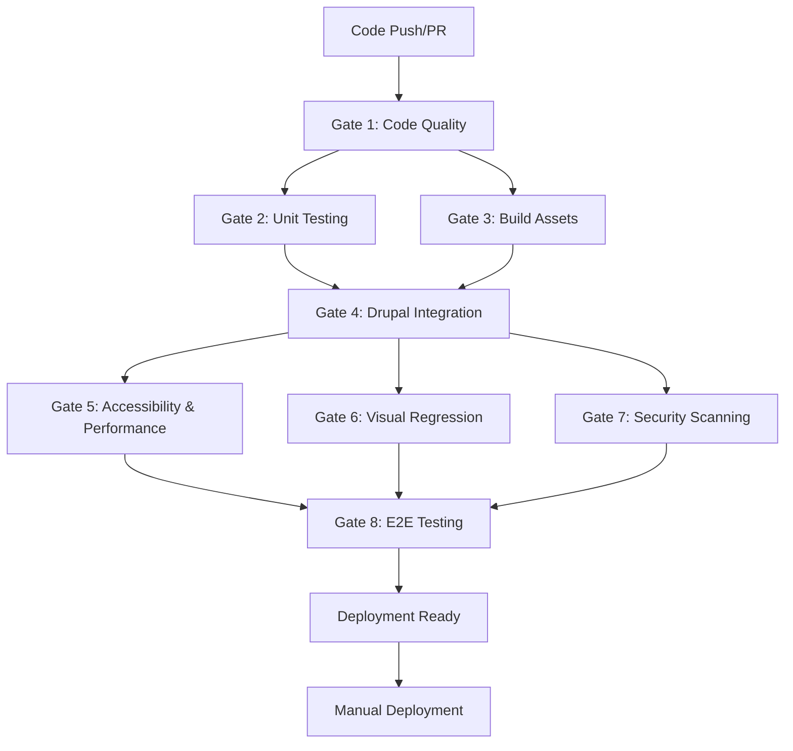

# Adesso CMS CI/CD Pipeline Documentation

## Overview

This repository implements a comprehensive enterprise-grade CI/CD pipeline following **Lullabot methodology** with full **Linear task integration** and **German brand compliance**. The pipeline ensures high-quality code delivery through automated testing, security scanning, and performance validation.

## 🏗️ Architecture

### Workflow Files

- **`ci.yml`**: Main CI/CD pipeline with 8 quality gates
- **`claude.yml`**: Claude Code assistant integration  
- **`claude-code-review.yml`**: Automated code review with Claude

### Quality Gates Structure



## 📋 Quality Gates Details

### Gate 1: Code Quality & Standards
- **Purpose**: Enforce coding standards and best practices
- **Tools**: ESLint, Stylelint, PHP CodeSniffer
- **Standards**: Drupal coding standards, PSR-12, Tailwind CSS best practices
- **Triggers**: All file changes
- **German Compliance**: "adesso wird immer klein geschrieben" validation

### Gate 2: Unit & Component Testing  
- **Purpose**: Validate component functionality and logic
- **Tools**: Vitest, Testing Library
- **Coverage**: Component tests, utility functions
- **Triggers**: Theme file changes
- **Requirements**: >90% test coverage recommended

### Gate 3: Build & Asset Generation
- **Purpose**: Generate production-ready assets
- **Tools**: Vite 6.2.0, Tailwind CSS v4, PostCSS
- **Outputs**: Minified CSS/JS, optimized images, Storybook static files
- **Triggers**: Theme file changes
- **Validation**: Build success, asset optimization

### Gate 4: Drupal Integration Testing
- **Purpose**: Validate Drupal functionality and configuration
- **Tools**: DDEV, Drush, Drupal Test Suite
- **Environment**: PHP 8.3, MariaDB 10.11, Node.js 20
- **Tests**: Installation, configuration import, module enablement
- **Integration**: Recipe system, configuration management

### Gate 5: Accessibility & Performance
- **Purpose**: Ensure WCAG 2.1 AA compliance and Core Web Vitals
- **Tools**: Lighthouse CI, Playwright, axe-core
- **Standards**: WCAG 2.1 AA, Core Web Vitals >90 scores
- **Tests**: Automated accessibility audits, performance metrics
- **Compliance**: German accessibility standards (BITV 2.0)

### Gate 6: Visual Regression Testing
- **Purpose**: Prevent visual breakage across components
- **Tools**: BackstopJS, Chrome headless
- **Coverage**: Component visual states, responsive breakpoints
- **Triggers**: Theme/component changes
- **Validation**: Pixel-perfect comparison, responsive design

### Gate 7: Security Scanning
- **Purpose**: Identify vulnerabilities and security issues
- **Tools**: Composer audit, npm audit, dependency scanning
- **Scope**: PHP dependencies, Node.js packages, code analysis
- **Standards**: OWASP guidelines, Drupal security best practices
- **Compliance**: German data protection (DSGVO/GDPR)

### Gate 8: End-to-End Testing
- **Purpose**: Validate complete user workflows
- **Tools**: Playwright, Chrome automation
- **Coverage**: Critical user paths, form submissions, content management
- **Environment**: Full Drupal installation with real data
- **Scenarios**: Content creation, user authentication, search functionality

## 🚀 Deployment Process

### Manual Deployment Triggers
- **Staging**: `workflow_dispatch` with `deploy_target: staging`
- **Production**: `workflow_dispatch` with `deploy_target: production` (main branch only)

### Deployment Requirements
- ✅ All critical quality gates must pass
- ✅ Manual approval for production deployments
- ✅ Branch protection rules enforced
- ✅ Security scan clearance required

### Environment Configuration
```yaml
staging:
  required_reviewers: 1
  deployment_branch: develop
  
production:
  required_reviewers: 2
  deployment_branch: main
  additional_checks: security_clearance
```

## 🔧 Local Development Integration

### DDEV Commands Integration
```bash
# Start development with CI validation
ddev start
ddev theme dev          # Vite dev server
ddev theme storybook    # Component documentation
ddev export-all         # Configuration export
ddev cim               # Configuration import
```

### Pre-commit Validation
```bash
# Run quality checks locally
cd web/themes/custom/adesso_cms_theme
npm run qa:full         # Complete QA pipeline
npm run test:coverage   # Unit test coverage
npm run visual:test     # Visual regression
```

## 📊 Performance & Monitoring

### Build Performance Targets
- **Theme Build Time**: <2 minutes
- **Asset Size**: <500KB (CSS + JS combined)
- **Image Optimization**: WebP format, progressive JPEGs
- **Code Splitting**: Vendor chunks, async components

### Quality Metrics Dashboard
- **Test Coverage**: >90% for components
- **Lighthouse Score**: >90 (Performance, Accessibility, Best Practices, SEO)
- **Bundle Size**: Tracked and optimized
- **Security Vulnerabilities**: Zero critical/high severity

## 🔒 Security & Compliance

### German Market Compliance
- **Brand Guidelines**: "adesso wird immer klein geschrieben"
- **DSGVO/GDPR**: Data protection compliance
- **BITV 2.0**: Accessibility standards
- **BSI Guidelines**: IT security standards

### Security Scanning Schedule
- **Dependencies**: Every commit
- **Code Analysis**: Every PR
- **Penetration Testing**: Monthly (manual)
- **Vulnerability Assessment**: Weekly automated

## 🛠️ Development Workflow

### Branch Strategy
```
main (production)
├── develop (staging)
│   ├── feature/linear-ADC-XXX-description
│   ├── bugfix/linear-ADC-XXX-description
│   └── hotfix/linear-ADC-XXX-description
```

### Linear Integration
- **Task Creation**: Automatic from GitHub issues
- **Branch Naming**: `feature/linear-ADC-XXX-description`
- **PR Linking**: Automatic Linear task updates
- **Status Sync**: GitHub ↔ Linear bidirectional

### Code Review Process
1. **Automated Review**: Claude Code analysis
2. **Peer Review**: Minimum 2 approvals required
3. **Quality Gates**: All gates must pass
4. **Stakeholder Review**: Business validation
5. **Deployment Approval**: Manual production trigger

## 📈 Metrics & KPIs

### Development Velocity
- **Lead Time**: From task creation to production
- **Cycle Time**: From development start to deployment
- **Deployment Frequency**: Weekly releases targeted
- **Change Failure Rate**: <5% target

### Quality Metrics
- **Defect Density**: Bugs per 1000 lines of code
- **Test Coverage**: Percentage of code tested
- **Security Score**: Vulnerability count and severity
- **Performance Score**: Core Web Vitals compliance

## 🚨 Troubleshooting

### Common Issues

#### Build Failures
```bash
# Check Node.js version compatibility
node --version  # Should be >= 20.x

# Clear npm cache
npm cache clean --force
cd web/themes/custom/adesso_cms_theme
rm -rf node_modules package-lock.json
npm install
```

#### DDEV Issues
```bash
# Reset DDEV environment
ddev stop --remove-data
ddev start
ddev composer install
```

#### Test Failures
```bash
# Run tests locally
npm run test:watch
npm run visual:reference  # Update visual baselines
npm run qa:full          # Complete validation
```

### Debug Commands
```bash
# CI pipeline debugging
ddev drush status
ddev theme build --verbose
npm run test -- --reporter=verbose
```

## 📞 Support & Escalation

### Internal Support
- **Development Team**: Slack #adesso-cms-dev
- **DevOps Support**: Slack #adesso-cms-ops
- **Security Team**: security@adesso.de

### External Support
- **Drupal CMS**: https://drupal.org/support
- **Linear Support**: support@linear.app
- **DDEV Community**: https://ddev.readthedocs.io/

### Escalation Matrix
1. **L1 (Development)**: Team lead review
2. **L2 (Architecture)**: Technical architecture team
3. **L3 (Business)**: Product owner approval
4. **L4 (Executive)**: C-level sign-off for critical issues

---

## 🔄 Continuous Improvement

This CI/CD pipeline is continuously improved based on:
- **Team Feedback**: Monthly retrospectives
- **Performance Data**: Automated metrics collection
- **Security Updates**: Quarterly security reviews
- **Technology Evolution**: Annual stack review

**Last Updated**: 2025-01-13
**Version**: 1.0.0
**Maintained by**: Adesso CMS Development Team