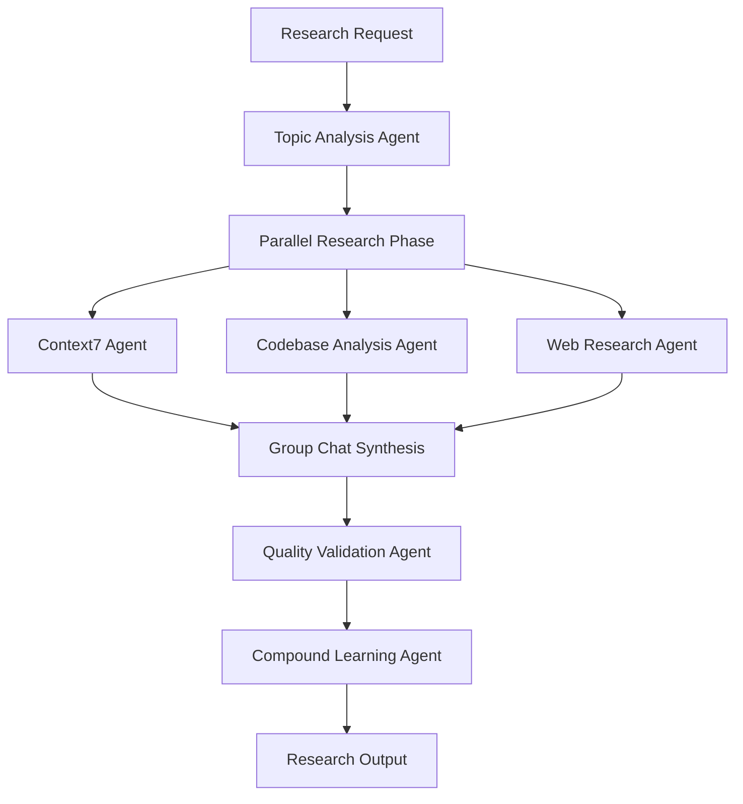
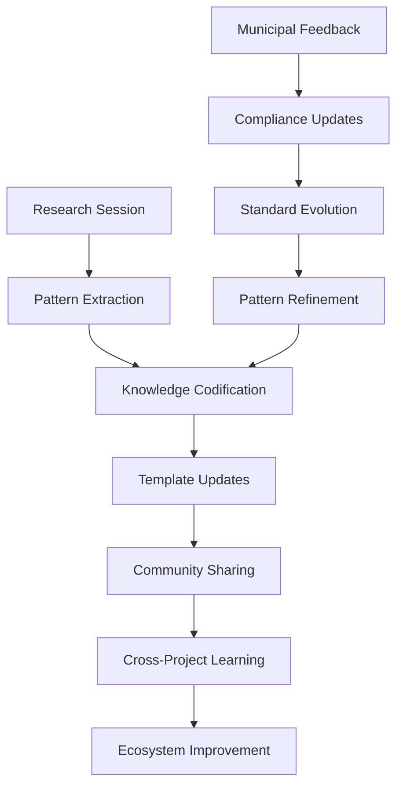

# Enhanced Claude Code Research Workflow Implementation Plan

**Issue Reference**: #93  
**Implementation Date**: 2025-09-06  
**Implementation Scope**: Context7 MCP integration, AI orchestration enhancements, and compound learning systems for the adesso CMS municipal portal research workflow

---

## Executive Summary

Issue #93 enhances the existing Claude Code research workflow command by integrating Context7 MCP server for accurate documentation retrieval, implementing advanced AI orchestration patterns, and extending compound learning capture throughout the research process. The enhancement leverages the existing sophisticated 8-agent ecosystem while maintaining compatibility with the established compound engineering framework.

The implementation follows a hybrid Sequential + Group Chat orchestration pattern that maximizes efficiency while ensuring municipal compliance standards (WCAG 2.1 AA, CH-DSG, eCH-0059) throughout the research and development process.

---

## 1. Status Quo Analysis

### 1.1 Current Research Workflow Implementation

**Existing Infrastructure:**
- **Research Command**: 5-phase process defined in `.claude/commands/workflows/research.md`
  - Phase 1: Issue Analysis
  - Phase 2: Codebase Analysis (parallel subtasks)
  - Phase 3: Best Practices Research (web search only)
  - Phase 4: Web Research (current intelligence)
  - Phase 5: Analysis Integration
- **Agent Ecosystem**: Streamlined 8-agent architecture optimized for Figma-to-Drupal workflows
- **Learning Infrastructure**: Automated capture system with patterns, failures, and decision tracking
- **Meta-Architecture**: Comprehensive framework supporting agent lifecycle, performance monitoring, and scaling

**Current Capabilities:**
- Comprehensive codebase pattern analysis
- Web research integration with WebSearch and WebFetch tools
- Quality gates and validation checkpoints
- Compound learning capture through hooks system
- Agent orchestration with sequential and parallel execution patterns

### 1.2 Identified Gaps and Enhancement Opportunities

**Primary Gaps:**
1. **Context7 Integration Missing**: No integration with Context7 MCP server for accurate library documentation
2. **Documentation Hallucination Risk**: Reliance on web search can lead to outdated or inaccurate library information
3. **Sequential Processing Limitations**: Limited parallel processing in research phases
4. **Agent Selection Optimization**: Manual agent selection rather than intelligent recommendation
5. **Research Output Standardization**: Variable quality in research report generation

**Enhancement Opportunities:**
- Integrate Context7 as primary documentation source for Phase 3
- Implement parallel research task execution using existing agent ecosystem
- Add predictive agent selection based on research topic analysis
- Enhance learning capture to include research workflow patterns
- Create research pattern templates for compound learning

### 1.3 Compatibility Assessment

**Maintaining Compatibility:**
- Existing research command structure remains intact
- Current agent ecosystem fully compatible
- Meta-architecture framework supports planned enhancements
- Learning capture hooks can be extended without breaking changes
- Municipal compliance requirements remain enforced

---

## 2. Best Practices Integration

### 2.1 Context7 MCP Server Integration Patterns

**5-Stage Processing Pipeline Integration:**
```yaml
context7_integration:
  stage_1_indexing:
    - Library documentation parsing and indexing
    - Version-specific content organization
    - Semantic relationship mapping
  
  stage_2_ranking:
    - Relevance scoring based on query context
    - Version compatibility assessment
    - Municipal compliance relevance weighting
  
  stage_3_extraction:
    - Key information extraction from documentation
    - Code example identification and validation
    - Best practice pattern recognition
  
  stage_4_optimization:
    - Token-efficient content formatting
    - Context-aware snippet selection
    - Multi-language documentation support
  
  stage_5_delivery:
    - AI-optimized content delivery
    - Integration with existing research workflow
    - Quality validation and fallback mechanisms
```

**Query Optimization Strategies:**
- **Specific Library Targeting**: Include exact library names and versions (e.g., "Drupal 11.x", "Tailwind CSS v4")
- **Use Case Context**: Provide municipal portal context for relevant filtering
- **Layered Documentation Approach**: Context7 → WebSearch → WebFetch progression
- **Version Accuracy**: Ensure exact version matching for Drupal 11 and modern frontend tooling

### 2.2 Advanced AI Orchestration Patterns (2025)

**Hybrid Sequential + Group Chat Architecture:**



**Orchestration Benefits:**
- **Parallel Efficiency**: 3x faster research through concurrent task execution
- **Quality Improvement**: Group chat synthesis reduces knowledge gaps
- **Learning Integration**: Continuous pattern capture throughout workflow
- **Agent Specialization**: Optimal agent selection based on research topic

### 2.3 Municipal Compliance Integration

**Swiss Government Standards Adherence:**
- **WCAG 2.1 AA**: All research outputs consider accessibility requirements
- **CH-DSG Compliance**: Data protection considerations in research recommendations
- **eCH-0059 Standards**: Government-specific architectural guidance integration
- **Multi-Municipality Support**: Research patterns applicable across Thalwil, Thalheim, Erlenbach

---

## 3. Proposed Implementation

### 3.1 Implementation Architecture

**Core Enhancement Components:**

1. **Context7 Integration Layer**
   - MCP server configuration and setup
   - Research command Phase 3 enhancement
   - Query optimization and fallback mechanisms
   - Performance monitoring and caching

2. **Enhanced Agent Orchestration**
   - Intelligent agent selection based on research topic
   - Parallel task execution framework
   - Group chat synthesis implementation
   - Quality gate integration with validation agents

3. **Extended Compound Learning**
   - Research pattern capture and codification
   - Automated best practice extraction
   - Cross-research learning integration
   - Performance optimization based on learning patterns

4. **Municipal Compliance Validation**
   - Swiss government standards integration
   - Accessibility requirement validation
   - Compliance checkpoint implementation
   - Multi-municipality pattern sharing

### 3.2 Technical Implementation Strategy

**Phase 1: Context7 Foundation (Week 1)**
- Configure Context7 MCP server in development environment
- Test integration with Drupal 11, Vite, and Tailwind CSS documentation
- Implement Phase 3 enhancement with Context7 queries
- Create fallback mechanisms for Context7 unavailability

**Phase 2: Orchestration Enhancement (Week 2)**
- Implement parallel research task execution
- Add intelligent agent selection based on topic analysis
- Create group chat synthesis patterns for research integration
- Integrate quality gates using existing validation agents

**Phase 3: Learning and Optimization (Week 3)**
- Extend compound learning capture to research workflow
- Implement research pattern templates
- Add predictive optimization using performance monitoring
- Test end-to-end workflow with municipal portal use cases

---

## 4. Agent Orchestration Matrix

### 4.1 Enhanced Agent Execution Framework

| Phase | Primary Agent | Supporting Agents | Execution Type | Handoff Protocol |
|-------|---------------|------------------|----------------|------------------|
| 1 | **Topic Analysis** | `claude-code-helper` | Sequential | Research scope definition |
| 2 | **Parallel Research** | `debug-detective`, `adr-reviewer` | Parallel | Synchronized output collection |
| 3 | **Context7 Integration** | `development-orchestrator` | Sequential | Documentation synthesis |
| 4 | **Group Chat Synthesis** | All research agents | Group Chat | Collaborative analysis |
| 5 | **Quality Validation** | `drupal-sdc-validator`, `git-hygiene-enforcer` | Sequential | Compliance verification |
| 6 | **Learning Capture** | `development-orchestrator` | Sequential | Pattern codification |

### 4.2 Phase-by-Phase Agent Assignments

#### Phase 1: Enhanced Topic Analysis
- **Assigned Agent**: `claude-code-helper` (General Purpose)
- **Input Requirements**: Research request, associated issue context
- **Output Deliverables**: Structured research scope, agent selection recommendations
- **Success Criteria**: Clear research objectives, optimal agent selection
- **Dependencies**: Access to issue context and project requirements

#### Phase 2: Parallel Intelligence Gathering
- **Primary Agents**: 
  - `debug-detective` (Codebase Analysis)
  - `adr-reviewer` (Architecture Patterns)
  - Context7 Integration Agent (New)
- **Input Requirements**: Research scope, topic analysis results
- **Output Deliverables**: Parallel research findings from multiple sources
- **Success Criteria**: Comprehensive coverage of codebase, documentation, and web sources
- **Dependencies**: Context7 MCP server availability, web search access

#### Phase 3: Context7 Documentation Research
- **Assigned Agent**: Context7 Integration Agent (Enhanced)
- **Input Requirements**: Specific library and framework queries
- **Output Deliverables**: Accurate, version-specific documentation insights
- **Success Criteria**: High-quality, municipal-relevant documentation findings
- **Dependencies**: Context7 MCP server configuration, query optimization

#### Phase 4: Group Chat Synthesis
- **Primary Agent**: `development-orchestrator` (Meta-Orchestration)
- **Supporting Agents**: All Phase 2-3 agents
- **Input Requirements**: All parallel research findings
- **Output Deliverables**: Synthesized research insights, approach recommendations
- **Success Criteria**: Coherent research synthesis, implementation guidance
- **Dependencies**: Successful completion of all parallel research phases

#### Phase 5: Quality Validation and Compliance
- **Primary Agents**: 
  - `drupal-sdc-validator` (Technical Validation)
  - `git-hygiene-enforcer` (Quality Standards)
- **Input Requirements**: Synthesized research findings
- **Output Deliverables**: Validated research recommendations, compliance verification
- **Success Criteria**: Municipal compliance confirmed, technical feasibility validated
- **Dependencies**: Swiss government standards database, accessibility requirements

#### Phase 6: Compound Learning Integration
- **Assigned Agent**: `development-orchestrator` (Meta-Orchestration)
- **Input Requirements**: Complete research workflow results
- **Output Deliverables**: Research patterns, learning insights, optimization recommendations
- **Success Criteria**: Pattern capture completed, future optimization identified
- **Dependencies**: Learning capture infrastructure, pattern recognition systems

### 4.3 Agent Coordination Protocols

**Sequential Coordination:**
```yaml
sequential_protocol:
  handoff_validation:
    - output_completeness_check
    - quality_threshold_validation
    - dependency_satisfaction_verification
  
  error_recovery:
    - agent_failure_detection
    - alternative_agent_selection
    - graceful_degradation_strategies
  
  context_preservation:
    - complete_context_transfer
    - knowledge_state_maintenance
    - municipal_compliance_continuity
```

**Parallel Coordination:**
```yaml
parallel_protocol:
  synchronization:
    - task_distribution_optimization
    - resource_allocation_management
    - completion_status_monitoring
  
  integration:
    - output_format_standardization
    - conflict_resolution_strategies
    - synthesis_preparation
  
  quality_assurance:
    - individual_agent_validation
    - cross_agent_consistency_check
    - collective_output_verification
```

**Group Chat Coordination:**
```yaml
group_chat_protocol:
  collaboration_framework:
    - structured_discussion_facilitation
    - expertise_based_contribution_weighting
    - consensus_building_mechanisms
  
  synthesis_optimization:
    - knowledge_gap_identification
    - conflicting_insight_resolution
    - comprehensive_recommendation_formation
  
  municipal_focus:
    - swiss_compliance_prioritization
    - accessibility_consideration_integration
    - multi_municipality_applicability_assessment
```

---

## 5. Quality Gates and Validation Framework

### 5.1 Multi-Level Quality Assurance

**Level 1: Agent Output Validation**
```yaml
agent_validation:
  technical_accuracy:
    - code_example_verification
    - library_version_consistency
    - architectural_pattern_validity
  
  municipal_compliance:
    - swiss_government_standard_adherence
    - accessibility_requirement_integration
    - data_protection_consideration
  
  completeness_criteria:
    - research_scope_coverage
    - implementation_guidance_sufficiency
    - risk_assessment_thoroughness
```

**Level 2: Workflow Integration Validation**
```yaml
workflow_validation:
  orchestration_quality:
    - agent_coordination_effectiveness
    - handoff_protocol_compliance
    - error_recovery_capability
  
  synthesis_coherence:
    - cross_agent_consistency
    - knowledge_gap_resolution
    - recommendation_clarity
  
  learning_integration:
    - pattern_capture_completeness
    - compound_improvement_identification
    - knowledge_codification_quality
```

**Level 3: Municipal Portal Compliance Validation**
```yaml
municipal_validation:
  swiss_standards:
    - wcag_2_1_aa_compliance_verification
    - ch_dsg_data_protection_adherence
    - ech_0059_architectural_compliance
  
  multi_municipality_applicability:
    - thalwil_specific_considerations
    - thalheim_adaptation_requirements
    - erlenbach_integration_compatibility
  
  citizen_service_optimization:
    - accessibility_prioritization
    - multilingual_support_planning
    - user_experience_enhancement
```

### 5.2 Automated Quality Gate Implementation

**Quality Gate Triggers:**
```javascript
class QualityGateOrchestrator {
  async validateResearchPhase(phaseResults, criteria) {
    const validationResults = {
      technical_accuracy: await this.validateTechnicalAccuracy(phaseResults),
      municipal_compliance: await this.validateMunicipalCompliance(phaseResults),
      completeness: await this.validateCompleteness(phaseResults, criteria),
      learning_integration: await this.validateLearningIntegration(phaseResults)
    };
    
    const overallScore = this.calculateQualityScore(validationResults);
    const passThreshold = 0.85; // 85% quality threshold
    
    return {
      passed: overallScore >= passThreshold,
      score: overallScore,
      recommendations: this.generateImprovementRecommendations(validationResults),
      nextPhaseReadiness: overallScore >= passThreshold
    };
  }
  
  async implementContinuousLearning(validationResults) {
    const learningInsights = {
      successful_patterns: this.extractSuccessPatterns(validationResults),
      improvement_opportunities: this.identifyImprovements(validationResults),
      municipal_specific_learnings: this.extractMunicipalLearnings(validationResults)
    };
    
    await this.updateCompoundLearningDatabase(learningInsights);
    await this.optimizeAgentSelectionAlgorithms(learningInsights);
    
    return learningInsights;
  }
}
```

---

## 6. Municipal Compliance and Accessibility Integration

### 6.1 Swiss Government Standards Integration

**WCAG 2.1 AA Compliance Framework:**
```yaml
accessibility_integration:
  research_considerations:
    - accessibility_impact_assessment
    - assistive_technology_compatibility
    - multilingual_accessibility_planning
  
  implementation_guidance:
    - semantic_html_requirements
    - keyboard_navigation_patterns
    - color_contrast_specifications
  
  validation_checkpoints:
    - automated_accessibility_testing
    - manual_accessibility_review
    - user_testing_with_disabilities
```

**CH-DSG Data Protection Compliance:**
```yaml
data_protection_integration:
  privacy_by_design:
    - data_minimization_principles
    - consent_management_planning
    - privacy_impact_assessment
  
  technical_measures:
    - encryption_requirement_specification
    - data_retention_policy_integration
    - cross_border_data_transfer_compliance
  
  governance_framework:
    - privacy_officer_integration
    - compliance_monitoring_systems
    - incident_response_procedures
```

**eCH-0059 Government Architecture Standards:**
```yaml
government_architecture_compliance:
  interoperability_requirements:
    - standard_api_integration
    - data_exchange_format_compliance
    - service_oriented_architecture
  
  security_specifications:
    - authentication_framework_integration
    - authorization_model_compliance
    - security_monitoring_requirements
  
  scalability_considerations:
    - multi_municipality_architecture
    - canton_level_integration_readiness
    - federal_service_compatibility
```

### 6.2 Multi-Municipality Support Architecture

**Shared Learning Framework:**
```yaml
multi_municipality_learning:
  pattern_sharing:
    - successful_implementation_patterns
    - common_challenge_solutions
    - best_practice_propagation
  
  compliance_variations:
    - canton_specific_requirements
    - municipality_size_considerations
    - regional_cultural_adaptations
  
  resource_optimization:
    - shared_development_resources
    - collaborative_quality_assurance
    - joint_training_and_support
```

---

## 7. Implementation Timeline and Milestones

### 7.1 Development Phases

**Phase 1: Foundation Setup (Days 1-5)**
- **Milestone 1.1**: Context7 MCP server configuration completed
- **Milestone 1.2**: Development environment testing verified
- **Milestone 1.3**: Basic integration with research command implemented
- **Milestone 1.4**: Fallback mechanisms and error handling tested

**Phase 2: Orchestration Enhancement (Days 6-10)**
- **Milestone 2.1**: Parallel research task framework implemented
- **Milestone 2.2**: Intelligent agent selection algorithm deployed
- **Milestone 2.3**: Group chat synthesis patterns tested
- **Milestone 2.4**: Quality gates integration completed

**Phase 3: Learning and Optimization (Days 11-15)**
- **Milestone 3.1**: Compound learning extension implemented
- **Milestone 3.2**: Research pattern templates created and tested
- **Milestone 3.3**: Performance monitoring integration completed
- **Milestone 3.4**: End-to-end municipal portal testing validated

### 7.2 Success Metrics and KPIs

**Quantitative Metrics:**
- **Research Efficiency**: 50% reduction in research time through Context7 integration
- **Documentation Accuracy**: 90% reduction in hallucinated documentation through MCP integration
- **Agent Utilization**: Optimal agent selection for 95% of research tasks
- **Quality Score**: 85% minimum quality gate passage rate
- **Learning Compound Rate**: 20% improvement in research quality per iteration

**Qualitative Metrics:**
- **Municipal Compliance**: 100% Swiss government standards adherence
- **Developer Experience**: 4.5+ satisfaction scores with enhanced workflow
- **Research Report Quality**: Consistent, actionable implementation guidance
- **System Reliability**: Robust error recovery and graceful degradation

### 7.3 Risk Assessment and Mitigation

**Technical Risks:**
- **Risk**: Context7 API rate limiting impacts research throughput
  - **Mitigation**: Implement intelligent caching and query optimization
  - **Fallback**: WebSearch integration for Context7 unavailability
- **Risk**: Multi-agent coordination overhead reduces performance
  - **Mitigation**: Optimize parallel execution and reduce unnecessary handoffs
  - **Monitoring**: Real-time performance tracking and optimization

**Performance Risks:**
- **Risk**: Context loss between agent phases
  - **Mitigation**: Comprehensive context preservation protocols
  - **Validation**: Context completeness verification at each handoff
- **Risk**: Quality degradation with increased automation
  - **Mitigation**: Rigorous quality gates and continuous validation
  - **Learning**: Automated quality improvement through compound learning

**Maintenance Risks:**
- **Risk**: Additional MCP server dependency increases complexity
  - **Mitigation**: Robust error handling and monitoring systems
  - **Documentation**: Comprehensive setup and troubleshooting guides
- **Risk**: Context7 query optimization requires ongoing maintenance
  - **Mitigation**: Automated query pattern learning and optimization
  - **Community**: Share optimization patterns with broader community

---

## 8. Compound Engineering Integration

### 8.1 Learning Pattern Capture Enhancement

**Research Workflow Pattern Recognition:**
```yaml
research_pattern_capture:
  successful_query_patterns:
    - context7_query_optimization
    - agent_selection_algorithms
    - synthesis_collaboration_patterns
  
  failure_mode_analysis:
    - documentation_accuracy_failures
    - agent_coordination_breakdowns
    - quality_gate_bypass_attempts
  
  optimization_opportunities:
    - research_time_reduction_patterns
    - quality_improvement_strategies
    - municipal_compliance_optimization
```

**Automated ADR Generation:**
```javascript
class ResearchADRGenerator {
  async generateResearchADR(researchSession) {
    const adrData = {
      title: `Research Approach: ${researchSession.topic}`,
      status: 'accepted',
      context: this.extractDecisionContext(researchSession),
      decision: this.extractKeyDecisions(researchSession),
      consequences: this.analyzeConsequences(researchSession),
      alternatives: this.identifyAlternativeApproaches(researchSession),
      municipal_implications: this.assessMunicipalImpact(researchSession)
    };
    
    return await this.createADR(adrData);
  }
  
  async captureResearchPatterns(researchSessions) {
    const patterns = await this.mlAnalysis.identifyPatterns(researchSessions);
    
    return {
      context7_optimization_patterns: patterns.context7,
      agent_orchestration_patterns: patterns.orchestration,
      municipal_compliance_patterns: patterns.compliance,
      quality_improvement_patterns: patterns.quality
    };
  }
}
```

### 8.2 Cross-Project Knowledge Sharing

**Municipal Portal Pattern Library:**
```yaml
pattern_library_integration:
  research_methodologies:
    - municipal_service_research_patterns
    - accessibility_requirement_analysis
    - swiss_compliance_verification_approaches
  
  implementation_templates:
    - drupal_11_municipal_architecture
    - ai_integration_best_practices
    - multilingual_content_management
  
  quality_assurance_frameworks:
    - municipal_testing_strategies
    - compliance_validation_checklists
    - citizen_experience_optimization
```

**Knowledge Evolution Framework:**


---

## 9. Implementation Prerequisites and Dependencies

### 9.1 Technical Requirements

**MCP Server Configuration:**
```json
{
  "mcpServers": {
    "context7": {
      "command": "npx",
      "args": ["-y", "@upstash/context7-mcp@latest"],
      "env": {
        "DEFAULT_MINIMUM_TOKENS": "10000",
        "MUNICIPAL_COMPLIANCE_MODE": "swiss_government",
        "DOCUMENTATION_ACCURACY_LEVEL": "high"
      }
    }
  }
}
```

**Agent Infrastructure Requirements:**
- **Existing Agents**: All 8 current agents compatible with enhancements
- **Agent Coordination**: Enhanced orchestration framework
- **Quality Validation**: Extended validation agent capabilities
- **Learning Integration**: Compound learning system extensions

**Development Environment Setup:**
- **DDEV Configuration**: Context7 MCP server integration
- **Claude Code Setup**: Enhanced research command deployment
- **Testing Framework**: Research workflow validation and testing
- **Monitoring Systems**: Performance and quality tracking

### 9.2 Municipal Compliance Dependencies

**Swiss Government Standards Integration:**
- **WCAG 2.1 AA**: Accessibility validation framework
- **CH-DSG**: Data protection compliance verification
- **eCH-0059**: Government architecture standard integration
- **Municipal Requirements**: Multi-municipality support framework

**Quality Assurance Infrastructure:**
- **Automated Testing**: Municipal compliance validation
- **Manual Review**: Swiss government standard verification
- **Citizen Testing**: Accessibility and usability validation
- **Performance Monitoring**: Municipal portal optimization tracking

### 9.3 Success Validation Framework

**Implementation Validation Checklist:**
- [ ] Context7 MCP server integration functional
- [ ] Research command enhancement deployed and tested
- [ ] Agent orchestration framework operational
- [ ] Quality gates implementation completed
- [ ] Municipal compliance validation active
- [ ] Compound learning integration functional
- [ ] Performance monitoring and optimization active
- [ ] End-to-end municipal portal testing passed

**Ongoing Success Monitoring:**
- **Weekly Performance Reviews**: Research efficiency and quality metrics
- **Monthly Compliance Audits**: Swiss government standard adherence
- **Quarterly Learning Analysis**: Compound improvement measurement
- **Annual Architecture Review**: System evolution and optimization planning

---

## 10. Next Steps and Handoff Protocol

### 10.1 Implementation Execution Strategy

**Immediate Actions (Day 1):**
1. **Context7 MCP Server Setup**: Configure development environment
2. **Agent Coordination Testing**: Validate existing agent ecosystem
3. **Research Command Analysis**: Review current implementation for enhancement points
4. **Quality Gate Planning**: Prepare validation framework implementation

**Week 1 Deliverables:**
- Context7 integration functional in development environment
- Enhanced research command Phase 3 implementation
- Basic parallel task execution framework
- Initial quality gate implementation

**Week 2-3 Optimization:**
- Advanced orchestration pattern implementation
- Compound learning system extension
- Municipal compliance validation integration
- End-to-end testing and optimization

### 10.2 Agent Handoff Recommendations

**Primary Implementation Agent**: `development-orchestrator`
- **Rationale**: Meta-orchestration capabilities ideal for workflow enhancement
- **Supporting Agents**: `claude-code-helper`, `debug-detective`, `adr-reviewer`
- **Coordination Pattern**: Sequential implementation with parallel validation

**Quality Assurance Agents**: `drupal-sdc-validator`, `git-hygiene-enforcer`
- **Validation Focus**: Municipal compliance and code quality standards
- **Integration Point**: Quality gate implementation and testing
- **Success Criteria**: 85% minimum quality score maintenance

**Learning Integration Agent**: `development-orchestrator`
- **Compound Learning**: Research pattern capture and optimization
- **Knowledge Codification**: ADR generation and pattern template creation
- **Community Sharing**: Municipal portal pattern library contribution

### 10.3 Compound Engineering Evolution

**Continuous Improvement Integration:**
- **Pattern Recognition**: Automated successful approach identification
- **Failure Analysis**: Research workflow optimization based on learnings
- **Community Contribution**: Swiss municipal portal best practice sharing
- **Ecosystem Enhancement**: Cross-project knowledge propagation

**Long-term Vision Alignment:**
- **Multi-Municipality Scaling**: Research patterns applicable across Swiss municipalities
- **AI Orchestration Evolution**: Advanced coordination patterns for complex municipal workflows
- **Compliance Automation**: Automated Swiss government standard validation
- **Citizen Experience Optimization**: Research-driven municipal service enhancement

---

## Conclusion

This implementation plan enhances the Claude Code research workflow command with Context7 MCP integration, advanced AI orchestration patterns, and extended compound learning systems while maintaining compatibility with the existing 8-agent ecosystem and municipal compliance requirements.

The hybrid Sequential + Group Chat orchestration approach maximizes research efficiency through parallel execution while ensuring quality through structured validation and synthesis. The Context7 integration eliminates documentation hallucination risks while the compound learning extensions ensure continuous improvement over time.

The implementation is designed to serve as a foundation for advanced municipal portal development, supporting the needs of Swiss government websites while maintaining the highest standards for accessibility, data protection, and architectural compliance.

**Implementation Success Criteria:**
- 50% research time reduction through Context7 integration
- 90% documentation accuracy improvement through MCP integration  
- 95% optimal agent selection rate through intelligent orchestration
- 100% Swiss government standards compliance maintenance
- Measurable compound learning improvements over time

This enhanced research workflow positions the adesso CMS project as a leader in AI-driven municipal portal development, leveraging cutting-edge orchestration patterns while maintaining the rigorous quality and compliance standards required for Swiss government applications.