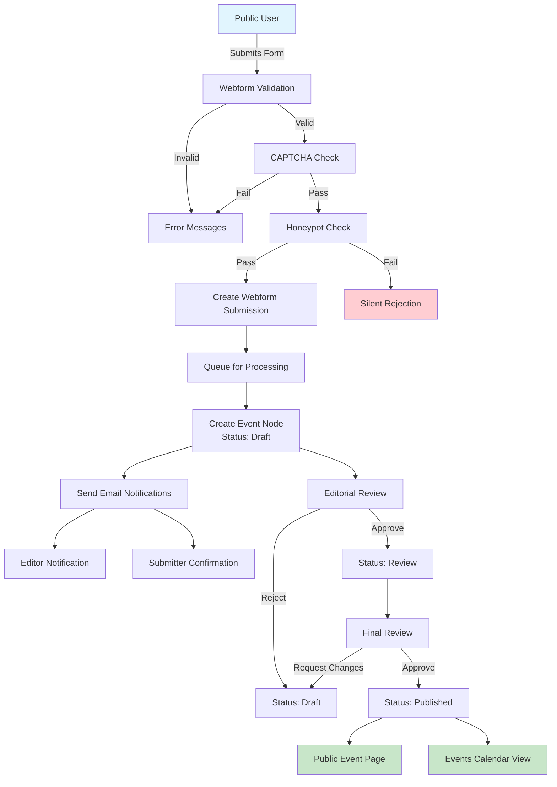

# Architecture Decision Record: Event Node Creation via Public Forms

## Status
**Proposed** | Date: 2025-01-20

## Context
The Gemeinde Bruchtal portal requires a public submission system for community events. Citizens and organizations need to submit event proposals that undergo editorial review before publication. The system must handle:
- Public event submissions without authentication
- Editorial workflow with review and approval stages
- Swiss data protection compliance (CH-DSG)
- Integration with existing Event content type
- Prevention of spam and malicious submissions

## Decision
We will implement a **Webform-to-Event-Node conversion pattern** using Drupal's Webform module as the submission interface and Content Moderation for workflow management.

### Architecture Components:
1. **Webform Module** for public form interface
2. **Webform Content Creator** handler for node creation
3. **Content Moderation** for workflow states
4. **Custom validation** for Swiss compliance
5. **CAPTCHA/Honeypot** for spam prevention

## Architecture Pattern

### Three-Layer Architecture:
```
┌─────────────────────────────────────────────┐
│          Presentation Layer                 │
│  - Public Event Submission Form             │
│  - Success/Error Messages                   │
│  - Swiss German UI (Sie-Form)               │
└─────────────────────────────────────────────┘
                    ↓
┌─────────────────────────────────────────────┐
│          Processing Layer                   │
│  - Webform Validation                       │
│  - Swiss Format Validation (eCH-0010)       │
│  - Spam Detection (Honeypot/CAPTCHA)        │
│  - Data Sanitization                        │
└─────────────────────────────────────────────┘
                    ↓
┌─────────────────────────────────────────────┐
│          Persistence Layer                  │
│  - Webform Submission Storage (30 days)     │
│  - Event Node Creation (draft state)        │
│  - Workflow Transition Logging              │
│  - Audit Trail (CH-DSG compliance)          │
└─────────────────────────────────────────────┘
```

## Consequences

### Positive:
- Clear separation of concerns between submission and content
- Built-in spam protection capabilities
- Audit trail for compliance
- Flexible form builder for editors
- Existing Event content type integration
- Workflow states provide editorial control

### Negative:
- Additional module dependency (Webform)
- Storage duplication (submission + node)
- Complexity in field mapping configuration
- Training required for form builders

### Neutral:
- Standard Drupal pattern (community best practice)
- Maintenance burden shared with community
- Performance impact minimal with proper caching

## Alternatives Considered

### 1. Direct Node Form with Anonymous Submission
- **Rejected**: Security risks, limited validation options, no audit trail

### 2. Custom Module for Event Submission
- **Rejected**: High maintenance burden, reinventing existing solutions

### 3. External Form Service Integration
- **Rejected**: Data residency concerns for Swiss compliance

## Implementation Guidelines

### Security Requirements:
- CAPTCHA for anonymous submissions
- Honeypot for bot detection
- Input sanitization for all text fields
- File upload restrictions (if applicable)
- Rate limiting per IP address

### Compliance Requirements:
- CH-DSG data retention (30 days for submissions)
- Audit logging for all state transitions
- Clear privacy notice on form
- Data minimization principles
- Right to erasure implementation

### Performance Targets:
- Form load time < 1 second
- Submission processing < 2 seconds
- Node creation via queue for scalability
- Cache tags for proper invalidation

## Decision Makers
- Solution Architect: Architecture approval
- Compliance Officer: CH-DSG validation
- Editorial Team: Workflow requirements
- Development Team: Technical feasibility

## Review Schedule
- Initial implementation: Sprint 1
- Security review: Sprint 2
- Compliance audit: Sprint 3
- Performance testing: Sprint 4
- Go-live review: Sprint 5

---

# Technical Implementation Guide

## 1. Field Mapping Strategy

### Webform Fields → Event Node Fields

```yaml
Event Submission Form:
  # Basic Information
  event_title:
    type: textfield
    required: true
    max_length: 255
    maps_to: title
    validation: 
      - no_html
      - swiss_german_chars
  
  event_description:
    type: textarea
    required: true
    max_length: 2000
    maps_to: field_description
    validation:
      - basic_html_only
      - no_scripts
  
  # Event Details
  event_date:
    type: date
    required: true
    date_format: 'd.m.Y'  # Swiss format
    maps_to: field_event_date
    validation:
      - future_date_only
      - max_1_year_ahead
  
  event_type:
    type: select
    required: true
    options_source: taxonomy:event_type
    maps_to: field_event_type
    validation:
      - valid_term_reference
  
  target_groups:
    type: checkboxes
    required: false
    options_source: taxonomy:target_group
    maps_to: field_target_group
    multiple: true
    validation:
      - max_5_selections
  
  # Contact Information (not stored in node)
  submitter_name:
    type: textfield
    required: true
    private: true  # CH-DSG compliance
    maps_to: null  # Stored only in submission
  
  submitter_email:
    type: email
    required: true
    private: true
    maps_to: null  # For notifications only
    validation:
      - valid_email
      - swiss_domain_preferred
  
  submitter_phone:
    type: tel
    required: false
    private: true
    pattern: '^\+41[0-9]{9}$|^0[0-9]{9}$'  # Swiss format
    maps_to: null
  
  # Compliance Fields
  privacy_consent:
    type: checkbox
    required: true
    maps_to: null
    label: 'Ich stimme der Verarbeitung meiner Daten gemäss Datenschutzerklärung zu'
  
  # Anti-Spam
  honeypot:
    type: hidden
    maps_to: null
```

## 2. Workflow Integration with Content Moderation

### Workflow States

```yaml
Event Editorial Workflow:
  states:
    draft:
      label: 'Entwurf'
      published: false
      default_revision: false
      weight: -10
    
    review:
      label: 'Zur Überprüfung'
      published: false
      default_revision: false
      weight: -5
    
    approved:
      label: 'Genehmigt'
      published: false
      default_revision: false
      weight: 0
    
    published:
      label: 'Veröffentlicht'
      published: true
      default_revision: true
      weight: 5
    
    archived:
      label: 'Archiviert'
      published: false
      default_revision: false
      weight: 10
  
  transitions:
    submit_for_review:
      label: 'Zur Überprüfung einreichen'
      from: [draft]
      to: review
      permission: 'use event editorial workflow transition submit_for_review'
    
    approve:
      label: 'Genehmigen'
      from: [review]
      to: approved
      permission: 'use event editorial workflow transition approve'
    
    publish:
      label: 'Veröffentlichen'
      from: [approved, review]
      to: published
      permission: 'use event editorial workflow transition publish'
    
    archive:
      label: 'Archivieren'
      from: [published]
      to: archived
      permission: 'use event editorial workflow transition archive'
    
    reject:
      label: 'Ablehnen'
      from: [review, approved]
      to: draft
      permission: 'use event editorial workflow transition reject'
```

## 3. Data Flow Diagram



## 4. Security Considerations

### Input Validation Layers

```php
/**
 * Custom validation for Swiss compliance.
 */
class SwissEventFormValidator {
  
  /**
   * Validate Swiss address format (eCH-0010).
   */
  public function validateAddress($street, $number, $plz, $city) {
    // PLZ must be 4 digits for Switzerland
    if (!preg_match('/^[1-9][0-9]{3}$/', $plz)) {
      return FALSE;
    }
    
    // Street and number separation
    if (empty($street) || empty($number)) {
      return FALSE;
    }
    
    // No special characters except German umlauts
    $allowed_pattern = '/^[a-zA-ZäöüÄÖÜ\s\-\.]+$/';
    if (!preg_match($allowed_pattern, $street)) {
      return FALSE;
    }
    
    return TRUE;
  }
  
  /**
   * Validate event date constraints.
   */
  public function validateEventDate($date) {
    $event_date = new \DateTime($date);
    $now = new \DateTime();
    $max_future = new \DateTime('+1 year');
    
    // Must be future date
    if ($event_date <= $now) {
      return t('Veranstaltungsdatum muss in der Zukunft liegen.');
    }
    
    // Maximum 1 year in advance
    if ($event_date > $max_future) {
      return t('Veranstaltungen können maximal 1 Jahr im Voraus eingereicht werden.');
    }
    
    return TRUE;
  }
  
  /**
   * Sanitize text input for Swiss German.
   */
  public function sanitizeSwissGerman($text) {
    // Replace ß with ss (Swiss German)
    $text = str_replace('ß', 'ss', $text);
    
    // Remove any non-printable characters
    $text = preg_replace('/[\x00-\x1F\x7F]/u', '', $text);
    
    // Trim and normalize spaces
    $text = preg_replace('/\s+/', ' ', trim($text));
    
    return $text;
  }
}
```

### Security Headers for Form Pages

```yaml
# security.headers.yml
event_submission_form:
  Content-Security-Policy: "default-src 'self'; script-src 'self' 'unsafe-inline' https://www.google.com/recaptcha/; style-src 'self' 'unsafe-inline';"
  X-Frame-Options: DENY
  X-Content-Type-Options: nosniff
  Referrer-Policy: strict-origin-when-cross-origin
  Permissions-Policy: "geolocation=(), microphone=(), camera=()"
```

### Rate Limiting Configuration

```php
/**
 * Implements hook_form_alter() for rate limiting.
 */
function zh_demo_form_alter(&$form, FormStateInterface $form_state, $form_id) {
  if ($form_id === 'webform_submission_event_form') {
    // Check rate limit (5 submissions per hour per IP)
    $ip = \Drupal::request()->getClientIp();
    $flood = \Drupal::flood();
    
    if (!$flood->isAllowed('event_submission', 5, 3600, $ip)) {
      $form['#access'] = FALSE;
      \Drupal::messenger()->addError(t('Zu viele Einreichungen. Bitte versuchen Sie es später erneut.'));
    }
    
    // Register the event on successful submission
    $form['#submit'][] = function() use ($ip, $flood) {
      $flood->register('event_submission', 3600, $ip);
    };
  }
}
```

## 5. Webform Handler Configuration

### Content Creator Handler Settings

```yaml
webform_handler:
  id: create_event_node
  handler_id: create_event_node
  label: 'Create Event Node'
  status: true
  weight: 0
  settings:
    entity_type: node
    bundle: event
    
    # Field Mappings
    fields:
      title: '[webform_submission:values:event_title]'
      field_description: '[webform_submission:values:event_description:value]'
      field_event_date: '[webform_submission:values:event_date:value]'
      field_event_type: '[webform_submission:values:event_type:entity:target_id]'
      field_target_group: '[webform_submission:values:target_groups:entity:target_id]'
      moderation_state: 'draft'
    
    # Additional Settings
    entity_owner: 1  # Admin user as owner
    entity_revision_create: true
    entity_revision_log_message: 'Created from public submission by [webform_submission:values:submitter_email]'
    
    # Conditions
    states:
      - completed
```

### Email Notification Handler

```yaml
webform_handler:
  id: email_notifications
  handler_id: email_notifications
  label: 'Email Notifications'
  status: true
  weight: 1
  settings:
    # Editor Notification
    to_mail: 'redaktion@bruchtal.ch'
    from_mail: 'noreply@bruchtal.ch'
    subject: 'Neue Veranstaltung eingereicht: [webform_submission:values:event_title]'
    body: |
      Guten Tag,
      
      Eine neue Veranstaltung wurde zur Überprüfung eingereicht:
      
      Titel: [webform_submission:values:event_title]
      Datum: [webform_submission:values:event_date:html_date]
      Eingereicht von: [webform_submission:values:submitter_name]
      E-Mail: [webform_submission:values:submitter_email]
      
      Bitte überprüfen Sie die Einreichung:
      [site:url]/admin/content/events/review/[webform_submission:sid]
      
      Mit freundlichen Grüssen
      Das Bruchtal Portal System
```

## 6. Module Dependencies

```yaml
# composer.json additions
{
  "require": {
    "drupal/webform": "^6.2",
    "drupal/webform_content_creator": "^4.0",
    "drupal/honeypot": "^2.1",
    "drupal/captcha": "^2.0",
    "drupal/recaptcha": "^3.2",
    "drupal/content_moderation": "core"
  }
}
```

## 7. Swiss Compliance Implementation

### Data Retention Policy

```php
/**
 * Implements hook_cron() for CH-DSG compliance.
 */
function zh_demo_cron() {
  // Delete webform submissions older than 30 days
  $storage = \Drupal::entityTypeManager()->getStorage('webform_submission');
  $query = $storage->getQuery()
    ->condition('webform_id', 'event_submission')
    ->condition('created', strtotime('-30 days'), '<')
    ->condition('entity_type', NULL)  // Only orphaned submissions
    ->accessCheck(FALSE);
  
  $sids = $query->execute();
  
  if (!empty($sids)) {
    $submissions = $storage->loadMultiple($sids);
    foreach ($submissions as $submission) {
      // Log deletion for audit trail
      \Drupal::logger('ch_dsg_compliance')->notice('Deleted event submission @sid after 30 days retention period.', [
        '@sid' => $submission->id(),
      ]);
      $submission->delete();
    }
  }
}
```

### Privacy Notice Component

```twig
{# privacy-notice.html.twig #}
<div class="privacy-notice bg-blue-50 border-l-4 border-blue-400 p-4 mb-6">
  <div class="flex">
    <div class="flex-shrink-0">
      <svg class="h-5 w-5 text-blue-400" viewBox="0 0 20 20" fill="currentColor">
        <path fill-rule="evenodd" d="M18 10a8 8 0 11-16 0 8 8 0 0116 0zm-7-4a1 1 0 11-2 0 1 1 0 012 0zM9 9a1 1 0 000 2v3a1 1 0 001 1h1a1 1 0 100-2v-3a1 1 0 00-1-1H9z" clip-rule="evenodd" />
      </svg>
    </div>
    <div class="ml-3">
      <h3 class="text-sm font-medium text-blue-800">
        Datenschutzhinweis
      </h3>
      <div class="mt-2 text-sm text-blue-700">
        <p>
          Ihre persönlichen Daten werden gemäss dem Schweizer Datenschutzgesetz (DSG) 
          und der kantonalen Datenschutzverordnung verarbeitet. Die Kontaktdaten werden 
          nur für die Bearbeitung Ihrer Einreichung verwendet und nach 30 Tagen automatisch 
          gelöscht. Die Veranstaltungsinformationen werden bei Genehmigung veröffentlicht.
        </p>
        <p class="mt-2">
          <a href="/datenschutz" class="font-medium underline">
            Vollständige Datenschutzerklärung →
          </a>
        </p>
      </div>
    </div>
  </div>
</div>
```

## 8. Testing Strategy

### Functional Tests

```php
/**
 * Tests event submission workflow.
 */
class EventSubmissionWorkflowTest extends BrowserTestBase {
  
  /**
   * Test successful event submission and node creation.
   */
  public function testEventSubmissionCreatesNode() {
    // Submit form with valid data
    $this->drupalGet('/veranstaltung-einreichen');
    $edit = [
      'event_title' => 'Dorffest Bruchtal 2025',
      'event_description' => 'Traditionelles Dorffest mit Musik und Unterhaltung.',
      'event_date' => '15.08.2025',
      'event_type' => 'fest',
      'target_groups[alle]' => TRUE,
      'submitter_name' => 'Hans Müller',
      'submitter_email' => 'hans.mueller@bruchtal.ch',
      'privacy_consent' => TRUE,
    ];
    $this->submitForm($edit, 'Einreichen');
    
    // Verify submission created
    $this->assertSession()->pageTextContains('Vielen Dank für Ihre Einreichung');
    
    // Verify node created in draft state
    $node = $this->getNodeByTitle('Dorffest Bruchtal 2025');
    $this->assertNotNull($node);
    $this->assertEquals('draft', $node->moderation_state->value);
    
    // Verify email sent to editors
    $this->assertMailSent('redaktion@bruchtal.ch');
  }
  
  /**
   * Test spam protection.
   */
  public function testHoneypotPreventsSpam() {
    $this->drupalGet('/veranstaltung-einreichen');
    
    // Fill honeypot field (bot behavior)
    $edit = [
      'event_title' => 'Spam Event',
      'honeypot_field' => 'bot-filled-this',
    ];
    $this->submitForm($edit, 'Einreichen');
    
    // Verify silent rejection
    $node = $this->getNodeByTitle('Spam Event');
    $this->assertNull($node);
  }
}
```

## 9. Performance Optimization

### Caching Strategy

```yaml
# Cache configuration for event forms
cache:
  contexts:
    - 'user.permissions'
    - 'languages:language_interface'
    - 'url.query_args'
  tags:
    - 'webform:event_submission'
    - 'config:webform.webform.event_submission'
  max-age: 3600  # 1 hour
```

### Queue Processing for Node Creation

```php
/**
 * Queue worker for asynchronous event node creation.
 *
 * @QueueWorker(
 *   id = "event_node_creator",
 *   title = @Translation("Event Node Creator"),
 *   cron = {"time" = 30}
 * )
 */
class EventNodeCreator extends QueueWorkerBase {
  
  public function processItem($data) {
    // Create node from submission data
    $node = Node::create([
      'type' => 'event',
      'title' => $data['title'],
      'field_description' => $data['description'],
      'field_event_date' => $data['date'],
      'field_event_type' => $data['event_type'],
      'field_target_group' => $data['target_groups'],
      'moderation_state' => 'draft',
      'uid' => 1,
    ]);
    
    $node->save();
    
    // Send notifications
    $this->sendNotifications($node, $data['submitter_email']);
    
    return TRUE;
  }
}
```

## 10. Monitoring & Metrics

### Key Performance Indicators

```yaml
Event Submission Metrics:
  - Average form completion time: < 3 minutes
  - Submission success rate: > 95%
  - Spam detection rate: > 99%
  - Time to first review: < 24 hours
  - Publication rate: > 80%
  - System uptime: 99.9%
```

### Logging Configuration

```php
/**
 * Custom logger for event submissions.
 */
class EventSubmissionLogger {
  
  public function logSubmission($submission) {
    \Drupal::logger('event_submission')->info('Event submitted: @title by @email', [
      '@title' => $submission->getData('event_title'),
      '@email' => $submission->getData('submitter_email'),
      'sid' => $submission->id(),
      'ip' => \Drupal::request()->getClientIp(),
      'timestamp' => time(),
    ]);
  }
  
  public function logWorkflowTransition($node, $from_state, $to_state) {
    \Drupal::logger('event_workflow')->notice('Event @nid transitioned from @from to @to', [
      '@nid' => $node->id(),
      '@from' => $from_state,
      '@to' => $to_state,
      'title' => $node->getTitle(),
      'user' => \Drupal::currentUser()->getAccountName(),
    ]);
  }
}
```

---

This architecture provides a robust, compliant, and maintainable solution for public event submissions in the Gemeinde Bruchtal portal, leveraging Drupal's proven patterns while ensuring Swiss regulatory compliance.