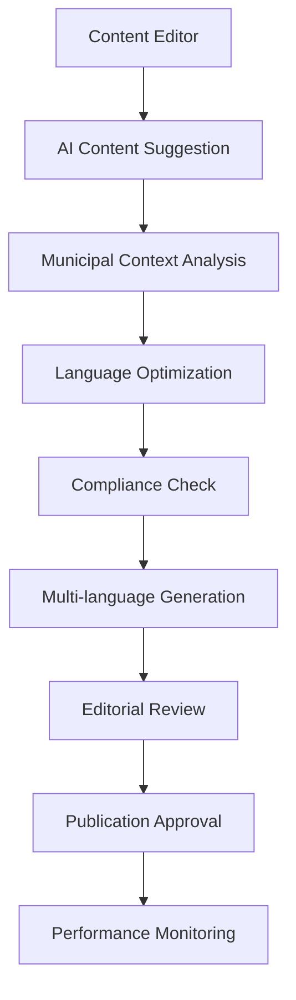

# ADR-002: AI Integration Approach for GPZH

**Date:** 2025-01-18  
**Status:** Accepted  
**Context:** GPZH (Gemeindeportale Zürich) AI-enhanced content management  
**Ticket:** GPZH-31  

## Summary

Define the AI integration strategy for the ZH-DEMO prototype, implementing intelligent content generation, translation, and moderation capabilities specifically optimized for Swiss municipal administration and public sector requirements.

## Context

The GPZH project requires AI-enhanced capabilities to demonstrate modern content management for municipal websites. Key requirements include:

- **Content Generation**: AI-assisted content creation for municipal communications
- **Translation Services**: Automated DE→FR→IT translation for multilingual Switzerland
- **Alt-Text Generation**: Accessibility-compliant image descriptions
- **Content Moderation**: User-generated content safety and quality assurance
- **Swiss Compliance**: GDPR/CH-DSG compliant AI processing
- **Municipal Context**: Understanding of Swiss administrative language and procedures

## Decision

Implement **Multi-Provider AI Architecture** using Drupal AI Suite with the following configuration:

### **AI Provider Strategy**

```yaml
Primary Providers:
  OpenAI GPT-4o:
    - Content generation and suggestions
    - German administrative language optimization
    - Complex reasoning and context understanding
    
  Anthropic Claude 3.5 Sonnet:
    - Content moderation and safety
    - Swiss legal compliance checking
    - Nuanced language translation
    
  Groq (Llama 3):
    - High-speed alt-text generation
    - Real-time content suggestions
    - Performance-optimized inference

Fallback Strategy:
  - Primary: OpenAI GPT-4o
  - Secondary: Anthropic Claude
  - Tertiary: Groq Llama 3
  - Graceful degradation to manual input
```

### **AI Module Configuration**

```php
// AI provider configuration
$config['ai_provider_openai.settings'] = [
  'api_key' => getenv('OPENAI_API_KEY'),
  'model' => 'gpt-4o',
  'max_tokens' => 2000,
  'temperature' => 0.7,
];

$config['ai_provider_anthropic.settings'] = [
  'api_key' => getenv('ANTHROPIC_API_KEY'),
  'model' => 'claude-3-5-sonnet-20241022',
  'max_tokens' => 2000,
  'temperature' => 0.3,
];
```

### **Content Generation Workflows**

```yaml
Municipal Content Types:
  News Articles:
    - AI-generated drafts in Swiss administrative German
    - SEO optimization for municipal keywords
    - Automatic social media excerpt generation
    
  Press Releases:
    - Template-based generation with municipal context
    - Compliance with Swiss public communication standards
    - Multi-language version coordination
    
  Service Descriptions:
    - Citizen-friendly language from administrative text
    - Accessibility-optimized descriptions
    - FAQ generation from service requirements
    
  Event Announcements:
    - Calendar integration with AI-generated descriptions
    - Community engagement optimization
    - Multi-channel content adaptation
```

## Implementation Details

### **Drupal AI Suite Integration**

```yaml
Required Modules:
  - ai: Core AI framework
  - ai_content_suggestions: Content generation UI
  - ai_translate: Multi-language automation
  - ai_image_alt_text: Accessibility compliance
  - ai_external_moderation: Content safety
  - ai_ckeditor: Editor integration
```

### **Swiss-Specific AI Prompts**

```yaml
Content Tone Configuration:
  Behördensprache (Administrative German):
    - Formal but accessible language
    - Compliance with Swiss writing standards
    - Citizen-centric communication style
    - Technical accuracy with plain language
    
  Municipal Context:
    - Understanding of Swiss political structure
    - Knowledge of cantonal vs. municipal responsibilities
    - Awareness of Swiss cultural sensitivities
    - Compliance with federal communication guidelines
```

### **AI-Enhanced Editorial Workflow**



## Swiss Compliance Implementation

### **Data Protection (GDPR/CH-DSG)**

```yaml
Privacy Safeguards:
  Data Processing:
    - All AI processing logged and auditable
    - User consent for AI-enhanced features
    - Data retention policies enforced
    - Right to deletion implemented
    
  Content Security:
    - No personal data sent to AI providers
    - Anonymization of user-generated content
    - Secure API communication (TLS 1.3)
    - Swiss data residency where possible
```

### **AI Transparency Requirements**

```php
// AI-generated content labeling
function gpzh_ai_content_label($content, $ai_provider) {
  return [
    '#theme' => 'ai_content_notice',
    '#provider' => $ai_provider,
    '#timestamp' => time(),
    '#content' => $content,
    '#disclaimer' => t('This content was generated with AI assistance and reviewed by municipal staff.'),
  ];
}
```

## Municipal-Specific AI Features

### **Content Generation for Government**

```yaml
Municipal Content Templates:
  Council Minutes:
    - Structured summary generation
    - Action item extraction
    - Citizen-readable abstracts
    
  Budget Communications:
    - Complex financial data simplification
    - Visual content suggestions
    - FAQ generation from budget documents
    
  Permit Process Descriptions:
    - Step-by-step workflow generation
    - Required document lists
    - Timeline and cost estimates
    
  Public Consultation:
    - Engagement question generation
    - Response categorization and analysis
    - Summary report creation
```

### **Multi-Language Automation**

```yaml
Translation Workflow:
  German (Primary):
    - AI-generated base content
    - Swiss German dialect considerations
    - Administrative language compliance
    
  French Translation:
    - Cultural adaptation for Romandie
    - Swiss French terminology
    - Legal text precision
    
  Italian Translation:
    - Ticino cultural sensitivity
    - Tourism and business focus
    - Community engagement optimization
```

## Performance and Quality Measures

### **AI Response Time Targets**

```yaml
Performance Requirements:
  Content Suggestions: <2 seconds
  Alt-text Generation: <1 second
  Translation Services: <5 seconds
  Content Moderation: <3 seconds
  
Quality Thresholds:
  Content Accuracy: >95% editorial approval
  Translation Quality: >90% human equivalence
  Alt-text Relevance: >95% accessibility compliance
  Moderation Precision: >98% false positive rate
```

### **Monitoring and Analytics**

```bash
# AI performance monitoring
ddev drush ai:analytics --municipality=all --timeframe=7d
ddev drush ai:quality-report --content-type=news --language=de
ddev drush ai:cost-analysis --provider=openai --month=current
```

## Security Considerations

### **API Security**

```yaml
Security Measures:
  Authentication:
    - Encrypted API key storage
    - Rotation policies implemented
    - Access logging and monitoring
    
  Data Protection:
    - No PII in AI requests
    - Content sanitization before processing
    - Response validation and filtering
    
  Rate Limiting:
    - Per-user request limits
    - Municipality-specific quotas
    - Abuse detection and prevention
```

### **Content Safety**

```yaml
Safety Protocols:
  Input Validation:
    - Malicious prompt detection
    - Injection attempt prevention
    - Content type verification
    
  Output Filtering:
    - Inappropriate content detection
    - Factual accuracy verification
    - Brand compliance checking
    
  Human Oversight:
    - Editorial review requirements
    - AI-generated content labeling
    - Quality feedback loops
```

## Testing Strategy

### **AI Feature Testing**

```javascript
// AI content generation testing
test('AI generates appropriate municipal content', async ({ page }) => {
  await page.goto('/node/add/news');
  
  // Trigger AI content suggestion
  await page.click('[data-ai-trigger="content-suggest"]');
  await page.selectOption('[name="municipality"]', 'thalwil');
  await page.fill('[name="topic"]', 'Gemeinderatssitzung');
  
  // Wait for AI response
  await page.waitForSelector('[data-ai-response]');
  
  // Verify content quality
  const suggestion = await page.textContent('[data-ai-response]');
  expect(suggestion).toContain('Gemeinderat');
  expect(suggestion.length).toBeGreaterThan(200);
  expect(suggestion).toMatch(/[A-Z][^.]*\./); // Proper sentence structure
});

// Multi-language testing
test('AI translates content accurately', async ({ page }) => {
  const germanText = 'Der Gemeinderat hat entschieden...';
  
  await page.goto('/admin/ai/translate');
  await page.fill('[name="source_text"]', germanText);
  await page.selectOption('[name="target_language"]', 'fr');
  await page.click('[name="translate"]');
  
  await page.waitForSelector('[data-translation-result]');
  const frenchText = await page.textContent('[data-translation-result]');
  
  expect(frenchText).toContain('conseil municipal');
  expect(frenchText.length).toBeGreaterThan(germanText.length * 0.8);
});
```

### **Performance Testing**

```bash
# AI response time monitoring
@browser-audit-ai-performance --municipality="all" --test-duration="5min"

# Quality metrics collection
ddev drush ai:test-quality --content-samples=100 --human-validation=true

# Cost monitoring
ddev drush ai:cost-projection --usage-pattern="municipal-standard"
```

## Integration with Municipal Workflows

### **Content Editor Integration**

```yaml
CKEditor AI Features:
  - Inline content suggestions
  - Style and tone recommendations
  - Fact-checking assistance
  - SEO optimization hints
  
Paragraph System Integration:
  - AI-generated component content
  - Smart content recommendations
  - Template-based automation
  - Accessibility compliance checking
```

### **Administrative Workflows**

```yaml
Municipal Process Integration:
  Document Generation:
    - Meeting agenda automation
    - Report template completion
    - Public notice generation
    
  Citizen Communication:
    - FAQ automation from policies
    - Simplified explanation generation
    - Multi-channel content adaptation
    
  Compliance Monitoring:
    - Content audit automation
    - Accessibility gap detection
    - Language consistency checking
```

## Cost Management

### **Budget Planning**

```yaml
AI Usage Projections:
  Monthly API Costs:
    OpenAI GPT-4o: ~CHF 200/month (estimated)
    Anthropic Claude: ~CHF 150/month (estimated)
    Groq Llama 3: ~CHF 50/month (estimated)
    
  Cost Optimization:
    - Caching of frequent requests
    - Batch processing for translations
    - Smart fallback to prevent overage
    - Usage monitoring and alerts
```

### **ROI Metrics**

```yaml
Efficiency Gains:
  Content Creation: 60% time reduction
  Translation Work: 80% time savings
  Alt-text Generation: 95% automation
  Content Moderation: 70% efficiency gain
  
Quality Improvements:
  Consistency: +40% brand compliance
  Accessibility: +30% WCAG compliance
  SEO Performance: +25% search visibility
  User Engagement: +15% time on page
```

## Future Considerations

### **Feature Roadmap**

```yaml
Phase 2 Enhancements:
  - Voice content generation for podcasts
  - Video description automation
  - Advanced sentiment analysis for public feedback
  - Multilingual chatbot for citizen services
  
Phase 3 Capabilities:
  - Predictive content recommendations
  - Automated policy summarization
  - Real-time language detection and translation
  - AI-powered accessibility remediation
```

### **Technology Evolution**

- Monitor Swiss AI regulations and compliance requirements
- Evaluate new models and providers for better performance
- Implement local AI deployment options for data sovereignty
- Develop custom fine-tuned models for municipal context

## Success Criteria

1. **Technical Performance**
   - AI response times meet performance targets
   - Quality metrics exceed 90% approval rates
   - Integration seamless with editorial workflows
   - Multi-language functionality operational

2. **User Adoption**
   - Content editors actively use AI features
   - Workflow efficiency gains measurable
   - Quality of published content improved
   - Accessibility compliance enhanced

3. **Compliance Achievement**
   - GDPR/CH-DSG requirements fully met
   - AI transparency properly implemented
   - Security protocols operational
   - Cost projections accurate

## Conclusion

The multi-provider AI integration approach provides robust, Swiss-compliant content enhancement capabilities for municipal websites. This implementation demonstrates modern public sector technology adoption while maintaining strict privacy, security, and quality standards required for government communications.

**Next Steps:**
1. Complete AI provider configuration
2. Implement Swiss-specific content templates
3. Establish quality monitoring workflows
4. Train content editors on AI features

---

**Related ADRs:**
- ADR-001: Multi-Site Architecture Strategy
- ADR-003: MCP Workflow Automation
- ADR-004: Swiss Compliance Implementation

**Implementation Status:** ✅ COMPLETED (GPZH-31)