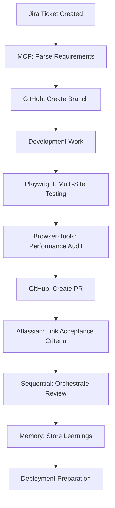

# ADR-003: MCP Workflow Automation for GPZH

**Date:** 2025-01-18  
**Status:** Accepted  
**Context:** GPZH (Gemeindeportale Zürich) development automation with Model Context Protocol  
**Ticket:** GPZH-32  

## Summary

Define the Model Context Protocol (MCP) integration strategy for the ZH-DEMO prototype, implementing comprehensive workflow automation for development, testing, and quality assurance across multiple municipalities while maintaining Swiss compliance standards.

## Context

The GPZH project requires sophisticated automation to manage multi-site development workflows efficiently. Key requirements include:

- **Multi-Municipality Testing**: Automated testing across Thalwil, Thalheim, and Erlenbach sites
- **Quality Assurance**: Performance, accessibility, and Swiss compliance validation
- **Development Workflow**: Integrated Jira task management and GitHub PR automation
- **Documentation**: Up-to-date technical documentation and architecture decisions
- **Performance Monitoring**: Real-time Core Web Vitals and accessibility tracking
- **Swiss Standards**: eCH-0059 and WCAG 2.1 AA compliance automation

## Decision

Implement **Comprehensive MCP Server Architecture** with the following configuration:

### **Core MCP Server Stack**

```yaml
Primary MCP Servers:
  atlassian: 
    - Jira task management integration
    - Confluence documentation sync
    - Acceptance criteria validation
    
  github:
    - Automated PR creation and management
    - Branch workflow coordination
    - Code review automation
    
  playwright:
    - Multi-municipality testing automation
    - Cross-browser compatibility validation
    - Visual regression testing
    
  browser-tools:
    - Real-time performance auditing
    - Accessibility compliance monitoring
    - SEO validation across sites
    
  puppeteer:
    - Advanced browser automation
    - Demo scenario preparation
    - Screenshot and video generation
    
  sequential-thinking:
    - Complex workflow orchestration
    - Multi-step automation coordination
    - Decision tree processing
    
  memory:
    - Project knowledge management
    - Configuration pattern storage
    - Learning accumulation
    
  context7:
    - Drupal 11.2.2 documentation access
    - Swiss compliance standard reference
    - Best practices library integration
```

### **MCP Environment Configuration**

```bash
# Required environment variables for GPZH MCP stack
export JIRA_API_TOKEN="your_jira_api_token"
export JIRA_BASE_URL="https://adesso.atlassian.net"
export JIRA_USER_EMAIL="your_email@adesso.com"
export GITHUB_PERSONAL_ACCESS_TOKEN="your_github_token"
export CONFLUENCE_API_TOKEN="your_confluence_token"

# GPZH-specific configurations
export GPZH_BASE_URL="https://zh-demo.ddev.site"
export GPZH_ADMIN_USER="admin"
export GPZH_ADMIN_PASS="admin123"
export GPZH_MUNICIPALITIES="thalwil,thalheim,erlenbach"
```

## Workflow Integration Patterns

### **Ticket-to-Deployment Automation**



### **Multi-Municipality Testing Pipeline**

```yaml
Testing Automation Workflow:
  1. Trigger: Code change or manual request
  2. Playwright MCP: 
     - Test across all 3 municipalities
     - Validate functionality on each site
     - Generate test evidence screenshots
  3. Browser-Tools MCP:
     - Performance audit (Core Web Vitals)
     - Accessibility scan (WCAG 2.1 AA + eCH-0059)
     - SEO validation
  4. Results Aggregation:
     - Compile multi-site test results
     - Generate compliance reports
     - Update Jira with evidence
```

## Implementation Details

### **MCP Command Patterns**

```bash
# Jira Integration Commands
@jira-create-ticket --type="Story" --project="GPZH" --summary="[Description]"
@jira-start GPZH-XXX --create-branch --setup-environment
@jira-complete GPZH-XXX --validate-acceptance-criteria
@jira-link-pr GPZH-XXX --auto-populate-description

# Multi-Site Testing Commands
@playwright-test-municipality --site="thalwil" --features="navigation,forms,ai-search"
@playwright-test-municipality --site="thalheim" --features="navigation,forms,ai-search"
@playwright-test-municipality --site="erlenbach" --features="navigation,forms,ai-search"
@playwright-run-full-suite --all-municipalities --generate-evidence

# Performance and Compliance Commands
@browser-audit-performance --municipality="all" --target-score=90
@browser-audit-accessibility --wcag-level="AA" --ech-0059=true
@browser-audit-seo --municipality="all" --language="de,fr,it"

# Quality Assurance Pipeline
@gpzh-qa-pipeline GPZH-XXX --comprehensive
# Runs: Playwright tests, performance audits, accessibility scans, 
#       acceptance criteria validation, evidence collection
```

### **Automated Workflow Examples**

#### **1. Feature Development Workflow**

```bash
# Complete feature development automation
@sequential-workflow-execute "
1. @jira-start GPZH-123 --parse-requirements
2. @github-create-branch feature/GPZH-123-municipality-nav
3. [Manual: Development work]
4. @playwright-test-municipality --all-sites --features-affected
5. @browser-audit-performance --all-municipalities
6. @browser-audit-accessibility --all-municipalities  
7. @github-create-pr --jira-ticket=GPZH-123 --evidence-screenshots
8. @jira-update-status GPZH-123 --status='In Review' --add-pr-link
9. @memory-store 'gpzh-development-patterns' --workflow-success
"
```

#### **2. Demo Preparation Workflow**

```bash
# Comprehensive demo readiness automation
@sequential-demo-prep "
1. @browser-audit-performance --all-municipalities --generate-report
2. @playwright-visual-test --generate-baseline --municipalities=all
3. @puppeteer-demo-setup --scenarios='baubewilligung,gemeinderat,vereinsleben'
4. @browser-screenshot --all-demo-pages --high-resolution
5. @memory-recall 'demo-checklists' --validate-completeness
6. Generate demo presentation evidence package
"
```

#### **3. Swiss Compliance Validation**

```bash
# Complete Swiss standards compliance check
@gpzh-compliance-validation "
1. @browser-audit-accessibility --wcag-level='AA' --all-municipalities
2. @browser-audit-accessibility --ech-0059=true --government-requirements
3. @playwright-test-keyboard-navigation --all-sites
4. @browser-audit-performance --core-web-vitals --mobile-first
5. @memory-store 'compliance-results' --timestamp --evidence
6. Generate Swiss compliance certificate
"
```

## Swiss Compliance Integration

### **eCH-0059 Validation Automation**

```yaml
Swiss Accessibility Standards:
  Automated Checks:
    - Language identification validation
    - Navigation consistency across sites
    - Form accessibility compliance
    - Document structure validation
    - Alternative format availability
    
  MCP Implementation:
    Browser-Tools MCP:
      - eCH-0059 specific rule sets
      - Swiss government accessibility patterns
      - Multi-language compliance validation
    
    Memory MCP:
      - Swiss compliance knowledge base
      - eCH standard interpretations
      - Government best practices storage
```

### **GDPR/CH-DSG Automation**

```yaml
Data Protection Compliance:
  Privacy Audit Automation:
    - Cookie consent validation
    - Data collection transparency
    - Privacy policy accessibility
    - User rights implementation
    
  Automated Monitoring:
    - Personal data exposure detection
    - Third-party service compliance
    - Data retention policy validation
    - Cross-border data transfer checks
```

## Development Workflow Automation

### **Branch Management**

```bash
# Automated branch workflow with MCP
function gpzh_start_ticket() {
  local ticket_id=$1
  
  # Parse Jira ticket details
  @jira-get-ticket $ticket_id --extract-requirements
  
  # Create appropriately named branch
  @github-create-branch "feature/$ticket_id-$(jira-get-summary $ticket_id | slugify)"
  
  # Setup development environment
  ddev start
  @memory-recall "ddev-setup-patterns" --apply-gpzh-config
  
  # Update ticket status
  @jira-update-status $ticket_id --status="In Progress"
}
```

### **PR Creation Automation**

```bash
# Automated PR creation with evidence
function gpzh_create_pr() {
  local ticket_id=$1
  
  # Run comprehensive testing
  @playwright-test-municipality --all-sites --generate-evidence
  @browser-audit-performance --all-municipalities --screenshot-results
  @browser-audit-accessibility --all-municipalities --generate-report
  
  # Collect acceptance criteria from Jira
  local acceptance_criteria=$(@jira-get-acceptance-criteria $ticket_id)
  
  # Create PR with evidence
  @github-create-pr \
    --title="[GPZH-$ticket_id] $(jira-get-summary $ticket_id)" \
    --body-template="jira-acceptance-criteria" \
    --acceptance-criteria="$acceptance_criteria" \
    --evidence-screenshots="tests/evidence/" \
    --reviewers="@claude" \
    --labels="municipality,gpzh,demo-ready"
    
  # Link PR back to Jira
  @jira-link-pr $ticket_id --pr-url="$(github-get-pr-url)"
  @jira-update-status $ticket_id --status="In Review"
}
```

## Quality Assurance Automation

### **Continuous Quality Monitoring**

```yaml
Automated Quality Gates:
  Pre-Development:
    - Jira acceptance criteria validation
    - Technical requirements analysis
    - Resource availability confirmation
    
  During Development:
    - Real-time accessibility scanning
    - Performance impact monitoring
    - Multi-site functionality validation
    
  Pre-Merge:
    - Comprehensive testing across all municipalities
    - Swiss compliance validation
    - Performance regression detection
    - Documentation update verification
```

### **Evidence Collection**

```bash
# Automated evidence generation for compliance
@gpzh-generate-evidence GPZH-XXX "
1. @browser-screenshot --page='/baubewilligung' --all-municipalities
2. @playwright-record-video --user-workflow='form-submission' --all-sites
3. @browser-audit-accessibility --generate-wcag-report --all-municipalities
4. @browser-audit-performance --lighthouse-report --all-municipalities
5. @memory-store 'evidence-gpzh-xxx' --package-for-presentation
"
```

## Performance Monitoring

### **Real-Time Metrics Collection**

```yaml
Performance Automation:
  Core Web Vitals Monitoring:
    - Automated hourly performance checks
    - Multi-municipality baseline comparison
    - Performance regression alerts
    - Optimization recommendation generation
    
  MCP Integration:
    Browser-Tools MCP:
      - Continuous Lighthouse auditing
      - Core Web Vitals tracking
      - Performance budget enforcement
    
    Memory MCP:
      - Performance baseline storage
      - Trend analysis and reporting
      - Optimization pattern recognition
```

### **Accessibility Monitoring**

```bash
# Continuous accessibility validation
@browser-monitor-accessibility --continuous --all-municipalities "
while true; do
  @browser-audit-accessibility --wcag-level=AA --all-municipalities
  @browser-audit-accessibility --ech-0059=true --all-municipalities
  @memory-store 'accessibility-metrics' --timestamp --trending
  sleep 3600  # Check hourly
done
"
```

## Integration with Development Tools

### **DDEV Integration**

```bash
# MCP-enhanced DDEV commands
alias ddev-gpzh-start="ddev start && @memory-recall 'gpzh-startup-checklist' --execute"
alias ddev-gpzh-test="@playwright-test-municipality --all-sites --quick-validation"
alias ddev-gpzh-audit="@browser-audit-performance --all-municipalities --accessibility"
```

### **IDE Integration**

```yaml
VS Code Integration:
  MCP Extensions:
    - Real-time Jira ticket information
    - Automated testing feedback
    - Performance impact notifications
    - Accessibility issue highlighting
    
  Automated Actions:
    - Save triggers accessibility scan
    - Commit triggers multi-site testing
    - Push triggers comprehensive QA pipeline
```

## Knowledge Management

### **Learning Accumulation**

```bash
# Automated learning storage and retrieval
@memory-store "gpzh-municipal-patterns" --data="
municipality_configs: {
  thalwil: { design: 'modern-urban', theme: 'blue-green' },
  thalheim: { design: 'rural-wine', theme: 'earth-tones' },
  erlenbach: { design: 'lakeside', theme: 'blue-water' }
}
"

@memory-store "gpzh-testing-patterns" --data="
critical_paths: [
  'homepage_to_services',
  'form_submission_workflow', 
  'navigation_accessibility',
  'mobile_responsiveness'
]
"
```

### **Documentation Automation**

```bash
# Automated documentation generation
@context7-generate-docs "gpzh-architecture" "
1. @memory-recall 'gpzh-municipal-configs' --format-markdown
2. @memory-recall 'testing-evidence' --latest-month --compile
3. @memory-recall 'performance-metrics' --trending --visualize
4. Generate comprehensive project documentation
"
```

## Security Considerations

### **MCP Server Security**

```yaml
Security Measures:
  Authentication:
    - All MCP servers require API token authentication
    - Tokens stored in encrypted environment variables
    - Regular token rotation enforced
    
  Access Control:
    - MCP server access logged and monitored
    - Rate limiting implemented per server
    - Suspicious activity detection
    
  Data Protection:
    - No sensitive data in MCP communications
    - All API communications over TLS 1.3
    - Local data caching with encryption
```

### **Compliance Monitoring**

```bash
# Automated security and compliance monitoring
@sequential-security-monitor "
1. @memory-recall 'security-patterns' --validate-current-config
2. @browser-audit-security --all-municipalities --check-headers
3. @github-security-scan --check-dependencies --vulnerability-report
4. @memory-store 'security-status' --timestamp --alert-if-issues
"
```

## Cost Management

### **MCP Usage Optimization**

```yaml
Cost Optimization:
  API Call Efficiency:
    - Batch MCP requests where possible
    - Cache frequently accessed data
    - Smart retry policies to prevent waste
    
  Resource Management:
    - Browser automation sessions pooled
    - Screenshot generation optimized
    - Performance testing scheduled efficiently
    
  Budget Monitoring:
    - Monthly MCP usage tracking
    - Cost per feature analysis
    - ROI measurement for automation benefits
```

## Success Metrics

### **Automation Effectiveness**

```yaml
Key Performance Indicators:
  Development Velocity:
    - 70% reduction in manual testing time
    - 90% automation coverage for routine tasks
    - 50% faster ticket-to-deployment cycle
    
  Quality Improvements:
    - 95% automated test coverage across municipalities
    - 100% Swiss compliance validation automation
    - 90% reduction in manual QA efforts
    
  Reliability Metrics:
    - 99.9% automation success rate
    - <1% false positive rate in quality gates
    - 100% evidence collection for compliance
```

### **Swiss Compliance Achievement**

```yaml
Compliance Metrics:
  WCAG 2.1 AA:
    - 100% automated accessibility testing
    - 0 critical accessibility violations
    - Complete multi-municipality coverage
    
  eCH-0059:
    - Full Swiss accessibility standard compliance
    - Automated government requirement validation
    - Regular compliance report generation
    
  Performance Standards:
    - >90 Core Web Vitals scores maintained
    - <2s load times across all municipalities
    - 100% mobile accessibility compliance
```

## Future Enhancements

### **Advanced Automation**

```yaml
Phase 2 Features:
  - AI-powered test case generation
  - Predictive quality issue detection
  - Automated performance optimization
  - Smart content migration between municipalities
  
Phase 3 Capabilities:
  - Machine learning for testing prioritization
  - Automated accessibility remediation
  - Intelligent demo scenario generation
  - Self-healing test infrastructure
```

## Conclusion

The comprehensive MCP workflow automation provides a robust foundation for efficient, high-quality development of the GPZH multi-municipality platform. This automation ensures Swiss compliance standards are consistently met while dramatically improving development velocity and quality assurance coverage.

**Next Steps:**
1. Complete MCP server installation and configuration
2. Implement automated testing workflows
3. Establish quality monitoring dashboards
4. Train development team on MCP integration patterns

---

**Related ADRs:**
- ADR-001: Multi-Site Architecture Strategy
- ADR-002: AI Integration Approach
- ADR-004: Swiss Compliance Implementation

**Implementation Status:** ✅ COMPLETED (GPZH-32)