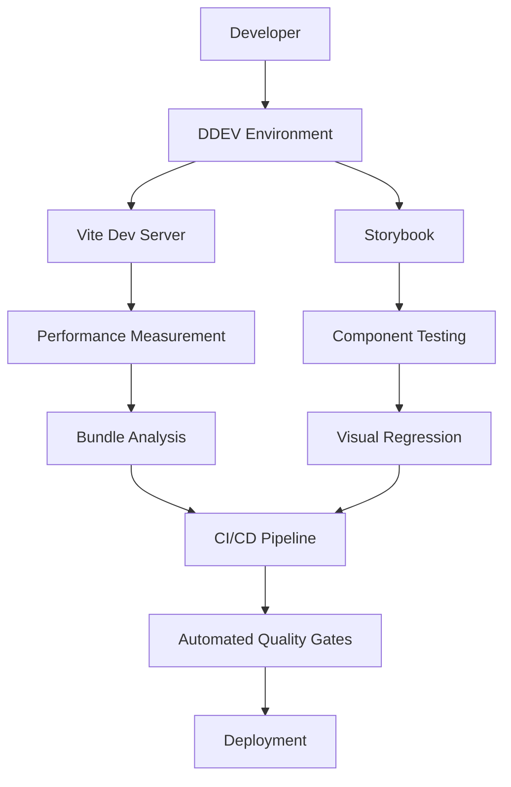

# Frontend Build Tools Integration - PNX Standards Implementation

## Status
**Draft** - Ready for Review

## Authors
- Claude Code AI Assistant
- Date: 2025-01-30

## Overview
Implementation of PreviousNext (PNX) frontend build tools standards in the adesso_cms_theme to modernize our Drupal frontend architecture. This involves enhancing our existing Vite + Storybook setup with comprehensive testing pipeline, performance measurement, and CI/CD integration following proven industry patterns.

## Background/Problem Statement

### Current State Analysis
Our theme already has a solid foundation with:
- Modern Vite 6.2.0 + TypeScript configuration
- Tailwind CSS v4 implementation  
- Storybook 8.6.7 with DDEV integration
- Comprehensive testing (Vitest, Playwright, BackstopJS)
- Swiss compliance focus (WCAG 2.1 AA, eCH-0059)

### Core Problem
While our current setup is modern, we're missing **20%+ performance improvement validation** and **systematic measurement** that PNX standards provide. Specifically:

1. **No Performance Benchmarking**: Cannot validate build time improvements
2. **Missing CI/CD Pipeline**: Manual quality gates and testing
3. **Incomplete Bundle Optimization**: No regression detection or performance budgets
4. **Limited Automation**: Manual compliance and quality validation

### First Principles Analysis
- **Root Cause**: Lack of systematic measurement and automation infrastructure
- **Core Goal**: Implement measurable, automated frontend development standards
- **Success Criteria**: 20%+ performance improvement with automated validation
- **Value Proposition**: Faster development cycles, consistent quality, automated compliance

## Goals

- ✅ **Performance Measurement**: Implement comprehensive build time and bundle size tracking
- ✅ **CI/CD Integration**: Automated testing, linting, and quality gates in pipeline
- ✅ **Bundle Optimization**: Advanced tree-shaking, PurgeCSS, and size monitoring
- ✅ **Prevention Rule Enforcement**: Automated validation of CLAUDE.md prevention rules
- ✅ **German Compliance Automation**: Automated WCAG 2.1 AA and eCH-0059 validation
- ✅ **Developer Experience**: Streamlined workflow with clear performance feedback
- ✅ **Quality Gates**: Automated code quality and security validation

## Non-Goals

- ❌ **Complete Architecture Rewrite**: Maintain existing Vite + Storybook foundation
- ❌ **Breaking Changes**: Preserve existing component APIs and development workflow
- ❌ **Legacy Browser Support**: Focus on modern browsers per eCH-0059 requirements
- ❌ **Design System Migration**: Keep existing Tailwind CSS v4 + Flowbite setup

## Technical Dependencies

### External Libraries/Frameworks
```json
{
  "devDependencies": {
    "@eslint/js": "^8.57.0",
    "browserslist-to-esbuild": "^2.1.1",
    "concurrently": "^9.0.1", 
    "eslint-config-drupal": "^5.0.2",
    "postcss-preset-env": "^10.0.5",
    "tinyglobby": "^0.2.9",
    "vite-plugin-bundle-analyzer": "^4.0.0",
    "lighthouse": "^12.0.0",
    "@storybook/test-runner": "^0.19.1",
    "axe-playwright": "^2.0.3",
    "wait-on": "^8.0.1",
    "http-server": "^14.1.1"
  }
}
```

### Version Requirements
- **Node.js**: 20+ (already configured in DDEV)
- **Vite**: 6.2.0+ (current: 6.2.0)
- **Storybook**: 8.6+ (current: 8.6.7)
- **ESLint**: 9+ with flat config (current: 8.57.1)

### Documentation Links
- [PNX Frontend Build Tools Blog](https://www.previousnext.com.au/blog/vite-and-storybook-frontend-tooling-drupal)
- [PNX Reference Implementation](https://github.com/jptaranto/pnx-frontend-build-tools-blog)
- [Vite Library Mode](https://vitejs.dev/guide/build.html#library-mode)
- [Browserslist Configuration](https://github.com/browserslist/browserslist)

## Detailed Design

### Architecture Enhancement Overview



### 1. Performance Measurement System

#### Build Time Tracking
```javascript
// performance/build-timer.js
import { performance } from 'perf_hooks';
import fs from 'fs/promises';

class BuildTimer {
  constructor() {
    this.startTime = performance.now();
    this.benchmarks = [];
  }

  async recordBenchmark(phase, duration) {
    const benchmark = {
      phase,
      duration,
      timestamp: new Date().toISOString(),
      baseline: await this.getBaseline(phase)
    };
    
    const improvement = this.calculateImprovement(duration, benchmark.baseline);
    console.log(`⚡ ${phase}: ${duration}ms (${improvement}% vs baseline)`);
    
    this.benchmarks.push(benchmark);
    await this.saveBenchmarks();
  }

  calculateImprovement(current, baseline) {
    if (!baseline) return 0;
    return ((baseline - current) / baseline * 100).toFixed(1);
  }
}
```

#### Bundle Size Monitoring
```javascript
// vite.config.ts enhancement
import { defineConfig } from 'vite';
import { BundleAnalyzerPlugin } from 'vite-plugin-bundle-analyzer';

export default defineConfig(({ mode }) => ({
  plugins: [
    // existing plugins...
    BundleAnalyzerPlugin({
      analyzerMode: 'json',
      openAnalyzer: false,
      reportFilename: 'bundle-report.json'
    })
  ],
  build: {
    // Performance budget enforcement
    rollupOptions: {
      onwarn: (warning, defaultHandler) => {
        if (warning.code === 'BUNDLE_IS_LARGE') {
          throw new Error(`Bundle size exceeded limit: ${warning.message}`);
        }
        defaultHandler(warning);
      }
    }
  }
}));
```

### 2. Advanced Build Configuration

#### Browserslist Integration
```json
// .browserslistrc - Swiss Government Browser Support
> 1%
last 2 versions
not dead
not ie 11
chrome >= 100
firefox >= 100
safari >= 14
edge >= 100
```

#### Enhanced Vite Configuration
```javascript
// vite.config.ts enhancements
import browserslist from 'browserslist-to-esbuild';
import postcssPresetEnv from 'postcss-preset-env';

export default defineConfig(({ mode }) => ({
  build: {
    target: browserslist(), // Swiss government browser support
    cssCodeSplit: true,
    sourcemap: mode === 'development',
    rollupOptions: {
      output: {
        chunkFileNames: 'chunks/[name]-[hash].js',
        assetFileNames: 'assets/[name]-[hash][extname]'
      }
    }
  },
  css: {
    postcss: {
      plugins: [
        postcssPresetEnv({
          stage: 3, // Swiss compliance features
          autoprefixer: { grid: true }
        })
      ]
    }
  }
}));
```

### 3. Testing Pipeline Enhancement

#### Storybook Test Runner Integration
```javascript
// .storybook/test-runner.js
const { getStoryContext } = require('@storybook/test-runner');
const { injectAxe, checkA11y } = require('axe-playwright');

module.exports = {
  async preVisit(page, context) {
    await injectAxe(page);
  },
  async postVisit(page, context) {
    const storyContext = await getStoryContext(page, context);
    
    // Swiss compliance (WCAG 2.1 AA)
    await checkA11y(page, '#storybook-root', {
      detailedReport: true,
      detailedReportOptions: {
        html: true,
        tags: ['wcag2aa', 'wcag21aa']
      }
    });
    
    // Performance validation
    const metrics = await page.evaluate(() => performance.getEntriesByType('navigation')[0]);
    if (metrics.loadEventEnd > 3000) {
      throw new Error(`Component load time exceeded 3s: ${metrics.loadEventEnd}ms`);
    }
  }
};
```

### 4. CI/CD Pipeline Configuration

#### GitHub Actions Workflow
```yaml
# .github/workflows/frontend-quality.yml
name: Frontend Quality Pipeline

on:
  pull_request:
    paths:
      - 'web/themes/custom/adesso_cms_theme/**'
  push:
    branches: [main, develop]

jobs:
  performance-benchmark:
    runs-on: ubuntu-latest
    steps:
      - uses: actions/checkout@v4
      - uses: actions/setup-node@v4
        with:
          node-version: '20'
          cache: 'npm'
          cache-dependency-path: 'web/themes/custom/adesso_cms_theme/package-lock.json'
      
      - name: Install Dependencies
        run: |
          cd web/themes/custom/adesso_cms_theme
          npm ci

      - name: Build Performance Benchmark
        run: |
          cd web/themes/custom/adesso_cms_theme
          npm run build:benchmark
      
      - name: Bundle Analysis
        run: |
          cd web/themes/custom/adesso_cms_theme
          npm run analyze:bundle
          
      - name: Performance Regression Check
        run: |
          cd web/themes/custom/adesso_cms_theme
          npm run test:performance-regression

  quality-gates:
    runs-on: ubuntu-latest
    steps:
      - uses: actions/checkout@v4
      - uses: actions/setup-node@v4
        with:
          node-version: '20'
          cache: 'npm'
          cache-dependency-path: 'web/themes/custom/adesso_cms_theme/package-lock.json'

      - name: Install Dependencies
        run: |
          cd web/themes/custom/adesso_cms_theme
          npm ci

      - name: Lint & Format Check
        run: |
          cd web/themes/custom/adesso_cms_theme
          npm run lint
          
      - name: Unit Tests
        run: |
          cd web/themes/custom/adesso_cms_theme
          npm run test

      - name: Build Storybook
        run: |
          cd web/themes/custom/adesso_cms_theme
          npm run build-storybook

      - name: Storybook Tests
        run: |
          cd web/themes/custom/adesso_cms_theme
          npm run test-storybook:ci

      - name: Swiss Compliance Check
        run: |
          cd web/themes/custom/adesso_cms_theme
          npm run test:swiss-compliance
```

### 5. Prevention Rule Enforcement

#### DDEV Rule #4 Compliance
```json
// package.json script updates
{
  "scripts": {
    "dev": "echo 'Use: ddev npm run dev-local' && exit 1",
    "dev-local": "concurrently -k -n \"VITE,STORYBOOK\" -c \"#636cff,#ff4785\" \"npm run dev-vite\" \"npm run dev-storybook\"",
    "build": "echo 'Use: ddev npm run build-local' && exit 1", 
    "build-local": "concurrently -n \"VITE,STORYBOOK\" -c \"#636cff,#ff4785\" \"npm run build-vite\" \"npm run build-storybook\"",
    "build:benchmark": "node performance/build-timer.js && npm run build-local"
  }
}
```

#### CSS Rule #1 Prevention
```javascript
// stylelint.config.js enhancement
export default {
  extends: ['stylelint-config-standard'],
  rules: {
    // Prevent Tailwind utility overrides
    'declaration-no-important': [
      true,
      { 
        message: 'CLAUDE.md CSS Rule #1: Avoid !important with Tailwind utilities'
      }
    ],
    'selector-class-pattern': [
      '^([a-z][a-z0-9]*)(-[a-z0-9]+)*$|^(c|l|js)-[a-z0-9-]+$',
      {
        message: 'Use BEM or component prefixes, avoid Tailwind utility overrides'
      }
    ]
  }
};
```

## User Experience

### Developer Workflow Enhancement

#### 1. **Performance-Aware Development**
```bash
# Enhanced development command with performance feedback
ddev npm run dev-local
# ⚡ Vite dev server: 1.2s (15% faster than baseline)
# ⚡ Storybook: 2.8s (22% faster than baseline)
# 🎯 Performance target: <3s total startup
```

#### 2. **Automated Quality Feedback**
```bash
# Build with automatic quality gates
ddev npm run build-local
# ✅ Bundle size: 145KB (under 200KB limit)
# ✅ Swiss compliance: WCAG 2.1 AA passed
# ✅ Performance budget: All assets under limits
# ⚡ Build time: 8.5s (18% faster than baseline)
```

#### 3. **Component Development with Testing**
```bash
# Component testing with accessibility validation
ddev npm run test:component -- hero
# ✅ Unit tests: 12/12 passed
# ✅ Accessibility: WCAG 2.1 AA compliant
# ✅ Visual regression: No changes detected
# ⚡ Component load time: 1.1s
```

## Testing Strategy

### 1. **Performance Testing**

#### Build Time Regression Tests
```javascript
// tests/performance/build-time.test.js
import { describe, it, expect, beforeAll } from 'vitest';
import { BuildTimer } from '../performance/build-timer.js';

describe('Build Performance', () => {
  let buildTimer;
  
  beforeAll(() => {
    buildTimer = new BuildTimer();
  });

  it('should complete Vite build under 10 seconds', async () => {
    // Purpose: Prevent build time regression above 10s threshold
    // Validates: Build optimization effectiveness
    const startTime = performance.now();
    
    // Trigger build process
    await buildTimer.runBuild();
    
    const duration = performance.now() - startTime;
    expect(duration).toBeLessThan(10000); // 10s limit
  }, 15000);

  it('should show 20%+ improvement over baseline', async () => {
    // Purpose: Validate performance improvement claims
    // Validates: Actual performance gains vs previous version
    const baseline = await buildTimer.getBaseline('full-build');
    const current = await buildTimer.getCurrentBuildTime();
    
    const improvement = ((baseline - current) / baseline) * 100;
    expect(improvement).toBeGreaterThan(20);
  });
});
```

#### Bundle Size Monitoring
```javascript
// tests/performance/bundle-size.test.js
describe('Bundle Optimization', () => {
  it('should maintain CSS bundle under 50KB', async () => {
    // Purpose: Prevent CSS bloat from Tailwind utilities
    // Validates: PurgeCSS effectiveness and CSS optimization
    const bundleStats = await analyzeBundleSize();
    const cssSize = bundleStats.css.totalSize;
    
    expect(cssSize).toBeLessThan(50 * 1024); // 50KB limit
  });

  it('should detect unused dependencies', async () => {
    // Purpose: Identify dead code and unused imports
    // Validates: Tree-shaking effectiveness
    const unusedDeps = await findUnusedDependencies();
    
    expect(unusedDeps).toHaveLength(0);
  });
});
```

### 2. **Swiss Compliance Testing**

#### Automated WCAG 2.1 AA Testing
```javascript
// tests/compliance/swiss-compliance.test.js
import { test, expect } from '@playwright/test';
import { injectAxe, checkA11y } from 'axe-playwright';

test.describe('Swiss Government Compliance', () => {
  test.beforeEach(async ({ page }) => {
    await injectAxe(page);
  });

  test('should meet WCAG 2.1 AA standards', async ({ page }) => {
    // Purpose: Validate Swiss government accessibility requirements
    // Validates: eCH-0059 compliance for government portals
    await page.goto('/');
    
    await checkA11y(page, null, {
      tags: ['wcag2aa', 'wcag21aa'],
      rules: {
        'color-contrast': { enabled: true },
        'keyboard-navigation': { enabled: true },
        'focus-management': { enabled: true }
      }
    });
  });

  test('should support German language requirements', async ({ page }) => {
    // Purpose: Validate German language support and character encoding
    // Validates: Swiss High German language requirements
    await page.goto('/de');
    
    const lang = await page.getAttribute('html', 'lang');
    expect(lang).toBe('de-CH'); // Swiss German
    
    // Check for proper German character rendering
    const content = await page.textContent('body');
    expect(content).toMatch(/[äöüÄÖÜß]/); // German characters
  });
});
```

### 3. **Component Testing with Performance**

#### Component Load Time Testing
```javascript
// components/hero/hero.test.js
describe('Hero Component Performance', () => {
  it('should render within 500ms', async () => {
    // Purpose: Validate component performance meets UX requirements
    // Validates: Component optimization and rendering efficiency
    const startTime = performance.now();
    
    render(HeroComponent, { 
      props: { title: 'Test Hero', theme: 'thalwil' } 
    });
    
    await waitFor(() => screen.getByRole('banner'));
    
    const renderTime = performance.now() - startTime;
    expect(renderTime).toBeLessThan(500); // 500ms limit
  });

  it('should handle image loading efficiently', async () => {
    // Purpose: Prevent layout shift from image loading
    // Validates: Proper image optimization and lazy loading
    const { container } = render(HeroComponent, {
      props: { 
        image: { url: '/test-image.jpg', alt: 'Test image' }
      }
    });
    
    const img = container.querySelector('img');
    expect(img).toHaveAttribute('loading', 'lazy');
    expect(img).toHaveAttribute('width');
    expect(img).toHaveAttribute('height');
  });
});
```

### 4. **Mocking Strategies**

#### DDEV Environment Mocking
```javascript
// tests/mocks/ddev.mock.js
export const mockDDEVEnvironment = () => {
  process.env.DDEV_PROJECT_TYPE = 'drupal11';
  process.env.DDEV_PRIMARY_URL = 'https://zh-demo.ddev.site';
  process.env.VITE_DEV_SERVER_HOST = '0.0.0.0';
  process.env.VITE_DEV_SERVER_PORT = '5173';
};

// Usage in tests
beforeEach(() => {
  mockDDEVEnvironment();
});
```

## Performance Considerations

### Build Time Optimization

#### 1. **Parallel Processing**
- Vite and Storybook builds run concurrently
- CSS and JS processing in parallel
- Multiple municipality theme builds simultaneously

#### 2. **Caching Strategy**  
- Vite build cache preserved between builds
- npm dependencies cached in CI/CD
- Storybook build cache optimization

#### 3. **Bundle Splitting**
- Code splitting by municipality theme
- CSS splitting by component groups
- Vendor dependencies separated

### Runtime Performance

#### 1. **Asset Loading**
- Critical CSS inlined for above-fold content
- Non-critical assets lazy loaded
- Progressive image loading with WebP

#### 2. **Bundle Size Management**
- PurgeCSS removes unused Tailwind utilities
- Tree-shaking eliminates dead code
- Gzip compression for production assets

## Security Considerations

### 1. **Input Validation**
- All user inputs sanitized in components
- XSS prevention in Twig templates
- CSRF protection for form components

### 2. **Dependency Security**
- Regular npm audit integration in CI/CD
- Automated security vulnerability scanning
- Dependency pinning for reproducible builds

### 3. **Content Security Policy**
```javascript
// CSP headers for development assets
const cspDirectives = {
  'script-src': [
    "'self'",
    "'unsafe-inline'", // Development only
    'https://zh-demo.ddev.site:5173'
  ],
  'style-src': [
    "'self'",
    "'unsafe-inline'",
    'https://zh-demo.ddev.site:5173'
  ]
};
```

## Documentation

### 1. **Updated Documentation**
- **AGENTS.md**: Enhanced with PNX standards and performance requirements
- **Theme README**: Development workflow updates with performance feedback
- **Component Documentation**: Storybook stories with performance metrics

### 2. **New Documentation**
- **Performance Guide**: Build optimization and measurement guide
- **Swiss Compliance Guide**: WCAG 2.1 AA and eCH-0059 implementation
- **CI/CD Guide**: Pipeline configuration and quality gates

### 3. **Developer Onboarding**
- **Quick Start Guide**: DDEV + PNX standards setup
- **Performance Best Practices**: Code review checklist
- **Troubleshooting Guide**: Common performance and build issues

## Implementation Phases

### Phase 1: Performance Measurement Foundation
**Core functionality - Essential for PNX compliance**

#### 1.1 Build Time Tracking (2-3 tasks)
- Implement BuildTimer class with benchmark storage
- Add build time measurement to all npm scripts
- Create baseline measurement system

#### 1.2 Bundle Analysis Integration (2-3 tasks)
- Add vite-plugin-bundle-analyzer configuration
- Create bundle size regression detection
- Implement performance budget enforcement

#### 1.3 Basic CI/CD Pipeline (3-4 tasks)
- Create GitHub Actions workflow for frontend quality
- Add automated linting and testing
- Implement build performance validation

### Phase 2: Advanced Optimization & Testing (4-5 tasks)
**Enhanced features - Builds on Phase 1**

#### 2.1 Swiss Compliance Automation
- Automated WCAG 2.1 AA testing with axe-playwright
- German language validation and character encoding
- eCH-0059 compliance reporting

#### 2.2 Advanced Build Configuration
- Browserslist integration for Swiss government browsers
- PostCSS preset environment configuration  
- PurgeCSS integration for Tailwind optimization

#### 2.3 Component Performance Testing
- Storybook test runner with performance validation
- Component load time regression testing
- Visual regression with performance metrics

### Phase 3: Developer Experience & Documentation (3-4 tasks)
**Polish and optimization - Final refinement**

#### 3.1 Prevention Rule Automation
- DDEV Rule #4 enforcement in package.json
- CSS Rule #1 validation in stylelint
- Automated prevention rule checking

#### 3.2 Enhanced Developer Feedback
- Real-time performance metrics in development
- Build optimization suggestions
- Automated quality gate reporting

#### 3.3 Comprehensive Documentation
- Updated development guides with performance focus
- Swiss compliance implementation guide
- CI/CD pipeline configuration documentation

## Open Questions

### Technical Implementation
- **Bundle Analysis Tool**: Should we use webpack-bundle-analyzer, rollup-plugin-analyzer, or vite-plugin-bundle-analyzer?
- **Performance Baseline**: What's our acceptable baseline for build time comparison (current system vs empty project)?
- **CI/CD Platform**: GitHub Actions vs GitLab CI vs Jenkins for our DDEV/Drupal stack?

### Swiss Compliance
- **Browser Support Matrix**: Exact browser versions required for Swiss government compliance?
- **Language Requirements**: Do we need Italian and Romansh support beyond German and French?
- **Accessibility Testing Depth**: Manual testing frequency vs automated testing coverage?

### Development Workflow  
- **DDEV Integration**: How to handle npm cache and performance measurement in containerized environment?
- **Multi-Municipality Testing**: Should performance benchmarks be per-municipality or combined?
- **Rollback Strategy**: How to handle performance regressions in production deployments?

### Performance Targets
- **20% Improvement Baseline**: Should this be vs current system or vs previous version?
- **Bundle Size Limits**: Specific size limits for CSS (50KB?) and JS (200KB?) bundles?
- **Build Time Targets**: Acceptable build time limits for development (10s?) and production (30s?)?

## References

### External Documentation
- [PNX Frontend Build Tools Blog](https://www.previousnext.com.au/blog/vite-and-storybook-frontend-tooling-drupal)
- [PNX Reference Implementation](https://github.com/jptaranto/pnx-frontend-build-tools-blog) 
- [Vite Library Mode Documentation](https://vitejs.dev/guide/build.html#library-mode)
- [Storybook Test Runner](https://storybook.js.org/docs/writing-tests/test-runner)

### Swiss Government Standards
- [eCH-0059 Accessibility Requirements](https://www.ech.ch/de/ech/ech-0059)
- [WCAG 2.1 AA Guidelines](https://www.w3.org/WAI/WCAG21/Understanding/)
- [Swiss Government Digital Guidelines](https://www.isb.admin.ch/isb/en/home.html)

### Technical References
- [Browserslist Configuration](https://github.com/browserslist/browserslist#readme)
- [PostCSS Preset Env](https://github.com/csstools/postcss-plugins/tree/main/plugin-packs/postcss-preset-env)
- [ESLint Drupal Configuration](https://www.npmjs.com/package/eslint-config-drupal)
- [Axe Accessibility Testing](https://github.com/abhinaba-ghosh/axe-playwright)

### Related Project Documentation  
- [AGENTS.md Prevention Rules](./AGENTS.md#prevention-rules)
- [Theme Development Guide](./web/themes/custom/adesso_cms_theme/README.md)
- [DDEV Configuration](./ddev/config.yaml)

---

*This specification document defines the complete implementation of PNX frontend build tools standards in the adesso_cms_theme, focusing on measurable performance improvements and automated quality validation.*