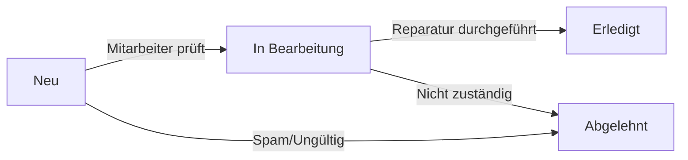

# Technische Spezifikation: Infrastrukturschäden-Meldeformular

## 1. Executive Summary

### Ziel
Implementierung eines benutzerfreundlichen Webformulars zur Meldung von Infrastrukturschäden an die Gemeinde Bruchtal, das von Gemeindemitarbeitenden ohne Programmierkenntnisse verwaltet werden kann.

### Kernfunktionalitäten
- Editor-freundliche Formulargestaltung via Webform UI
- Tabellarische Datenspeicherung mit Views-Integration
- 3-stufiger Status-Workflow (Neu → In Bearbeitung → Erledigt)
- Swiss Compliance (eCH-0010 Adressformat)
- Rollenbasierte Zugriffskontrolle
- Automatische Test-Daten-Generierung (100 Einreichungen)

## 2. Technische Architektur

### 2.1 Module Stack
```yaml
Core Modules:
  - webform: Formularerstellung und -verwaltung
  - views: Tabellarische Darstellung der Einreichungen
  - user: Rollen und Permissions
  - file: Datei-Uploads für Fotos
  - image: Bildverarbeitung

Contrib Modules (bereits installiert):
  - webform: 6.2.x
  - webform_views: Integration für Views-Darstellung
  - address: Swiss-compliant Adressfelder

Custom Modules:
  - zh_demo: Erweiterungen für Test-Daten und Workflow
```

### 2.2 Architektur-Diagramm
```
┌─────────────────────────────────────────────────────────┐
│                    Frontend Layer                        │
│  ┌──────────────────────────────────────────────────┐  │
│  │  SDC Components (Form, Table, Status Badge)      │  │
│  └──────────────────────────────────────────────────┘  │
└─────────────────────────────────────────────────────────┘
                            ↓
┌─────────────────────────────────────────────────────────┐
│                   Webform Module                         │
│  ┌──────────────────────────────────────────────────┐  │
│  │  Form Builder UI (für Redaktoren/Admins)         │  │
│  │  - Drag & Drop Field Management                   │  │
│  │  - Validation Rules                               │  │
│  │  - Conditional Logic                              │  │
│  └──────────────────────────────────────────────────┘  │
└─────────────────────────────────────────────────────────┘
                            ↓
┌─────────────────────────────────────────────────────────┐
│                  Data Storage Layer                      │
│  ┌──────────────────────────────────────────────────┐  │
│  │  Webform Submissions (webform_submission entity)  │  │
│  │  - Structured Data Storage                        │  │
│  │  - File Attachments                               │  │
│  │  - Metadata (Status, Timestamps, User)            │  │
│  └──────────────────────────────────────────────────┘  │
└─────────────────────────────────────────────────────────┘
                            ↓
┌─────────────────────────────────────────────────────────┐
│                    Views Layer                           │
│  ┌──────────────────────────────────────────────────┐  │
│  │  Admin Dashboard View                             │  │
│  │  - Tabular Display                                │  │
│  │  - Status Filters                                 │  │
│  │  - Bulk Operations                                │  │
│  │  - Export (CSV/Excel)                             │  │
│  └──────────────────────────────────────────────────┘  │
└─────────────────────────────────────────────────────────┘
```

## 3. Feldstruktur Definition

### 3.1 Kontaktinformationen
```yaml
melder_information:
  type: fieldset
  title: "Angaben zur meldenden Person"
  fields:
    name:
      type: textfield
      title: "Name"
      required: true
      maxlength: 255
      description: "Vor- und Nachname"
      
    email:
      type: email
      title: "E-Mail-Adresse"
      required: true
      description: "Für Rückfragen und Statusbenachrichtigungen"
      
    phone:
      type: tel
      title: "Telefonnummer"
      required: false
      pattern: '(\+41|0)([0-9]{2})([0-9]{3})([0-9]{2})([0-9]{2})'
      placeholder: "079 123 45 67"
      
    anonymous_report:
      type: checkbox
      title: "Anonyme Meldung"
      description: "Meldung ohne Namensnennung einreichen"
```

### 3.2 Schadensinformationen
```yaml
schaden_details:
  type: fieldset
  title: "Details zum Schaden"
  fields:
    damage_type:
      type: select
      title: "Art des Schadens"
      required: true
      options:
        strasse: "Strassenschaden"
        gehweg: "Gehweg/Trottoir"
        beleuchtung: "Strassenbeleuchtung"
        signalisation: "Signalisation/Verkehrszeichen"
        kanalisation: "Kanalisation/Abfluss"
        spielplatz: "Spielplatz"
        parkanlage: "Parkanlage/Grünfläche"
        bruecke: "Brücke/Unterführung"
        gebaeude: "Öffentliches Gebäude"
        andere: "Andere"
        
    damage_severity:
      type: radios
      title: "Dringlichkeit"
      required: true
      options:
        niedrig: "Niedrig - Keine unmittelbare Gefahr"
        mittel: "Mittel - Sollte zeitnah behoben werden"
        hoch: "Hoch - Gefahr für Personen/Fahrzeuge"
        notfall: "Notfall - Sofortiges Handeln erforderlich"
        
    damage_description:
      type: textarea
      title: "Beschreibung des Schadens"
      required: true
      rows: 5
      maxlength: 2000
      description: "Bitte beschreiben Sie den Schaden möglichst genau"
      
    damage_date:
      type: date
      title: "Wann wurde der Schaden festgestellt?"
      required: true
      date_format: "d.m.Y"
      max: "[webform_submission:created:html_date]"
```

### 3.3 Standortinformationen (Swiss Compliance)
```yaml
standort:
  type: fieldset
  title: "Standort des Schadens"
  fields:
    location_description:
      type: textfield
      title: "Standortbeschreibung"
      required: true
      description: "z.B. Vor Hausnummer 42, bei der Bushaltestelle"
      maxlength: 500
      
    address:
      type: fieldset
      title: "Genaue Adresse"
      description: "Nach eCH-0010 Standard"
      fields:
        street:
          type: textfield
          title: "Strasse"
          required: true
          maxlength: 60
          
        house_number:
          type: textfield
          title: "Hausnummer"
          required: false
          size: 12
          maxlength: 12
          
        postal_code:
          type: textfield
          title: "PLZ"
          required: true
          pattern: "[0-9]{4}"
          default_value: "8XXX"
          size: 4
          maxlength: 4
          
        locality:
          type: textfield
          title: "Ort"
          required: true
          default_value: "Bruchtal"
          maxlength: 40
          
    coordinates:
      type: fieldset
      title: "GPS-Koordinaten (optional)"
      collapsible: true
      collapsed: true
      fields:
        latitude:
          type: number
          title: "Breitengrad"
          step: 0.000001
          min: 45.0
          max: 48.0
          
        longitude:
          type: number
          title: "Längengrad"
          step: 0.000001
          min: 5.0
          max: 11.0
```

### 3.4 Dokumentation
```yaml
dokumentation:
  type: fieldset
  title: "Fotos und Dokumente"
  fields:
    damage_photos:
      type: managed_file
      title: "Fotos vom Schaden"
      description: "Max. 5 Fotos, je max. 10MB (JPG, PNG)"
      required: false
      multiple: true
      max_files: 5
      upload_location: "public://damage_reports/[date:custom:Y-m]/photos"
      upload_validators:
        file_validate_extensions: "jpg jpeg png"
        file_validate_size: 10485760
        
    additional_documents:
      type: managed_file
      title: "Zusätzliche Dokumente"
      description: "z.B. Kostenvoranschläge (PDF, max. 5MB)"
      required: false
      upload_location: "public://damage_reports/[date:custom:Y-m]/documents"
      upload_validators:
        file_validate_extensions: "pdf"
        file_validate_size: 5242880
```

### 3.5 Interne Felder (nicht sichtbar für Melder)
```yaml
internal_fields:
  type: fieldset
  title: "Interne Bearbeitung"
  access: [editor, administrator]
  fields:
    status:
      type: select
      title: "Bearbeitungsstatus"
      default_value: "new"
      options:
        new: "Neu"
        in_progress: "In Bearbeitung"
        completed: "Erledigt"
        rejected: "Abgelehnt"
        
    priority:
      type: select
      title: "Interne Priorität"
      options:
        low: "Niedrig"
        medium: "Mittel"
        high: "Hoch"
        urgent: "Dringend"
        
    assigned_to:
      type: entity_autocomplete
      title: "Zugewiesen an"
      target_type: user
      selection_handler: default:user
      selection_settings:
        include_anonymous: false
        filter:
          type: role
          role:
            - editor
            - administrator
            
    internal_notes:
      type: textarea
      title: "Interne Notizen"
      rows: 5
      
    estimated_cost:
      type: number
      title: "Geschätzte Kosten (CHF)"
      min: 0
      step: 0.01
      
    completion_date:
      type: date
      title: "Erledigungsdatum"
      date_format: "d.m.Y"
```

## 4. Workflow-Definition

### 4.1 Status-Workflow


### 4.2 Workflow-Regeln
```yaml
workflow_rules:
  new_submission:
    trigger: "Formular eingereicht"
    actions:
      - set_status: "new"
      - send_email_confirmation: "melder"
      - send_email_notification: "zuständige_stelle"
      - create_log_entry: "Neue Meldung eingegangen"
      
  status_change_to_in_progress:
    trigger: "Status auf 'In Bearbeitung' gesetzt"
    conditions:
      - assigned_to: "not_empty"
    actions:
      - send_email: "melder"
      - create_log_entry: "Bearbeitung begonnen"
      
  status_change_to_completed:
    trigger: "Status auf 'Erledigt' gesetzt"
    conditions:
      - completion_date: "not_empty"
    actions:
      - send_email: "melder"
      - create_log_entry: "Schaden behoben"
      - archive_after: "90_days"
```

## 5. Datenspeicherungs-Strategie

### 5.1 Views-Konfiguration für Tabellendarstellung
```yaml
view_infrastructure_damage_reports:
  label: "Infrastrukturschäden-Übersicht"
  description: "Tabellarische Übersicht aller gemeldeten Schäden"
  
  base_table: webform_submission
  base_field: sid
  
  displays:
    page_admin:
      path: "/admin/infrastructure/damage-reports"
      title: "Schadensmeldungen"
      access:
        type: role
        roles: [editor, administrator]
      
      fields:
        sid:
          label: "Nr."
          type: numeric
          
        created:
          label: "Eingangsdatum"
          date_format: "d.m.Y H:i"
          
        damage_type:
          label: "Schadensart"
          
        damage_severity:
          label: "Dringlichkeit"
          
        location_description:
          label: "Standort"
          
        status:
          label: "Status"
          formatter: status_badge
          
        assigned_to:
          label: "Zugewiesen an"
          
        operations:
          label: "Aktionen"
          links:
            - view: "Ansehen"
            - edit: "Bearbeiten"
            - delete: "Löschen"
            
      filters:
        status:
          exposed: true
          label: "Status"
          type: select
          
        damage_type:
          exposed: true
          label: "Schadensart"
          type: select
          
        created:
          exposed: true
          label: "Zeitraum"
          type: date_range
          
        damage_severity:
          exposed: true
          label: "Dringlichkeit"
          type: select
          
      sort:
        created:
          order: DESC
          exposed: true
          
      pager:
        type: full
        items_per_page: 50
        
      style:
        type: table
        options:
          row_class: "status-[status]"
          responsive: true
          
      bulk_operations:
        - change_status
        - assign_to_user
        - export_csv
        - delete
```

### 5.2 Datenbank-Schema
```sql
-- Webform Submissions werden automatisch in folgenden Tabellen gespeichert:
-- webform_submission: Haupttabelle für Einreichungen
-- webform_submission_data: Key-Value Storage für Formulardaten
-- webform_submission_log: Audit-Log für Änderungen

-- Zusätzliche Indizes für Performance:
CREATE INDEX idx_damage_status ON webform_submission_data (name, value) 
  WHERE name = 'status';
CREATE INDEX idx_damage_type ON webform_submission_data (name, value) 
  WHERE name = 'damage_type';
CREATE INDEX idx_damage_severity ON webform_submission_data (name, value) 
  WHERE name = 'damage_severity';
```

## 6. Permissions und Rollen-Setup

### 6.1 Rollen-Definition
```yaml
roles:
  anonymous:
    permissions:
      - "access webform damage_report"
      - "create webform submission damage_report"
      
  authenticated:
    permissions:
      - "access webform damage_report"
      - "create webform submission damage_report"
      - "view own webform submission damage_report"
      - "edit own webform submission damage_report"
      
  infrastructure_manager:
    label: "Infrastruktur-Verantwortlicher"
    permissions:
      - "view any webform submission damage_report"
      - "edit any webform submission damage_report"
      - "delete any webform submission damage_report"
      - "view webform submission log damage_report"
      - "access webform overview damage_report"
      - "export webform submissions damage_report"
      
  editor:
    inherits: [authenticated]
    permissions:
      - "view any webform submission damage_report"
      - "edit any webform submission damage_report"
      - "view webform submission log damage_report"
      
  administrator:
    permissions:
      - "administer webform"
      - "administer webform submission"
```

### 6.2 Zugriffskontrolle
```yaml
access_control:
  form_creation:
    description: "Nur Administratoren können neue Formulare erstellen"
    roles: [administrator]
    
  form_editing:
    description: "Redaktoren können Formularfelder bearbeiten"
    roles: [editor, administrator]
    
  submission_management:
    description: "Infrastruktur-Manager können alle Meldungen verwalten"
    roles: [infrastructure_manager, administrator]
    
  bulk_operations:
    description: "Nur Administratoren können Bulk-Operations durchführen"
    roles: [administrator]
```

## 7. SDC-Komponenten Integration

### 7.1 Status Badge Component
```yaml
component: status-badge
path: /themes/custom/adesso_cms_theme/components/status-badge
props:
  status: string
  label: string
  icon: string
  
usage:
  new: 
    class: "bg-blue-100 text-blue-800"
    icon: "info-circle"
    label: "Neu"
    
  in_progress:
    class: "bg-yellow-100 text-yellow-800"
    icon: "clock"
    label: "In Bearbeitung"
    
  completed:
    class: "bg-green-100 text-green-800"
    icon: "check-circle"
    label: "Erledigt"
    
  rejected:
    class: "bg-red-100 text-red-800"
    icon: "x-circle"
    label: "Abgelehnt"
```

### 7.2 Damage Report Table Component
```yaml
component: damage-report-table
path: /themes/custom/adesso_cms_theme/components/damage-report-table
props:
  submissions: array
  filters: object
  sorting: object
  
features:
  - responsive_design
  - sticky_header
  - row_highlighting
  - inline_editing
  - bulk_selection
```

### 7.3 File Upload Component
```yaml
component: file-upload
path: /themes/custom/adesso_cms_theme/components/file-upload
props:
  multiple: boolean
  maxFiles: number
  acceptedTypes: array
  maxSize: number
  
features:
  - drag_and_drop
  - preview_images
  - progress_indicator
  - validation_messages
```

## 8. Test-Daten-Generierungs-Strategie

### 8.1 Drush Command für Test-Daten
```php
<?php
// web/modules/custom/zh_demo/src/Commands/DamageReportCommands.php

namespace Drupal\zh_demo\Commands;

use Drush\Commands\DrushCommands;

class DamageReportCommands extends DrushCommands {
  
  /**
   * Generate test damage report submissions.
   *
   * @command zh-demo:generate-damage-reports
   * @aliases zhdr
   * @param int $count Number of submissions to generate
   * @usage zh-demo:generate-damage-reports 100
   */
  public function generateDamageReports($count = 100) {
    $damage_types = ['strasse', 'gehweg', 'beleuchtung', 'signalisation', 
                     'kanalisation', 'spielplatz', 'parkanlage', 'bruecke', 
                     'gebaeude', 'andere'];
    $severities = ['niedrig', 'mittel', 'hoch', 'notfall'];
    $statuses = ['new', 'in_progress', 'completed', 'rejected'];
    
    // Lord of the Rings themed test data
    $names = [
      'Frodo Beutlin', 'Samweis Gamdschie', 'Gandalf der Graue',
      'Aragorn Streicher', 'Legolas Grünblatt', 'Gimli Glóins Sohn',
      'Boromir von Gondor', 'Faramir von Ithilien', 'Éowyn von Rohan',
      'Théoden König', 'Éomer Marschall', 'Arwen Abendstern',
      'Elrond Halbelb', 'Galadriel von Lothlórien', 'Pippin Tuk',
      'Merry Brandybock', 'Bilbo Beutlin', 'Tom Bombadil'
    ];
    
    $streets = [
      'Beutelsend', 'Hobbingen-Weg', 'Grüner Drache Gasse',
      'Bruchtal-Strasse', 'Isengart-Allee', 'Minas Tirith Platz',
      'Rohan-Weg', 'Gondor-Strasse', 'Lothlórien-Park',
      'Düsterwald-Pfad', 'Erebor-Strasse', 'Auenland-Weg'
    ];
    
    $descriptions = [
      'Ein grosses Schlagloch hat sich gebildet, das die Durchfahrt erschwert.',
      'Die Strassenbeleuchtung ist ausgefallen und muss dringend repariert werden.',
      'Der Gehweg ist durch Wurzeln angehoben und stellt eine Stolpergefahr dar.',
      'Das Verkehrsschild ist umgeknickt und muss neu befestigt werden.',
      'Der Kanaldeckel ist locker und macht laute Geräusche bei Überfahrt.',
      'Die Parkbank ist beschädigt und nicht mehr sicher benutzbar.',
      'Der Spielplatz-Zaun hat eine gefährliche Lücke.',
      'Die Brückengeländer sind verrostet und instabil.',
      'Graffiti an der Wand des Gemeindehauses.',
      'Der Abfalleimer ist überfüllt und muss geleert werden.'
    ];
    
    for ($i = 1; $i <= $count; $i++) {
      $submission_data = [
        'name' => $names[array_rand($names)],
        'email' => 'test' . $i . '@bruchtal.ch',
        'phone' => '079 ' . rand(100, 999) . ' ' . rand(10, 99) . ' ' . rand(10, 99),
        'damage_type' => $damage_types[array_rand($damage_types)],
        'damage_severity' => $severities[array_rand($severities)],
        'damage_description' => $descriptions[array_rand($descriptions)],
        'damage_date' => date('Y-m-d', strtotime('-' . rand(0, 30) . ' days')),
        'location_description' => 'Bei ' . $streets[array_rand($streets)] . ' ' . rand(1, 100),
        'street' => $streets[array_rand($streets)],
        'house_number' => (string) rand(1, 150),
        'postal_code' => '8' . rand(000, 999),
        'locality' => 'Bruchtal',
        'status' => $statuses[array_rand($statuses)],
        'priority' => $severities[array_rand($severities)]
      ];
      
      // Create webform submission
      $this->createWebformSubmission('damage_report', $submission_data);
      
      if ($i % 10 == 0) {
        $this->output()->writeln("Generated $i damage reports...");
      }
    }
    
    $this->output()->success("Successfully generated $count damage report submissions!");
  }
}
```

### 8.2 Test-Szenarien
```yaml
test_scenarios:
  distribution:
    damage_types:
      strasse: 30%
      gehweg: 20%
      beleuchtung: 15%
      signalisation: 10%
      andere: 25%
      
    severities:
      niedrig: 40%
      mittel: 35%
      hoch: 20%
      notfall: 5%
      
    statuses:
      new: 30%
      in_progress: 40%
      completed: 25%
      rejected: 5%
      
  temporal_distribution:
    last_7_days: 40%
    last_14_days: 30%
    last_30_days: 30%
```

## 9. Implementierungs-Schritte

### Phase 1: Basis-Setup (Tag 1)
1. Webform "damage_report" erstellen
2. Alle Feldgruppen und Felder konfigurieren
3. Swiss-compliant Adressfelder implementieren
4. Basis-Validierungen einrichten

### Phase 2: Workflow & Permissions (Tag 1-2)
1. Status-Feld mit Workflow-Regeln
2. Rollen und Permissions konfigurieren
3. E-Mail-Handler für Benachrichtigungen
4. Logging und Audit-Trail

### Phase 3: Views & Dashboard (Tag 2)
1. Admin-Dashboard View erstellen
2. Filter und Sortierung implementieren
3. Bulk Operations konfigurieren
4. Export-Funktionalität (CSV)

### Phase 4: SDC Integration (Tag 2-3)
1. Status-Badge Component entwickeln
2. Table Component anpassen
3. File-Upload Component optimieren
4. Frontend-Styling mit Tailwind

### Phase 5: Testing & Daten (Tag 3)
1. Drush Command implementieren
2. 100 Test-Datensätze generieren
3. Performance-Tests durchführen
4. Acceptance Testing

## 10. Acceptance Criteria

### Funktionale Anforderungen
- [ ] Formular kann von Redakteuren ohne Code-Kenntnisse bearbeitet werden
- [ ] Alle Pflichtfelder sind korrekt validiert
- [ ] Swiss-compliant Adressformat (eCH-0010) implementiert
- [ ] Datei-Upload funktioniert (max. 5 Bilder)
- [ ] E-Mail-Benachrichtigungen werden versendet

### Workflow-Anforderungen
- [ ] 3-Status-Workflow funktioniert (Neu → In Bearbeitung → Erledigt)
- [ ] Status-Änderungen werden geloggt
- [ ] Zuweisungen an Mitarbeiter möglich
- [ ] Bulk-Status-Updates funktionieren

### Darstellungs-Anforderungen
- [ ] Tabellarische Übersicht zeigt alle Einreichungen
- [ ] Filter funktionieren (Status, Typ, Dringlichkeit, Datum)
- [ ] Sortierung nach allen Spalten möglich
- [ ] Responsive Design auf Mobile/Tablet
- [ ] Export als CSV funktioniert

### Performance-Anforderungen
- [ ] Seite lädt in < 2 Sekunden mit 100 Einträgen
- [ ] Filter-Updates in < 500ms
- [ ] Formular-Submission in < 3 Sekunden
- [ ] Bulk-Operations für 50 Items in < 5 Sekunden

### Daten-Anforderungen
- [ ] 100 Test-Einreichungen generiert
- [ ] Realistische Verteilung der Schadenstypen
- [ ] Verschiedene Status-Zustände abgebildet
- [ ] Lord of the Rings Referenzen in Testdaten

### Compliance-Anforderungen
- [ ] WCAG 2.1 AA Accessibility
- [ ] Swiss eCH-0010 Adressstandard
- [ ] CH-DSG Datenschutz-konform
- [ ] Responsive für alle Bildschirmgrössen

## 11. Risiken und Mitigationen

### Identifizierte Risiken
```yaml
risks:
  performance:
    risk: "Views könnte bei >1000 Einträgen langsam werden"
    mitigation: "Implementierung von Views-Caching und Indizierung"
    
  complexity:
    risk: "Workflow-Logik könnte für Redakteure zu komplex sein"
    mitigation: "Einfache UI mit klaren Status-Badges und Hilfetexten"
    
  data_loss:
    risk: "Versehentliches Löschen von Einreichungen"
    mitigation: "Soft-Delete mit 30-Tage-Archivierung"
    
  spam:
    risk: "Spam-Einreichungen könnten System überfluten"
    mitigation: "CAPTCHA für anonyme Nutzer, Rate-Limiting"
```

## 12. Dokumentation für Redakteure

### Schnellstart-Anleitung
1. **Formular bearbeiten**: `/admin/structure/webform/manage/damage_report`
2. **Einreichungen ansehen**: `/admin/infrastructure/damage-reports`
3. **Status ändern**: Klick auf "Bearbeiten" → Status-Dropdown
4. **Bulk-Aktionen**: Checkboxen → Aktion wählen → Ausführen
5. **Export**: Button "Export CSV" in der Toolbar

### Häufige Aufgaben
- **Neue Felder hinzufügen**: Build → Add element
- **Validierung ändern**: Field settings → Validation
- **E-Mail anpassen**: Settings → Emails/Handlers
- **Berechtigungen**: People → Permissions → Webform

---

**Nächste Schritte:**
1. Review dieser Spezifikation mit Building Lane
2. Implementierung nach Freigabe
3. Testing mit Swiss Compliance Specialist
4. Demo-Vorbereitung für GPZH-Präsentation

**Technische Ansprechpartner:**
- Solution Architect: Architektur & Design-Entscheidungen
- Lead Developer: Implementierung & Code
- Swiss Compliance: eCH-Standards & Datenschutz
- QA Specialist: Testing & Validierung